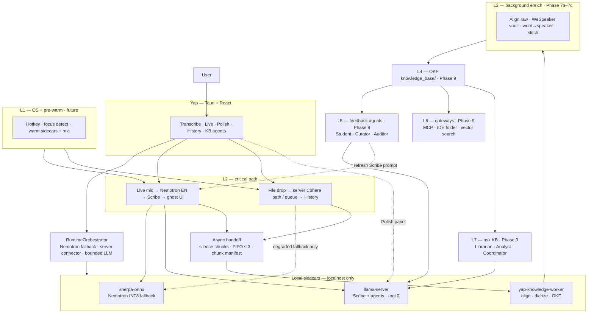
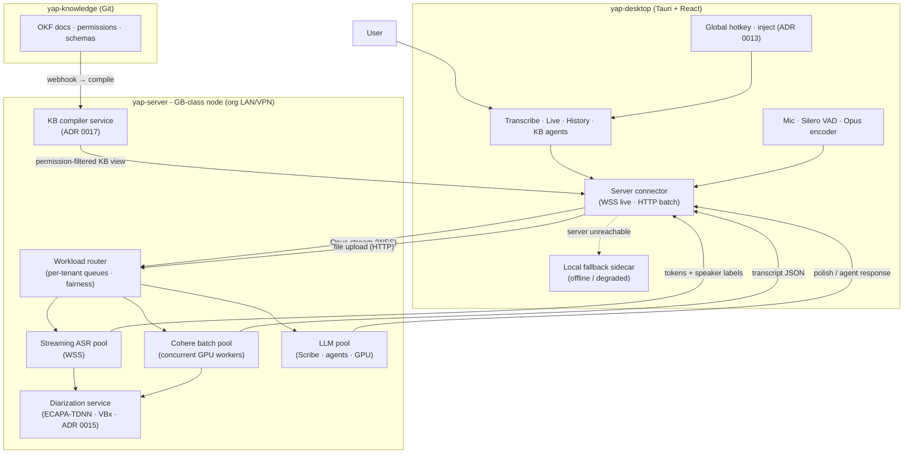
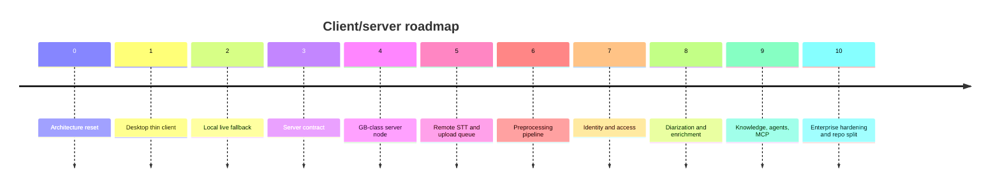

# Yap & Voice OS — System Architecture

**Status:** Living document (2026-07-01)
**Authority:** Decisions are normative in [ADR 0001–0019](adr/README.md). This doc is the readable synthesis of the full Voice OS flowchart + reconciled Yap decisions.

> **2026-07-08 — Local model reset:** Yap keeps one local live/offline fallback model: Nemotron 3.5 ASR Streaming 0.6B INT8 through in-process `sherpa-onnx`. Client-side fusion routing is rejected; model routing belongs on the server.

> **ADR precedence:** ADR 0014-0019 are the current direction for team/server mode, official large-recording paths, and local fallback model selection. Older local-heavy ADR details remain useful for solo/local fallback where they have not been amended. The desktop owns mic capture, VAD/endpointing, Opus chunks, hotkey/UI, server connector, and local live fallback. In team/server mode, the server owns official long-recording STT, preprocessing, diarization, auth, KB compilation, and agent workloads.

---

## Is this a good idea?

**Yes — if you build it in phases.** The architecture is sound engineering; the main risk is building the whole “Voice OS” before Yap reliably transcribes files.

### Why it’s a good idea

| Principle | Why it works |
|-----------|--------------|
| **Local-first (solo profile)** | Offline, privacy-max; no cloud STT lock-in for individual users. |
| **On-prem GPU (team profile)** | The GB-class server node is org-owned hardware on an org-controlled LAN — "our hardware, our network." Not cloud. GPU removes the CPU bottleneck (~26-min batch drops to a few minutes; exact wall time unbenchmarked). |
| **Critical path isolation** | Live stays fast; heavy work (diarization, OKF, agents) never blocks typing. |
| **Right model per job** | Nemotron INT8 for local live/offline fallback; server router for official recordings/live; **LLM pool** for polish/agents — not one model for everything. |
| **Two-pass diarization** | ECAPA-TDNN live labels + AHC/VBx post-meeting accuracy; rolling centroid improves speaker recognition over time. |
| **Modular diarizer** | WeSpeaker + vault (~200 MB) for solo; ECAPA-TDNN on GPU for team — realistic on both hardware targets. |
| **Graceful degradation** | Dual-track Scribe, quarantine folder, RAG confidence gates, offline fallback to local sidecar — production-minded. |
| **Recordings as moat** | Journalists/researchers already have files; Cohere batch (GPU-accelerated in team profile) is differentiated vs pure dictation apps. |

### Where it can go wrong

| Risk | Mitigation (in ADRs) |
|------|----------------------|
| **Scope creep** | Ship desktop history/playback → local live fallback → server STT → preprocessing → diarization → L3 OKF in that order. |
| **Three processes** | sherpa live recognizer in the Tauri process + llama-server + knowledge worker; worker idles out after 5 min. |
| **Local ASR dependency** | Pin artifacts; verify hashes; profile chunk/latency; CI smoke tests. |
| **Wispr comparison on v1** | Don’t promise global hotkey + inject until later desktop OS integration; compete on batch + local first. |
| **OKF/agents before core STT** | Transcripts history first; OKF Phase 9. |

### Verdict

- **Yap (batch + live EN + polish):** Strong product — ship this.
- **Background diarization + speaker vault:** Good idea for meetings/interviews — Phase 7, after STT stable.
- **Full agentic KB + MCP + global injector:** Ambitious second product layer — good *direction*, don’t block v1 on it.

---

## What Yap is today vs where we’re going

| | **Yap v1 target** | **Voice OS (long-term)** |
|--|---------------------|---------------------------|
| Primary input | Thin client live/offline fallback + recording queue shell | + live mic, eventually global hotkey |
| Live language | **English only** | Multilingual live router (future ADR) |
| Batch language | Server Cohere **14 langs** (manual + LID gate later) | Same |
| STT runtime | **Nemotron INT8 sherpa fallback** + future server connector | Same client shell; heavier pools move server-side |
| Polish | **llama-server** (bundled, CPU `-ngl 0`) | Scribe + agents; Ollama dev fallback |
| Speakers | Plain transcript | Diarization + vault + OKF |
| Knowledge | Transcripts history (solo) / `yap-knowledge` Git + compiler (team) | OKF + glossary agents + Q&A |

---

## Two deployment profiles

| Attribute | **Solo / fallback** | **Team / server** |
|-----------|------------------------|-------------------|
| Target | Individual users with local live fallback | Org teams on a shared GB-class server node |
| STT (live) | Local Nemotron INT8 (`sherpa-onnx`) | Server streaming ASR pool (WSS) |
| STT (batch) | Queue/block when offline; official larger recordings use the server path | Server Cohere batch pool (concurrent GPU workers) |
| LLM | Local llama-server (`-ngl 0`) | Server LLM pool (GPU, multi-tenant) |
| Diarization | WeSpeaker + vault (old 7b, ADR 0004) | ECAPA-TDNN two-pass (Phase 8, ADR 0015) |
| Identity | None | Entra ID / MSAL (ADR 0016) |
| Knowledge base | Local OKF markdown (old 7c, ADR 0010) | `yap-knowledge` Git + KB compiler (Phase 9, ADR 0017) |
| Network | None required for live fallback; server required for official recordings | LAN/VPN to the GB-class server node |

The **client shell** (`yap-desktop`) is identical in both profiles: mic capture, VAD/endpointing, Opus encoding, hotkey, ghost UI, and server connector. The local path is a Nemotron INT8 fallback for live/offline use. Server unavailability should queue or block larger recordings instead of silently producing official-looking transcripts from the fallback.

The on-prem GB-class server node is **org-owned hardware on an org-controlled LAN** — not a public cloud service. The current profile is DGX Spark GB10; a future GB300-class node should be a capacity/profile change, not a product architecture change. This is consistent with the "no cloud STT" principle for regulated/clinical orgs.

Details: [ADR 0014](adr/0014-server-tier-compute-topology.md) (topology) · [ADR 0015](adr/0015-two-pass-diarization-speaker-identity.md) (diarization) · [ADR 0016](adr/0016-auth-identity-bridge.md) (auth) · [ADR 0017](adr/0017-knowledge-base-compiler.md) (KB compiler) · [ADR 0018](adr/0018-three-repo-topology.md) (repos)

---

## Core decisions (summary)

1. **Recordings → server Cohere** (accuracy, multilingual, long files).
2. **Live mic / offline fallback → Nemotron INT8** (English v1).
3. **One warm local sherpa recognizer**; server router owns heavier model residency.
4. **SpeechBrain LID** = language **gate** (“Detected French — continue?”), not silent auto-`-l`.
5. **L3 background worker** = separate subprocess (not Python thread — avoids GIL).
6. **Diarization** = off hot path; silence-anchored chunks + **Speaker Vault**.
7. **Align raw STT**, never polished LLM text, before word→speaker intersection.
8. **On-prem GPU** = "our hardware, our network" — not cloud; extends local-first trust to the org's LAN (team profile).
9. **Auth** = Entra ID / MSAL; objectId→voice-centroid bridge in identity DB; biometric consent required before enrollment.
10. **KB compiler** = Git source-of-truth + deterministic compile → Postgres + Redis + vector DB (all indexes disposable).

Details: [ADR 0001](adr/0001-dual-stt-backends.md) · [0002](adr/0002-crispasr-unified-stt-runtime.md) · [0003](adr/0003-long-term-voice-architecture.md) · [0004](adr/0004-background-diarization-okf-agents.md) · [0005](adr/0005-llama-server-agents.md) · [0006](adr/0006-silero-agents-state-machine.md) · [0014](adr/0014-server-tier-compute-topology.md) · [0015](adr/0015-two-pass-diarization-speaker-identity.md) · [0016](adr/0016-auth-identity-bridge.md) · [0017](adr/0017-knowledge-base-compiler.md) · [0018](adr/0018-three-repo-topology.md) · [0019](adr/0019-local-streaming-model-selection.md)

---

## Pipeline charts

Two views of the same architecture — **high-level** for orientation, **low-level** for implementation. These charts depict the current direction: a thin desktop client, local Nemotron INT8 fallback, and server model pools for official large-recording work. Normative rules live in [ADR 0001–0019](adr/README.md); sections below expand each box.

**Read order:** UI → **RuntimeOrchestrator** → local fallback or server connector. **L3** never blocks L2. **Polish panel** (batch) and **Scribe** (live) share **llama-server** via mutex rules ([ADR 0006](adr/0006-silero-agents-state-machine.md)).

### High-level overview

Layers, dual inputs, three processes, and async handoff — no per-node detail.



### Team / server profile — high-level

Thin client shell + GB-class server node. The client-side STT sidecars are replaced by server model pools; the client connector streams Opus audio and receives tokens/labels. See [ADR 0014](adr/0014-server-tier-compute-topology.md).



### Low-level detail — 7 layers

Full Voice OS flowchart reconciled for Yap — **live + batch**, orchestrator, sidecars, manifests, and Phase 7 stack.


**Batch vs live on L3:** files **under 5 minutes** enqueue one whole-file manifest; **≥ 5 minutes** or **live sessions** use the silence chunk pipeline ([ADR 0004](adr/0004-background-diarization-okf-agents.md)).

---

## Coverage matrix

Everything from the original 7-layer flowchart and master spec is captured below. **Reconciled** items differ from the original diagram on purpose (ADRs override).

| Original flowchart node | Documented? | Where | Yap decision (if changed) |
|-------------------------|-------------|-------|---------------------------|
| **L1** Global OS listeners (pynput, UI automation) | ✅ | § Layer model | Future — not v1 |
| **L1** Pre-warm (llama.cpp KV, mic, Silero) | ✅ | ADR 0002, 0005, 0019 | Warm **Nemotron recognizer** + **llama-server** + mic |
| **L2** Mic, WebRTC/AGC clean | ✅ | § L2 | Optional AGC; Silero required |
| **L2** Silero VAD | ✅ | ADR 0004 §3, §10 | Shared `vad_segments` → L3 |
| **L2** SpeechBrain LangID | ✅ | ADR 0003 | **Off L2 v1**; batch gate Phase 4 |
| **L2** ASR | ✅ Reconciled | ADR 0001–0002/0014/0019 | **Nemotron local fallback**; **server router** for official recordings/live |
| **L2** Post-LLM (Llama 3 8B) | ✅ Reconciled | ADR 0005 | **llama-server** ~2B Q4, `-ngl 0` |
| **L2** Ghost preview | ✅ | § L2 | In-app panel v1 |
| **L2** Cross-app injector | ✅ | Future desktop OS integration | Deferred |
| **L2** Silence chunker → FIFO | ✅ | ADR 0004 §3, §10 | Async writer; max queue 3 |
| **L3** Handoff audio + raw text | ✅ | ADR 0004 chunk manifest | `text_raw` frozen at boundary |
| **L3** Wav2Vec2 / MMS align | ✅ | ADR 0004 §5 | Align **raw** only; canary-ctc-aligner default |
| **L3** WeSpeaker + spectral cluster | ✅ | ADR 0004 §4 | **Vault-first**; cluster unmatched only |
| **L3** Speaker Vault (>0.70) | ✅ | ADR 0004 §4, §10 | Merge centroids ≥0.85 |
| **L3** Word→speaker intersection | ✅ | ADR 0004 §5 | >50% overlap rule |
| **L3** OKF parser | ✅ | ADR 0004 §6 | Phase 9 |
| **L3** Python thread worker | ✅ Reconciled | ADR 0004 §7 | **`yap-knowledge-worker` subprocess** (not thread) |
| **L4** knowledge_base dirs | ✅ | § Process layout | + `team_knowledge/` in long-term OKF |
| **L5** Student, Curator, Watcher loop | ✅ | § Agents | Three-strike + git opt-in |
| **L5** Auditor | ✅ | § Agents | Weekly cron; Phase 9 |
| **L5** Rewriter → Post prompt cache | ✅ | § Agents | Updates Scribe system prompt |
| **L6** IDE, MCP, VectorDB | ✅ | Phase 9 | Open-folder KB |
| **L7** Librarian, Analyst, Coordinator | ✅ | § Agents | RAG + citations + todos |
| **Failure states** (Scribe, Archivist, …) | ✅ | § Failure states | Full spec below |
| **Bottleneck / thread caps** | ✅ | § Resource profiling | ORT/torch 2 threads in worker |
| **Silero VAD (L2 + segments → L3)** | ✅ | [ADR 0006](adr/0006-silero-agents-state-machine.md) | Rust ONNX; no re-VAD in worker |
| **Agent profiles (8 personas)** | ✅ | [ADR 0006](adr/0006-silero-agents-state-machine.md) | Mutex groups; v1 = Scribe only |
| **Runtime state machine** | ✅ | [ADR 0006](adr/0006-silero-agents-state-machine.md) | One STT backend; bounded LLM queue |
| **16 GB RAM budget** | ✅ | ADR 0004 §9 | Pyannote rejected |
| **Recordings / file drop (Yap)** | ✅ | ADR 0001, 0003, 0014 | Server Cohere batch; local fallback only when explicitly degraded |

**Not in code yet** — all of the above is **architecture only** until phases ship.

---

## Layer model (7 layers)

| Layer | Name | Yap phase | Role |
|-------|------|-----------|------|
| **L1** | OS listeners + pre-warm | 7+ | Hotkey, focus detect, warm sidecar/mic |
| **L2** | Real-time critical path | 3 | Nemotron → optional Scribe → UI/inject |
| **L3** | Async background | 7a–7c | Align, diarize, stitch, OKF |
| **L4** | OKF knowledge base | 7c | Markdown + YAML conversations |
| **L5** | Agentic feedback | 7d | Student, Curator, Auditor |
| **L6** | Ecosystem gateways | 7e | MCP, vector search, IDE folder |
| **L7** | Ask-your-KB agent | 7e | Librarian + Analyst |

---

## Real-time path (L2) — reconciled

```
Mic → optional AGC → Silero VAD
  → Nemotron INT8 (sherpa-onnx, English)       ← live tokens
  → llama-server polish (Scribe) if <400ms budget   ← else raw only
  → ghost UI / in-app panel (v1)              ← inject later (L1)

Parallel (never blocks above):
  VAD silence (1.5–2s) + buffer ≥30s speech
    → async write .opus chunk
    → push manifest to FIFO (vad_segments included)
```

**Not on L2:** Cohere, SpeechBrain LID (v1), diarization, alignment, OKF.

---

## Background path (L3) — hardened

### Chunk manifest (required fields)

```json
{
  "chunk_id": "...",
  "session_id": "...",
  "audio_path": "...",
  "text_raw": "...",
  "text_polished": "...",
  "t_start_ms": 0,
  "t_end_ms": 32000,
  "language": "en",
  "source": "live|batch",
  "vad_segments": [[1200, 3400]],
  "degraded": false
}
```

### Processing per chunk

1. **Align** raw text to audio (`canary-ctc-aligner` default).
2. **Diarize:** WeSpeaker embeddings → **vault match first** (sim ≥0.70) → cluster **unmatched only**.
3. **Intersect:** majority overlap → `SPEAKER_XX`.
4. **Append** to session store; **stitch** at session end into one conversation file.

### Back-pressure

- FIFO depth **3**. Overflow → `degraded: true`; finish labels after session ends.
- Worker **BELOW_NORMAL** priority; **2** ONNX threads; **idle exit** after 5 min empty.

### Batch recordings

- Files **&lt;5 min:** whole-file path (no micro-chunks).
- Files **≥5 min** or live sessions: chunk pipeline.

---

## Agents & failure modes

### Agent roster (8 personas)

Scoped profiles, mutex groups, and state rules: **[ADR 0006](adr/0006-silero-agents-state-machine.md)**.

| Agent | Layer | Trigger | Job | LLM? |
|-------|-------|---------|-----|------|
| **Scribe** | L2 | Raw STT tokens | Filler strip, grammar, jargon dict | llama-server |
| **Archivist** | L3 | Chunk JSON ready | OKF markdown + YAML frontmatter | No |
| **Student** | L5 | New conversation saved | Flag unknown terms/acronyms | Optional |
| **Curator** | L5 | User defines term | Glossary card, wiki-links, refresh Scribe prompt | llama-server |
| **Auditor** | L5 | Weekly / on bulk edit | Flag contradictions across notes | llama-server |
| **Librarian** | L7 | User query | Hybrid retrieve → context pack | No |
| **Analyst** | L7 | Context pack | Grounded answer + citations | llama-server |
| **Coordinator** | L7 | New transcript | Extract action items → todos | llama-server |

### Failure states (graceful degradation)

| Agent | Risk | Fallback |
|-------|------|----------|
| **Scribe** | Hallucination / over-edit | **Dual-track** raw + polished; undo → raw; **>400ms → raw only** on live |
| **Archivist** | Bad JSON / write fail | **`quarantine/`** — audio + text; worker continues |
| **Student** | Notification spam | **Three-strike rule**; **Ignore forever** blacklist |
| **Curator** | Broken wiki-links | **Opt-in git**; auto-commit before bulk edits; rollback |
| **Auditor** | False conflicts | Non-blocking toast; user dismisses |
| **Librarian** | No good hits | Confidence **<0.60** → do not pass to Analyst |
| **Librarian** | Too many hits (>50) | Pass **5 most recent**; flag “summarize older?” |
| **Analyst** | RAG hallucination | Must cite sources; “no solid notes” template if empty context |
| **Coordinator** | False commitments | **Proposed tasks** vs auto todos by confidence score |

---

## Runtime orchestration (summary)

**State machine** (Rust in Tauri) — full spec in [ADR 0006](adr/0006-silero-agents-state-machine.md):

| Rule | Limit |
|------|--------|
| Local STT loaded | Client fallback loads **Nemotron INT8 only**; server router owns fusion/routing |
| Scribe (HOT) | **1** at a time; **400 ms** max |
| Background LLM agents | **1 queued** (Student, Curator, Analyst, …) |
| Knowledge worker | **1 chunk** processing; **3** pending max → degraded |
| Background agents during live | **Blocked** except Scribe |
| Worker idle | Exit after **5 min** empty queue |

**Silero:** ONNX in **Rust** on audio thread → live VAD + chunk cuts + `vad_segments`; worker **does not** re-run Silero.

```
Idle ↔ FallbackReady ↔ FallbackRunning  (local Nemotron INT8)
Idle ↔ ServerQueued ↔ ServerUploading   (GB-class server Cohere)
         client does not load local Cohere in PR3
```

### Desktop implementation guardrails

These rules prevent the repeated UI and runtime churn we have been seeing. They are part of the architecture contract, not polish notes.

| Surface | Do | Do not |
|---------|----|--------|
| Live overlay geometry | Keep one owner for native window size and position. Rust owns the Tauri window frame; React owns only the visible island inside that frame. | Do not resize/reposition the native overlay from both Rust and React. Do not shrink the hover sensor to the visible island width. |
| Live overlay motion | Animate transforms and opacity inside a stable frame. Keep the hover sensor fixed and test the motion while it is moving. | Do not animate layout dimensions that move the cursor out of the hit area. Do not rely only on settled screenshots. |
| Overlay permissions | Give the overlay window only the capabilities it needs for its owner boundary. | Do not grant frontend `set_size`, `set_position`, or monitor permissions if Rust owns geometry. |
| Live transcription process | Prefer one session owner and explicit lifecycle boundaries. Until the sidecar exposes reset/ack/session tags, stale stdout must not be able to enter a new dictation session. | Do not hide clipping or stale-session risk behind warm reuse unless there is a protocol-level ready/reset signal. |
| Recording history | Keep one canonical transcript/review surface and one cache owner. | Do not maintain separate preview dialogs, separate read-through caches, or fake recording adapters for the same transcript row. |
| Settings and controls | Use native controls or already-installed primitives when they cover the job. Keep copy user-facing. | Do not add bespoke controls for simple select/radio/toggle behavior or explain CPU/GPU plumbing in normal settings copy. |
| Docs and code | Update the ADR/spec/product surface in the same phase as the code. | Do not ship behavior that contradicts the client/server split: live local fallback is allowed; official long recordings queue for server. |
| Server staging | Keep `server/` to health, contract, route selection, and tests until the API/WSS contract is real. | Do not add placeholder pools/config/schema packages, app firewall exposure, Docker deployment, or service-disabling host tweaks before Phase 3-4 need them. |

---

## Resource profiling (16 GB target)

| Concern | Fix |
|---------|-----|
| CPU thread thrashing | L3 in **subprocess**; worker `torch`/ORT **2 threads**; `BELOW_NORMAL` priority |
| RAM OOM (Pyannote/Nemo) | **WeSpeaker + sklearn** ~200 MB; reject Pyannote default |
| Live dropouts | No align/diarize on L2; chunk write **async** |
| Speaker over-cluster (1–15) | Vault-first; sim truncate **0.68**; min segment **500 ms** |
| Chunk identity swap | **Speaker Vault** sim ≥ **0.70**; merge ≥ **0.85** |
| Queue backlog | FIFO **3** → degraded mode; stitch at session end |

---

## Language policy

| Mode | Languages | Detection |
|------|-----------|-----------|
| **Live** | English only (v1) | No LID on hot path |
| **Batch / larger recordings** | Server Cohere 14 | Manual picker; SpeechBrain **suggests** with user gate (Phase 4) |

Supported batch codes: `en`, `fr`, `de`, `it`, `es`, `pt`, `el`, `nl`, `pl`, `zh`, `ja`, `ko`, `vi`, `ar`.

UI copy: **“Local fallback: English · Server files: 14 languages”**

---

## Process & data layout

### Solo / local-first profile

```
Yap (Tauri)  [yap-desktop]
  ├─ sherpa recognizer         STT — Nemotron INT8 fallback
  ├─ llama-server sidecar      Polish + LLM agents (CPU -ngl 0)
  └─ yap-knowledge-worker      align + diarize + OKF (queue-driven)

%LOCALAPPDATA%/Yap/
  models/                      pinned model cache
  Transcripts/                 Yap history (ship first)
  knowledge_base/              OKF (Phase 9)
    conversations/
    jargon_glossary/
    work_artifacts/
    team_knowledge/
    media_cache/
    quarantine/
  logs/
    knowledge-worker.log
```

### Team / server profile

```
yap-desktop (Tauri) — thin client shell
  ├─ Silero VAD (Rust ONNX)    VAD + Opus encoding + vad_segments
  ├─ sherpa recognizer         Offline fallback only (Nemotron INT8)
  └─ Server connector          WSS (live) + HTTP (batch) to yap-server

yap-server (GB-class server node, org LAN/VPN)
  ├─ Workload router            per-tenant queues, fairness, backpressure
  ├─ Streaming ASR pool         WSS endpoint
  ├─ Cohere batch pool          concurrent GPU workers
  ├─ LLM pool                   Scribe + agents, GPU
  ├─ Diarization service        ECAPA-TDNN + AHC/VBx (ADR 0015)
  ├─ KB compiler service        Lane 1 + Lane 2 → Postgres + Redis + vector DB (ADR 0017)
  ├─ Identity DB (Postgres)     objectId → voice centroid (ADR 0016)
  ├─ Redis                      hot permission cache
  ├─ Vector DB                  disposable semantic RAG index
  └─ S3                         raw blobs, backups, snapshots

yap-knowledge (Git repo, org LAN)
  ├─ meetings/                  Lane 1 entry point (normalised OKF)
  ├─ conversations/             curated stitched sessions (Lane 2)
  ├─ jargon_glossary/
  ├─ permissions/               mutable source-of-truth for access control
  ├─ schemas/
  └─ agent_artifacts/           generated knowledge with provenance
```

---

## Master roadmap

The canonical roadmap is organized around the product boundary: **desktop thin client → server brain → enterprise/network layer**. ADR phase labels remain as historical aliases, but active specs use client/server names.



| Phase | Boundary | Deliverable | Old refs |
|-------|----------|-------------|----------|
| **0** | architecture | Reset around thin client, server brain, local fallback, and queued offline behavior. | ADR 0014/0018 |
| **1** | desktop | Recordings home, playback, queue, settings, setup flow, and server connection state. | Phase 3 UI work |
| **2** | desktop fallback | Local Nemotron INT8 live/offline fallback with explicit model downloads. | Phases 1-2; ADR 0001/0002/0019 |
| **3** | contract | Server API/WSS contract, health, job model, error model, and client connector shape. | Old Phase 8; server-tier spec |
| **4** | server node | GB-class node provisioning, firewall, model-pool layout, and workload router skeleton. | ADR 0014 |
| **5** | remote STT | Connected-mode STT for long recordings, upload jobs, and server ASR routing. | Old Phase 5/8 |
| **6** | preprocessing | Audio normalization, VAD/chunk manifests, LID, forced alignment, word timestamps, and retryable pipeline state. | ADR 0004/0007/0008/0009 |
| **7** | identity/access | Entra/MSAL bridge, consent, voice identity DB, and permission hooks needed by speaker identity and KB. | Old Phase 9; ADR 0016 |
| **8** | diarization | Solo fallback diarization plus server two-pass ECAPA/VBx, speaker vault/centroids, and post-meeting correction. | Old 7b/10; ADR 0004/0015 |
| **9** | knowledge | OKF, KB compiler, agents, RAG, MCP, and permission-filtered views. | Old 7c-7e/11; ADR 0010/0011/0012/0017 |
| **10** | enterprise/release | Zscaler/corporate access hardening, audit/deploy runbooks, packaging, and eventual repo split. | Old 7+/12; ADR 0013/0018 |

### Current phase status

| Phase | Status | Where we are now |
|-------|--------|------------------|
| **0** | Done enough | Docs now point at thin client + server brain as the main direction. |
| **1** | In progress | Desktop has recordings/playback; a typed recording-job workflow is the next required refactor before server connector wiring. |
| **2** | In progress | Local Nemotron INT8 fallback is the active local path; install/remove/disable is explicit and UI copy stays terse. |
| **3** | Starting now | `server/` exists as a small staging area; the real API/WSS contract still needs to be written. |
| **4** | Starting now | `infra/yap-server-node/` and the runbook exist; production service deployment is not started. |
| **5** | Planned | Remote long-recording transcription waits on the contract and node runtime. |
| **6** | Planned, not optional | Preprocessing remains required: VAD/chunking, LID, alignment, timestamps, manifests, retries. |
| **7** | Planned | Auth/identity bridge design exists; implementation waits for a server entrypoint. |
| **8** | Planned, not optional | Diarization remains first-class: solo fallback plus server two-pass speaker identity. |
| **9** | Planned | OKF, KB compiler, agents, RAG, and MCP wait on preprocessing, identity, and diarization outputs. |
| **10** | Later | Corporate access hardening, release packaging, and repo split come after the MVP server is real. |

Solo/local fallback and team/server mode share concepts, but the server path is now canonical for the main roadmap.

**Future (unnumbered):** multilingual live router — its own ADR once per-language streaming backends are chosen; server GPU removes the latency excuse.

**Build specs:** [Client state machine](specs/client-state-machine.md) · [Model download UX](specs/model-download-ux.md) · [Local audio preprocessing](specs/local-audio-preprocessing-stack.md) · [Local live fallback](specs/local-live-fallback-sidecar.md) · [Local LLM sidecar](specs/local-llm-sidecar.md) · [Live dictation client](specs/live-dictation-client-ux.md) · [Server tier MVP](specs/server-tier-mvp.md) · [Testing](specs/testing-strategy.md). Diarization gets a dedicated build spec when implementation begins.

---

## Phase-gate checklist

Each phase ships **code + doc/product sync** together, so positioning never lags shipped features.

| Gate | Code done | Docs/product to update |
|------|-----------|------------------------|
| **1** Desktop thin client | Recordings home, playback, recording-job workflow, setup/settings | Product copy; setup flow; connected/offline states |
| **2** Local fallback | Nemotron INT8 live/offline fallback, explicit install/remove/disable | Mark [STT spec](specs/local-live-fallback-sidecar.md) Accepted; setup download docs |
| **3** Server contract | Health, jobs, WSS, errors, client connector | [Server tier MVP spec](specs/server-tier-mvp.md); OpenAPI/WSS docs |
| **4** Server node | Workload router, model pools, node runbook | [ADR 0014](adr/0014-server-tier-compute-topology.md); firewall/deploy runbook |
| **5** Remote STT | Long-recording upload + server STT routing | Recording queue UX; remote/local policy |
| **6** Preprocessing | VAD/chunks, LID, forced alignment, word timestamps, manifests | Preprocessing spec; aligner/LID decisions |
| **7** Identity/access | Entra sign-in, consent, identity DB | [ADR 0016](adr/0016-auth-identity-bridge.md); enrollment UX |
| **8** Diarization | Solo fallback + server two-pass diarization | [ADR 0004](adr/0004-background-diarization-okf-agents.md); [ADR 0015](adr/0015-two-pass-diarization-speaker-identity.md) |
| **9** Knowledge/agents | OKF, KB compiler, RAG, MCP | KB compiler spec; permission compile SLA |
| **10** Enterprise/release | Zscaler/corp access, packaging, repo split | CI/CD migration; cross-repo link update |

---

## Hardening checklist (implementation)

**STT (Phase 1–2)**

- [ ] Local Nemotron fallback
- [ ] Pin Nemotron artifacts; CI smoke test
- [ ] Sidecar health in Setup UI
- [ ] Structured error codes → toasts
- [ ] Optional Q8 batch quality toggle

**Orchestrator (Phase 1+)**

- [ ] Rust `RuntimeOrchestrator` state machine ([ADR 0006](adr/0006-silero-agents-state-machine.md))
- [ ] Silero ONNX in Rust audio path; `vad_segments` in manifests
- [ ] Agent profile registry; v1 enable `scribe` only
- [ ] Mutex: one STT backend, one HOT LLM, one background LLM queue

**Local LLM sidecar**

- [ ] Bundle llama-server; `-ngl 0`; Rust sidecar manager
- [ ] Migrate polish.ts to `/v1/chat/completions`
- [ ] `YAP_LLM_BACKEND=ollama|llama`

**L3 (Phase 7)**

- [ ] Subprocess worker, not thread
- [ ] `vad_segments` in every manifest
- [ ] Async chunk writer (ring buffer)
- [ ] FIFO max 3 + degraded mode
- [ ] Vault-first diarization
- [ ] Align raw STT only
- [ ] Session stitch job
- [ ] Worker idle shutdown + local logs

---

## Document map

| Topic | ADR |
|-------|-----|
| Streaming live vs server batch split | [0001](adr/0001-dual-stt-backends.md) |
| Local fallback runtime history | [0002](adr/0002-crispasr-unified-stt-runtime.md), [0019](adr/0019-local-streaming-model-selection.md) |
| SpeechBrain LID gate, recordings moat | [0003](adr/0003-long-term-voice-architecture.md) |
| Diarization, vault, micro-batches, OKF, agents | [0004](adr/0004-background-diarization-okf-agents.md) |
| llama-server for Scribe + agents | [0005](adr/0005-llama-server-agents.md) |
| Silero, agent profiles, state machine | [0006](adr/0006-silero-agents-state-machine.md) |
| Forced-alignment engine pick | [0007](adr/0007-forced-alignment-engine.md) |
| SpeechBrain LID gate decisions | [0008](adr/0008-speechbrain-lid-gate.md) |
| Knowledge worker IPC protocol | [0009](adr/0009-knowledge-worker-protocol.md) |
| OKF conversation schema | [0010](adr/0010-okf-conversation-schema.md) |
| Vector index + RAG retrieval | [0011](adr/0011-vector-rag-retrieval.md) |
| MCP server surface | [0012](adr/0012-mcp-server-surface.md) |
| Global hotkey + injection (L1) | [0013](adr/0013-global-hotkey-injection.md) |
| Server tier topology + thin client + workload router + two profiles | [0014](adr/0014-server-tier-compute-topology.md) |
| Two-pass diarization + speaker identity (ECAPA-TDNN, VBx, rolling centroid) | [0015](adr/0015-two-pass-diarization-speaker-identity.md) |
| Auth + identity bridge (Entra ID / MSAL, objectId→centroid, biometric consent) | [0016](adr/0016-auth-identity-bridge.md) |
| Team KB compiler (source-of-truth, two-lane store, permission model, disposable indexes) | [0017](adr/0017-knowledge-base-compiler.md) |
| Three-repo topology (`yap-desktop` / `yap-server` / `yap-knowledge`) | [0018](adr/0018-three-repo-topology.md) |
| Local Nemotron INT8 streaming fallback | [0019](adr/0019-local-streaming-model-selection.md) |

### Build specs (how to implement)

| Spec | Phase |
|------|-------|
| [Client state machine](specs/client-state-machine.md) | 1–2 |
| [Local live fallback](specs/local-live-fallback-sidecar.md) | 2 |
| [Local LLM sidecar](specs/local-llm-sidecar.md) | polish/Scribe |
| [Live dictation client](specs/live-dictation-client-ux.md) | 1–2 |
| [Server tier MVP](specs/server-tier-mvp.md) | 3–4 |
| [Testing strategy](specs/testing-strategy.md) | all |

## Related documents

- [PRODUCT.md](../PRODUCT.md) — product voice and scope
- [DESIGN.md](../DESIGN.md) — UI principles
- [adr/README.md](adr/README.md) — decision records index
