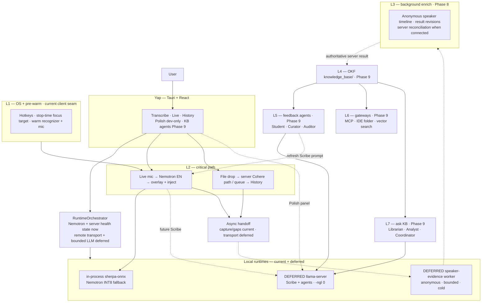
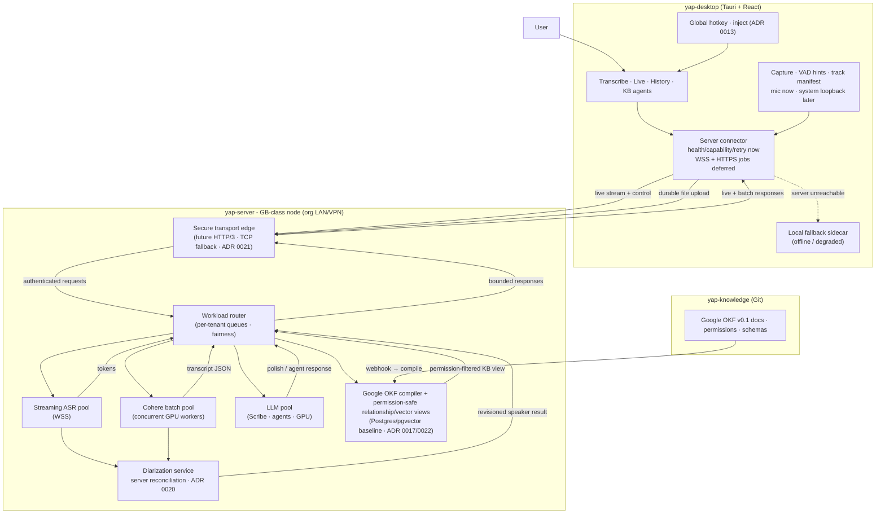
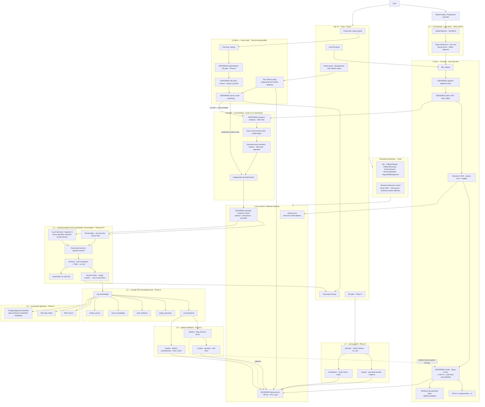
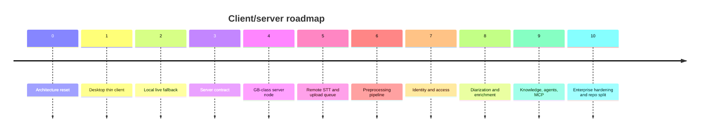

# Yap & Voice OS — System Architecture

**Status:** Living document (2026-07-13)
**Authority:** Decisions are normative according to status in [ADR 0001–0022](adr/README.md). This doc is the readable synthesis of the full Voice OS flowchart + reconciled Yap decisions.

For implementation truth rather than decision intent, use the living [ADR implementation status audit](ADR-IMPLEMENTATION-STATUS.md). An accepted ADR or a documented flowchart node is not proof that its code exists.

> **2026-07-08 — Local model reset:** Yap keeps one local live/offline fallback model: Nemotron 3.5 ASR Streaming 0.6B INT8 through in-process `sherpa-onnx`. Client-side fusion routing is rejected; model routing belongs on the server.

> **ADR precedence:** ADR 0014-0022 define the current thin-client, server, local-fallback, meeting-processing, transport-evolution, and knowledge-projection direction. ADR 0020 supersedes conflicting diarization details in ADR 0004 and ADR 0015. ADR 0021 makes HTTP/3 a gated future secure-edge target without changing the bounded Phase 3 loopback service. ADR 0022 adopts pinned Google OKF v0.1, requires a permission-safe Postgres/pgvector plus typed-relationship baseline, and makes Neo4j an optional benchmark-gated challenger; no database becomes the knowledge or authorization source-of-truth. The desktop owns capture, deterministic preprocessing, recording, hotkey/UI, local live fallback, optional anonymous speaker evidence, and future transport packaging. The server owns official long-recording STT, authoritative meeting reconciliation, purpose-authorized named identity, team storage, KB compilation, and agent workloads.

---

## Is this a good idea?

**Yes — if you build it in phases.** The architecture is sound engineering; the main risk is building the whole “Voice OS” before Yap reliably transcribes files.

### Why it’s a good idea

| Principle | Why it works |
|-----------|--------------|
| **Local-first (solo profile)** | Offline, privacy-max; no cloud STT lock-in for individual users. |
| **On-prem GPU (team profile)** | The GB-class server node is org-owned hardware on an org-controlled LAN — "our hardware, our network." Not cloud. Moving batch work off the client is promising, but GB10 wall time and safe concurrency remain benchmark gates. |
| **Critical path isolation** | Live stays fast; heavy work (diarization, OKF, agents) never blocks typing. |
| **Right model per job** | Nemotron INT8 for local live/offline fallback; server router for official recordings/live; **LLM pool** for polish/agents — not one model for everything. |
| **Revisioned diarization** | Local results may use anonymous `Unknown` and `Speaker N`; server reconciliation may refine boundaries and attach purpose-authorized names. |
| **Model-agnostic diarizer** | Existing `sherpa-onnx` APIs provide the first local baseline; SphereVBx-PF and overlap-aware models must earn promotion through benchmarks. |
| **Graceful degradation** | Dual-track Scribe, quarantine folder, RAG confidence gates, offline fallback to local sidecar — production-minded. |
| **Recordings as moat** | Journalists/researchers already have files; Cohere batch (GPU-accelerated in team profile) is differentiated vs pure dictation apps. |

### Where it can go wrong

| Risk | Mitigation (in ADRs) |
|------|----------------------|
| **Scope creep** | Ship desktop history/playback → local live fallback → server STT → preprocessing → diarization → L3 OKF in that order. |
| **Target local runtimes** | Today only the in-process sherpa live recognizer exists. If the deferred solo LLM and evidence workers ship, keep their lifecycle bounded and release them by measured idle/resource policy. |
| **Local ASR dependency** | Pin artifacts; verify hashes; profile chunk/latency; CI smoke tests. |
| **Wispr comparison on v1** | Keep hotkey + focused-field injection client-owned and regression-tested; never make insertion depend on the server. |
| **OKF/agents before core STT** | Transcripts history first; OKF Phase 9. |

### Verdict

- **Yap (batch + live EN + polish):** Strong product — ship this.
- **Source-aware meeting diarization:** Good idea for meetings/interviews - canonical Phase 8 after track/timeline contracts are stable; never block dictation on it.
- **Full agentic KB + MCP:** Ambitious second product layer — good *direction*, don’t block the live dictation path on it.

---

## What Yap is today vs where we’re going

| | **Current + next Yap boundary** | **Voice OS (long-term)** |
|--|---------------------|---------------------------|
| Primary input | File imports + explicit live mic + global dictation hotkey; paste-last is optional and imports remain a queue shell | Same client inputs plus future connected server routes |
| Live language | **English only** | Multilingual live router (future ADR) |
| Batch language | Server Cohere **14 langs** (manual + LID gate later) | Same |
| STT runtime | **Nemotron INT8 sherpa fallback** + server health connector; remote transport deferred | Same client shell; heavier pools move server-side |
| Polish | Development-only Ollama call today; bundled `llama-server` is deferred | Scribe + agents through a governed client/server LLM boundary |
| Speakers | Plain dictation; optional anonymous meeting labels later | Revisioned diarization + purpose-authorized server identity + OKF |
| Knowledge | Transcripts history (solo) / `yap-knowledge` Google OKF + compiler (team) | Permission-safe OKF graph/vector views + glossary agents + Q&A |

---

## Two deployment profiles

| Attribute | **Solo / fallback** | **Team / server** |
|-----------|------------------------|-------------------|
| Target | Individual users with local live fallback | Org teams on a shared GB-class server node |
| STT (live) | Local Nemotron INT8 (`sherpa-onnx`) | Server streaming ASR pool (WSS) |
| STT (batch) | Queue/block when offline; official larger recordings use the server path | Server Cohere batch pool (concurrent GPU workers) |
| LLM | No shipped local LLM; development Polish currently calls Ollama | Future server LLM pool (GPU, multi-tenant) |
| Diarization | Optional local `Unknown` / `Speaker N`; no durable profiles | Server-authoritative reconciliation; algorithms selected by benchmark (ADR 0020) |
| Identity | Per-transcript contact labels only; no biometric matching | Entra ID / MSAL + explicit voice enrollment (ADR 0016/0020) |
| Knowledge base | Future Google OKF Markdown with local SQLite retrieval | Future `yap-knowledge` Git + deterministic compiler + Postgres permissions/relationships + pgvector baseline; optional Neo4j challenger (Phase 9, ADR 0017/0022) |
| Network | None required for live fallback; server required for official recordings | LAN/VPN to the GB-class server node; future HTTP/3 secure edge with HTTP/2 or HTTP/1.1 fallback |

The **client shell** (`yap-desktop`) is identical in both profiles. Mic capture, track-aware preparation, explicit gaps, bounded sink fan-out, streaming recording, hotkey, overlay UI, local Nemotron fallback, durable imported-job ownership, and connector health/capability/retry state are implemented. Opus, WSS, upload/drain, authentication, and remote execution remain deferred. Server unavailability queues or blocks larger recordings instead of silently producing official-looking transcripts from the fallback.

The on-prem GB-class server node is **org-owned hardware on an org-controlled LAN** — not a public cloud service. The current profile is DGX Spark GB10; a future GB300-class node should be a capacity/profile change, not a product architecture change. This is consistent with the "no cloud STT" principle for regulated/clinical orgs.

Details: [ADR 0014](adr/0014-server-tier-compute-topology.md) (topology) · [ADR 0020](adr/0020-meeting-capture-diarization-authority.md) (meeting capture and diarization) · [ADR 0016](adr/0016-auth-identity-bridge.md) (auth and purpose-authorized identity) · [ADR 0017](adr/0017-knowledge-base-compiler.md) (KB compiler) · [ADR 0018](adr/0018-three-repo-topology.md) (repos) · [ADR 0021](adr/0021-http3-secure-edge-transport.md) (gated HTTP/3 edge) · [ADR 0022](adr/0022-google-okf-permission-safe-projections.md) (Google OKF and permission-safe graph/vector views)

---

## Core decisions (summary)

1. **Recordings → server Cohere** (accuracy, multilingual, long files).
2. **Live mic / offline fallback → Nemotron INT8** (English v1).
3. **One warm local sherpa recognizer**; server router owns heavier model residency.
4. **SpeechBrain LID** = language **gate** (“Detected French — continue?”), not silent auto-`-l`.
5. **Meeting enrichment** = independent bounded sinks and revisioned results; never block dictation.
6. **Diarization** = local anonymous evidence when available; server-authoritative reconciliation and purpose-authorized names.
7. **Align raw STT**, never polished LLM text, before word→speaker intersection.
8. **On-prem GPU** = "our hardware, our network" — not cloud; extends local-first trust to the org's LAN (team profile).
9. **Auth** = Entra ID / MSAL; `(tid, oid)` principal key; Yap API audience validation; explicit consent before any durable voice profile.
10. **KB compiler** = pinned Google OKF/Git source-of-truth + deterministic compile → Postgres permission/relationship ledger + pgvector baseline + optional Redis; Neo4j must earn promotion.
11. **Transport evolution** = bounded loopback service now; authenticated HTTP/3 secure edge later, with TCP fallback and benchmark gates.

Details: [ADR 0001](adr/0001-dual-stt-backends.md) · [0002](adr/0002-crispasr-unified-stt-runtime.md) · [0003](adr/0003-long-term-voice-architecture.md) · [0004](adr/0004-background-diarization-okf-agents.md) · [0005](adr/0005-llama-server-agents.md) · [0006](adr/0006-silero-agents-state-machine.md) · [0014](adr/0014-server-tier-compute-topology.md) · [0016](adr/0016-auth-identity-bridge.md) · [0017](adr/0017-knowledge-base-compiler.md) · [0018](adr/0018-three-repo-topology.md) · [0019](adr/0019-local-streaming-model-selection.md) · [0020](adr/0020-meeting-capture-diarization-authority.md) · [0021](adr/0021-http3-secure-edge-transport.md) · [0022](adr/0022-google-okf-permission-safe-projections.md)

---

## Pipeline charts

Two views of the same target architecture - **high-level** for orientation, **low-level** for implementation. They include deferred components so each future boundary has a home; a node is current only when its label or the implementation-status sections below say so. Normative rules live in [ADR 0001–0022](adr/README.md); sections below expand each box.

**Target read order:** UI → **RuntimeOrchestrator** → local fallback or server connector. **L3** never blocks L2. If the deferred local LLM product is activated, **Polish** and **Scribe** share **llama-server** via the mutex rules in [ADR 0006](adr/0006-silero-agents-state-machine.md). Today Polish is a development-only Ollama call and Scribe/llama-server are absent.

### High-level overview

Current and deferred layers, dual inputs, and async handoff — no per-node detail.



Imported and official recording jobs never run through local Nemotron. When the server is unavailable they remain queued or blocked; "offline" describes connectivity, not a local file-transcription mode.

### Team / server profile — high-level

Thin client shell + GB-class server node. The client connector currently owns only validated health/capability/retry state. In the planned connected profile, deferred transport will stream Opus audio and receive tokens/labels from future server model pools. See [ADR 0014](adr/0014-server-tier-compute-topology.md).



### Low-level target detail — 7 layers

Full Voice OS target flowchart reconciled for Yap — **live + batch**, orchestrator, local runtimes, manifests, and canonical Phases 8–9 enrichment. Arrows show intended flow, not landed integration; deferred nodes are labeled directly.



**Meeting transport:** bounded windows may align to VAD boundaries but never grow without bound. Full retained source audio remains available for authoritative reprocessing; client VAD is advisory ([ADR 0020](adr/0020-meeting-capture-diarization-authority.md)).

**Transport evolution:** the Phase 3 application stays on bounded loopback HTTP/1.1. After the remote transport and authentication baselines exist, the client-facing edge may promote HTTP/3 with HTTP/2 or HTTP/1.1 fallback. WSS over HTTP/3 and a supported WebTransport candidate must be benchmarked against the authenticated WSS baseline before promotion ([ADR 0021](adr/0021-http3-secure-edge-transport.md)).

---

## Decision-coverage matrix

Everything from the original 7-layer flowchart and master spec is represented below. **Reconciled** items differ from the original diagram on purpose (ADRs override). The checkmark means the decision is documented, not implemented; current implementation scores live in [ADR-IMPLEMENTATION-STATUS.md](ADR-IMPLEMENTATION-STATUS.md).

| Original flowchart node | Decision documented? | Where | Yap decision (if changed) |
|-------------------------|-------------|-------|---------------------------|
| **L1** Global OS listeners | ✅ | ADR 0013 | Tauri hotkeys + Windows target-validated injection are active; other platforms follow |
| **L1** Pre-warm (llama.cpp KV, mic, Silero) | ✅ | ADR 0002, 0005, 0019 | Warm **Nemotron recognizer** is implemented; llama-server and Silero are deferred |
| **L2** Mic, WebRTC/AGC clean | ✅ | § L2 | Capture foundation is implemented; AGC and Silero are deferred |
| **L2** VAD | ✅ Reconciled | Local audio spec, ADR 0020 | Advisory boundaries and endpointing; false negatives never erase source audio |
| **L2** SpeechBrain LangID | ✅ | ADR 0003 | **Off L2**; batch gate is canonical Phase 6 |
| **L2** ASR | ✅ Reconciled | ADR 0001–0002/0014/0019 | **Nemotron local fallback**; **server router** for official recordings/live |
| **L2** Post-LLM (Llama 3 8B) | ✅ Reconciled | ADR 0005 | Deferred **llama-server** target; current development Polish uses Ollama |
| **L2** Ghost preview | ✅ | § L2 | In-app panel v1 |
| **L2** Cross-app injector | ✅ | ADR 0013 + `live/injection.rs` | Revalidate stop-time target; Unicode input; visible clipboard fallback |
| **L2** Bounded track handoff | ✅ Reconciled | Local audio spec, ADR 0020 | Independent sinks, content identity, and explicit gaps |
| **L3** Handoff audio + raw text | ✅ Reconciled | ADR 0020 | Versioned source tracks and immutable raw artifacts |
| **L3** Forced alignment | ✅ Reconciled | ADR 0007, ADR 0020 | Align raw text only; server result is authoritative |
| **L3** Anonymous local speaker evidence | ✅ Reconciled | ADR 0020 | Contracts permit `Unknown` / `Speaker N`; no production speaker model is wired |
| **L3** Server diarization + identity | ✅ Reconciled | ADR 0016, ADR 0020 | Revisioned reconciliation; names require active purpose grants and provenance |
| **L3** Word-to-speaker timeline | ✅ Reconciled | ADR 0020 | Model-derived boundaries with result revision and confidence |
| **L3** OKF parser | ✅ | ADR 0004 §6 | Phase 9 |
| **L3** Worker isolation | ✅ Reconciled | ADR 0020 | Optional client evidence and server reconciliation are independent from capture/ASR |
| **L4** knowledge_base dirs | ✅ | § Process layout | + `team_knowledge/` in long-term OKF |
| **L5** Student, Curator, Watcher loop | ✅ | § Agents | Three-strike + git opt-in |
| **L5** Auditor | ✅ | § Agents | Weekly cron; Phase 9 |
| **L5** Rewriter → Post prompt cache | ✅ | § Agents | Updates Scribe system prompt |
| **L6** IDE, MCP, VectorDB | ✅ | Phase 9 | Open-folder KB |
| **L7** Librarian, Analyst, Coordinator | ✅ | § Agents | RAG + citations + todos |
| **Failure states** (Scribe, Archivist, …) | ✅ | § Failure states | Full spec below |
| **Bottleneck / resource caps** | ✅ | § Resource profiling | Bounded sinks, bounded session clusters, benchmarked CPU/RSS/latency gates |
| **Silero VAD (L2 + segments → L3)** | ✅ | [ADR 0006](adr/0006-silero-agents-state-machine.md) | Rust ONNX; no re-VAD in worker |
| **Agent profiles (8 personas)** | ✅ | [ADR 0006](adr/0006-silero-agents-state-machine.md) | Mutex groups; v1 = Scribe only |
| **Runtime state machine** | ✅ | [ADR 0006](adr/0006-silero-agents-state-machine.md) | One client-local Nemotron session; server pools schedule independently; bounded LLM queue |
| **16 GB RAM budget** | ✅ Reconciled | ADR 0020 | No diarization model is promoted without measured CPU, RSS, and latency evidence |
| **Recordings / file drop (Yap)** | ✅ | ADR 0001, 0003, 0014 | Server batch only; queue/block during disconnects; never use local Nemotron |

Rows marked as future remain architecture-only. The Windows hotkey/injection path, local live fallback, Nemotron-gated source-aware microphone capture, bounded recording/local-ASR fan-out, and durable recording/recovery path are implemented client behavior. Bounded evidence and transport ports exist, but their production consumers are not wired.

---

## Layer model (7 layers)

| Layer | Name | Yap phase | Role |
|-------|------|-----------|------|
| **L1** | OS listeners + pre-warm | Current client | Hotkey, foreground-field injection, warm recognizer/mic |
| **L2** | Real-time critical path | Current + follow-on | Nemotron → UI/inject now; optional Scribe later |
| **L3** | Async background | 8–9 | Align, diarize, stitch, OKF |
| **L4** | Google OKF knowledge base | 9 | Markdown/YAML concepts, typed Yap relationships, Git history, permission-safe projections |
| **L5** | Agentic feedback | 9 | Student, Curator, Auditor |
| **L6** | Ecosystem gateways | 9 | MCP, vector search, IDE folder |
| **L7** | Ask-your-KB agent | 9 | Librarian + Analyst |

---

## Real-time path (L2) — implemented baseline

```
Nemotron INT8 startup (required before current production capture)
Mic → bounded capture/preprocess → Nemotron INT8 (sherpa-onnx)
  → partial/final state → overlay
  → stop-time target revalidation → Windows Unicode injection
  → clipboard fallback when target/input validation fails
  → track-aware prepared frames + exact gaps
      → independent bounded recording + local-ASR consumers
      → bounded evidence + transport ports (production consumers not wired)
      → streaming WAV + immutable capture sidecar/commit
      → hash-validated history, partial recovery, and deletion
```

### Target fan-out beyond the implemented baseline

The following includes deferred components. Today the production coordinator wires recording and local Nemotron ASR only; it does not run Silero, llama-server/Scribe, speaker inference, or server transport.

```
Mic → optional AGC → Silero VAD                         [deferred]
  → Nemotron INT8 (sherpa-onnx, English)       ← live tokens
  → llama-server polish (Scribe) if <400ms budget   [deferred]
  → ghost UI + focused-field injection (Windows)   ← clipboard fallback if blocked

Parallel (never blocks above):
  prepared microphone frames + explicit gaps
    → recording sink
    → optional anonymous speaker-evidence sink
    → future retryable server-transport sink
```

The production coordinator currently supplies recording and local-ASR consumers; `speaker_evidence` and `server_transport` are `None`. The coordinator contract lets recording fail or finalize independently of ASR, but the user-facing production start path does not yet capture without first constructing the Nemotron stream and local-ASR adapter.

**Not on the L2 hot thread:** official server ASR, language ID, speaker inference, alignment, reconciliation, identity matching, and OKF.

---

## Background path (L3) — hardened

### Conceptual future server chunk payload

This snake_case example is explanatory server-contract material, not the current Rust serialization. The implemented client contracts serialize camelCase fields and include nested replay/content identity and revision information. The machine-readable Phase 3 contract must be generated from or tested against those current types rather than copying this example.

```json
{
  "schema_version": 1,
  "chunk_id": "...",
  "owner_namespace": "local:<install-id>",
  "session_id": "...",
  "track_id": "mic-0",
  "track_source": { "kind": "captured", "source": "microphone" },
  "sequence_start": 0,
  "sequence_end": 319,
  "start_ms": 0,
  "duration_ms": 32000,
  "sample_rate_hz": 16000,
  "codec": "pcm_s16le",
  "content_sha256": "...",
  "audio_artifact_id": "...",
  "session_mode": "dictation|meeting",
  "session_origin": "live_capture|imported_file",
  "vad_segments": [[1200, 3400]],
  "gaps": [],
  "route": "local_fallback|server_live|server_batch",
  "degraded": false
}
```

For an import, `track_source` is `{ "kind": "imported", "provenance": "unknown|mixed|user_declared" }` with an optional declared source. The local owner namespace prevents collisions on one installation; when a chunk crosses the server boundary, the server replaces it with the token-derived `(tenant_id, owner_subject_id)` and never trusts a client-supplied tenant owner.

Raw/polished text, language, and speaker attribution are not capture-manifest fields. Each belongs to a separate immutable result revision that references the capture or chunk hash, so reprocessing cannot mutate capture history.

### Timestamped speaker result (separate revision)

```json
{
  "session_id": "...",
  "revision": 3,
  "authority": "server_authoritative",
  "created_at_utc": "2026-07-10T12:00:00Z",
  "capture_manifest_sha256": "...",
  "status": "complete|partial",
  "language": { "tag": "en-US", "confidence": 0.98 },
  "speaker_turns": [
    { "turn_id": "t1", "start_ms": 1200, "end_ms": 3400, "speaker": "speaker-1", "confidence": 0.94 }
  ],
  "aligned_words": [
    { "index": 0, "text": "Hello", "start_ms": 1280, "end_ms": 1640, "turn_id": "t1", "speaker": "speaker-1" }
  ]
}
```

All intervals are end-exclusive on the monotonic session timeline. Speaker turns may overlap. Segment timestamps exist independently of word alignment; alignment adds word-level timestamps and speaker intersection later.

### Processing per chunk

1. **Validate** schema, session, track, timing, content identity, and gaps.
2. **Preserve** raw audio and raw text as immutable inputs.
3. **Project local evidence** to `Unknown` or session-scoped `Speaker N` when the optional client path is available.
4. **Reconcile on the server** from retained source audio; align raw text and publish a new result revision.
5. **Attach names only** through purpose-authorized, tenant-scoped profiles with model and calibration provenance.

### Back-pressure

- Every sink is bounded and reports its own degraded state.
- Recording has priority over optional ASR, evidence, and transport work.
- Exceeding the local speaker safety ceiling yields `Unknown` plus a server-reprocessing marker.
- Thread counts, queue depths, and idle policy are measured runtime configuration, not fixed architecture constants.

### Batch recordings

- Imported files retain a whole-file artifact and may use bounded processing windows.
- Live meetings retain source tracks and may use bounded transport windows aligned to VAD hints.

---

## Agents & failure modes

### Agent roster (8 personas)

Scoped profiles, mutex groups, and state rules: **[ADR 0006](adr/0006-silero-agents-state-machine.md)**.

| Agent | Layer | Trigger | Job | LLM? |
|-------|-------|---------|-----|------|
| **Scribe** | L2 | Raw STT tokens | Filler strip, grammar, jargon dict | llama-server |
| **Archivist** | L3 | Chunk JSON ready | OKF markdown + YAML frontmatter | No |
| **Student** | L5 | New conversation saved | Flag unknown terms/acronyms | Optional |
| **Curator** | L5 | User defines term | Glossary card, wiki-links, refresh Scribe prompt | llama-server |
| **Auditor** | L5 | Weekly / on bulk edit | Flag contradictions across notes | llama-server |
| **Librarian** | L7 | User query | Hybrid retrieve → context pack | No |
| **Analyst** | L7 | Context pack | Grounded answer + citations | llama-server |
| **Coordinator** | L7 | New transcript | Extract action items → todos | llama-server |

### Failure states (graceful degradation)

| Agent | Risk | Fallback |
|-------|------|----------|
| **Scribe** | Hallucination / over-edit | **Dual-track** raw + polished; undo → raw; **>400ms → raw only** on live |
| **Archivist** | Bad JSON / write fail | **`quarantine/`** — audio + text; worker continues |
| **Student** | Notification spam | **Three-strike rule**; **Ignore forever** blacklist |
| **Curator** | Broken wiki-links | **Opt-in git**; auto-commit before bulk edits; rollback |
| **Auditor** | False conflicts | Non-blocking toast; user dismisses |
| **Librarian** | No good hits | Confidence **<0.60** → do not pass to Analyst |
| **Librarian** | Too many hits (>50) | Pass **5 most recent**; flag “summarize older?” |
| **Analyst** | RAG hallucination | Must cite sources; “no solid notes” template if empty context |
| **Coordinator** | False commitments | **Proposed tasks** vs auto todos by confidence score |

---

## Runtime orchestration (summary)

**Target state-machine limits** — full decision in [ADR 0006](adr/0006-silero-agents-state-machine.md). The implemented Rust boundary enforces the local Nemotron lifecycle and projects connector health/capabilities/retries. LLM scheduling, Silero, and remote server transport/processing are not wired:

| Rule | Limit |
|------|--------|
| Local STT loaded | Client fallback loads **Nemotron INT8 only**; server router owns fusion/routing |
| Scribe (HOT) | **1** at a time; **400 ms** max |
| Background LLM agents | **1 queued** (Student, Curator, Analyst, …) |
| Speaker evidence | Optional, bounded, anonymous, and independently degradable |
| Background agents during live | **Blocked** except Scribe |
| Meeting workers | Load only for meeting work; release by measured idle/resource policy |

**VAD:** Runs outside inference ownership and supplies advisory endpointing and segment hints. Source audio remains authoritative, so later processing may revise VAD decisions.

```
Idle ↔ FallbackReady ↔ FallbackRunning  (local Nemotron INT8)
Idle ↔ ServerQueued ↔ ServerUploading   (GB-class server Cohere)
         client does not load local Cohere in PR3
```

### Desktop implementation guardrails

These rules prevent the repeated UI and runtime churn we have been seeing. They are part of the architecture contract, not polish notes.

**Current gaps:** these guardrails are not all landed. The current implementation uses a fixed 260×40 native overlay frame, a 260×8 Windows idle interaction region, and frontend-issued surface changes. Shortcut settings still accept typed chord strings; only dictation has a default and paste-last starts off. The convergence client must close those gaps without weakening the working Windows injection path.

| Surface | Do | Do not |
|---------|----|--------|
| Live island geometry | Keep one continuously reused tray-owned island window and one owner for native bounds. Collapsed bounds match the visible island; hover expands the same window downward to match the visible controls. | Do not use a second island window, an oversized transparent click-catcher, or competing Rust/React geometry owners. |
| Live island motion | Keep a visible hover target through the collapse grace period and animate content inside the current native bounds. Test hit testing and focus while the surface is moving. | Do not leave transparent native-window area intercepting clicks or let expansion activate/focus the app. Do not rely only on settled screenshots. |
| Overlay permissions | Give the overlay window only the capabilities it needs for its owner boundary. | Do not grant frontend `set_size`, `set_position`, or monitor permissions if Rust owns geometry. |
| Live transcription process | Prefer one session owner and explicit lifecycle boundaries. Until the sidecar exposes reset/ack/session tags, stale stdout must not be able to enter a new dictation session. | Do not hide clipping or stale-session risk behind warm reuse unless there is a protocol-level ready/reset signal. |
| Recording history | Keep one canonical transcript/review surface and one cache owner. | Do not maintain separate preview dialogs, separate read-through caches, or fake recording adapters for the same transcript row. |
| Settings and controls | Ship usable dictation and paste-last defaults. Enter an explicit "Change shortcut" mode that records one physical chord, normalizes it on release, supports Cancel and Reset, and preserves the previous registration on failure. | Do not require users to type chord strings, accept bare printable/OS-reserved chords, capture outside deliberate recording mode, or log/store raw key events. |
| Docs and code | Update the ADR/spec/product surface in the same phase as the code. | Do not ship behavior that contradicts the client/server split: live local fallback is allowed; official long recordings queue for server. |
| Speaker privacy | Persist anonymous timelines and user labels; keep local embeddings transient. | Do not turn contact import, transcript renaming, or meeting attendance into passive voice enrollment. |
| Server staging | Keep the implemented Phase 3 boundary to tested health, contracts, and the route-selection skeleton. Add transport, queues, and worker runtimes only with their Phase 4-5 gates. | Do not mistake the skeleton for a production workload router or add placeholder worker code, app firewall exposure, Docker deployment, or service-disabling host tweaks ahead of a gated runtime. |

---

## Resource profiling (16 GB target)

| Concern | Fix |
|---------|-----|
| CPU thread thrashing | Independent bounded sinks; speaker work stays off the capture/ASR hot thread |
| RAM growth | Session clusters target 32 and stop at the 64-speaker safety ceiling; exemplars remain bounded and transient |
| Live dropouts | Recording is the priority sink; callback loss becomes an explicit timeline gap |
| Short or noisy turns | Under 1.6 seconds is weak evidence; use calibrated score, margin, quality, and cumulative speech rather than a forced match |
| Speaker-label churn | Stable IDs within a result revision; merges, splits, server reconciliation, and user corrections create explicit revisions |
| Queue backlog | The Rust-owned durable ledger preserves backlog independently; automatic reconnect upload/drain remains deferred |

---

## Language policy

| Mode | Languages | Detection |
|------|-----------|-----------|
| **Live** | English only (v1) | No LID on hot path |
| **Batch / larger recordings** | Server Cohere 14 | Manual picker; SpeechBrain **suggests** with user gate (Phase 6) |

Supported batch codes: `en`, `fr`, `de`, `it`, `es`, `pt`, `el`, `nl`, `pl`, `zh`, `ja`, `ko`, `vi`, `ar`.

UI copy: **“Local fallback: English · Server files: 14 languages”**

---

## Process & data layout

### Target solo / local-first profile

Only the in-process sherpa recognizer, model cache, transcripts/history artifacts, and normal logs exist today. The other entries below are deferred targets.

```
Yap (Tauri)  [yap-desktop]
  ├─ sherpa recognizer         STT — Nemotron INT8 fallback
  ├─ llama-server sidecar      [deferred] Polish + LLM agents (CPU -ngl 0)
  └─ speaker-evidence worker   [deferred] anonymous meeting labels; no durable identity

%APPDATA%/com.mcnatg1.yap/     Tauri app_data_dir on Windows
  models/                      pinned model cache
  live-recordings/             committed audio/transcript history
  jobs.sqlite3                 durable imported-job ledger
  live-settings.json           client capture/overlay settings
  server-settings.json         validated server origin settings
  knowledge_base/              [deferred] OKF (Phase 9)
    conversations/
    jargon_glossary/
    work_artifacts/
    team_knowledge/
    media_cache/
    quarantine/
  logs/
    knowledge-worker.log       [deferred]
```

### Target team / server profile

The hardened host bootstrap, machine-readable HTTP/live contracts, bounded loopback capability-health service, desktop health connector/state machine, and durable SQLite imported-job ledger exist. Upload/WSS transport, queue drain, server processing, pools, databases, secure transport edge, and the `yap-knowledge` repository below are deferred.

```
yap-desktop (Tauri) — thin client shell
  ├─ Track-aware capture       VAD hints + source manifests + explicit gaps
  ├─ sherpa recognizer         Offline fallback only (Nemotron INT8)
  └─ Server connector          health/config/retry implemented; [deferred] WSS + HTTPS jobs + HTTP/3 negotiation

yap-server (GB-class server node, org LAN/VPN)
  ├─ Secure transport edge      [future] HTTP/3 + HTTP/2 or HTTP/1.1 fallback (ADR 0021)
  ├─ Workload router            per-tenant queues, fairness, backpressure
  ├─ Streaming ASR pool         WSS endpoint
  ├─ Cohere batch pool          concurrent GPU workers
  ├─ LLM pool                   Scribe + agents, GPU
  ├─ Diarization service        authoritative model-selected reconciliation (ADR 0020)
  ├─ KB compiler service        Lane 1 + Google OKF Lane 2 → Postgres/pgvector + optional Redis (ADR 0017/0022)
  ├─ Identity DB (Postgres)     (tid, oid) → purpose-authorized versioned voice profile (ADR 0016/0020)
  ├─ Redis                      hot permission cache
  ├─ Neo4j                      [optional] disposable GraphRAG challenger; promote only by benchmark
  └─ S3                         raw blobs, backups, snapshots

yap-knowledge (Git repo, org LAN)
  ├─ meetings/                  Lane 1 entry point (normalised OKF)
  ├─ conversations/             curated stitched sessions (Lane 2)
  ├─ jargon_glossary/
  ├─ permissions/               mutable source-of-truth for access control
  ├─ schemas/
  └─ agent_artifacts/           generated knowledge with provenance
```

---

## Master roadmap

The canonical roadmap is organized around the product boundary: **desktop thin client → server brain → enterprise/network layer**. ADR phase labels remain as historical aliases, but active specs use client/server names.



| Phase | Boundary | Deliverable | Old refs |
|-------|----------|-------------|----------|
| **0** | architecture | Reset around thin client, server brain, local fallback, and queued offline behavior. | ADR 0014/0018 |
| **1** | desktop foundation | Recordings home, playback, setup, typed job projection seams, source-aware capture contracts, bounded sink fan-out, and crash-safe recording. | Phase 3 UI work; ADR 0020 prerequisite slices |
| **2** | desktop fallback | Local Nemotron INT8 live/offline fallback with explicit model downloads. | Phases 1-2; ADR 0001/0002/0019 |
| **3** | contract | Server API/WSS contract, health, job/error model, client connector health state, and Rust-owned durable imported-job ledger. | Old Phase 8; server-tier spec |
| **4** | server node | GB-class node provisioning, firewall, model-pool layout, and workload router skeleton. | ADR 0014 |
| **5** | remote STT | Connected-mode STT for long recordings, upload jobs, and server ASR routing. | Old Phase 5/8 |
| **6** | preprocessing | Audio normalization, VAD/chunk manifests, LID, forced alignment, word timestamps, and retryable pipeline state. | ADR 0004/0007/0008/0009 |
| **7** | identity/access | Entra/MSAL bridge, Yap API audience, purpose grants, tenant-scoped identity, and permission hooks. | Old Phase 9; ADR 0016/0020 |
| **8** | meeting evidence | Local anonymous speaker evidence, timestamped result revisions, server reconciliation, and purpose-authorized named identity. | Old 7b/10; ADR 0020 |
| **9** | knowledge | Pinned Google OKF, KB compiler, agents, GraphRAG/vector retrieval, MCP, and permission-safe virtual views. | Old 7c-7e/11; ADR 0010/0011/0012/0017/0022 |
| **10** | enterprise/release | Zscaler/corporate access hardening, HTTP/3 secure-edge evaluation, production publication governance/evidence, audit/deploy runbooks, and eventual repo split. | Old 7+/12; ADR 0013/0018/0021 |

### Current phase status

| Phase | Status | Where we are now |
|-------|--------|------------------|
| **0** | Done enough | Docs now point at thin client + server brain as the main direction. |
| **1** | Capture foundation and durable imported-job ledger implemented | History/playback/setup, source-aware production microphone capture, exact gaps, independent bounded sinks, streaming recording, immutable sidecar/commit, recovery/deletion, a Rust orchestrator projection, and the Rust-owned SQLite imported-job ledger exist. |
| **2** | Implemented baseline; hosted proof remains | Local Nemotron INT8 fallback, explicit install/remove/disable, warmup, stable errors, and tests exist. Windows native WDIO, stock NSIS packaging contracts, and release-artifact contracts exist; installer lifecycle proof now belongs only to a disposable Windows runner. Hosted lifecycle, real-model/native release CI, and measured latency/accuracy gates remain. |
| **3** | Implementation gate passed; PR closure pending | Contracts, loopback capability-health, connector/retry state, and the durable Rust ledger remain implemented. Exact candidate `c3999b7b685dd668165d54b64d1af61e41adad05` passed the one-time local/native/server/GB10 gate; tunneled health projected `Ready`, refusal projected `Retrying`, and teardown was clean. Checked-head hosted CI and the disposable-Windows installer lifecycle remain merge gates. This still does not imply same-process native UI transition, persistent service, upload/WSS/auth/ASR, or inference. |
| **4** | Host bootstrap, route-selection skeleton, and transient health proof only | Infra, the runbook, a tested live/batch route-selection skeleton, and an empty model-pool namespace exist. Exact `c3999b7b685dd668165d54b64d1af61e41adad05` was promoted and run transiently on loopback, then stopped. No production workload router, worker/model-pool runtime, service unit, persistent process, external application listener, or firewall change exists. Clock synchronization and root UFW read-back remain later gates. |
| **5** | Planned | Remote long-recording transcription waits on upload/drain, WSS, authentication, and the node runtime. |
| **6** | Planned, not optional | Preprocessing remains required: VAD/chunking, LID, alignment, timestamps, manifests, retries. |
| **7** | Planned | Auth/identity design exists but requires the corrected Yap API token audience, `(tid, oid)` key, purpose-grant records, and a server entrypoint. |
| **8** | Capture prerequisites implemented; diarization deferred | ADR 0020 and the source-aware design are canonical. Track/timeline/recording prerequisites are implemented; the anonymous speaker model, real benchmark, result production, and server reconciliation are not. |
| **9** | Planned | Google OKF conformance, KB compiler, Postgres permission/relationship ledger, pgvector baseline, optional Neo4j challenger, agents, RAG, and MCP wait on preprocessing, identity, and diarization outputs. |
| **10** | Later | Corporate access hardening, HTTP/3 edge promotion, production publication governance, and repo split come after the remote transport and authentication baselines are real. Stock installer packaging exists; checked-head lifecycle proof remains a disposable-Windows gate. |

Solo/local fallback and team/server mode share concepts, but the server path is now canonical for the main roadmap.

**Sequencing rule:** ADR 0020 spans both foundation and feature work. Its contract/manifest and independent recording-sink slices are pulled forward into the Phase 1 desktop foundation because Phase 3–5 server work must consume stable capture artifacts. Phase 8 begins with anonymous speaker inference and result reconciliation; it must not force a rewrite of capture or upload.

**Capture persistence rule:** current `live-s-...` sessions use one canonical recording contract (`PreparedFrame`, atomic `RevisionTransition`, and exact `Gap`) and are complete only after immutable sidecar/commit publication. Partial artifacts are recoverable/deletable. Pre-release timestamp-era recordings remain untouched and unindexed; no migration adapter or alternate fixture path is planned.

**Deferred after the verified Phase 3 boundary:** upload/drain, WSS/auth/server inference, model pools and server processing; the HTTP/3 secure edge and transport benchmark; system loopback; Opus transport; an anonymous-speaker/diarization model; a real WER/model benchmark; hosted production-release workflow proof; and per-OS real-model/native hardware CI.

**Future (unnumbered):** multilingual live routing; Windows system-loopback capture; and user-managed Yap contacts or permissioned OS contact/roster suggestions. Contacts may provide names, aliases, and meeting context for manual labels, but contain no voiceprints. Automatic cross-session naming waits for a separately enrolled, purpose-authorized server profile; guest voice evidence stays session-only and is recomputed from retained audio when authorized. Any encrypted local reusable voice profile requires its own privacy review and ADR.

**Build specs:** [Client state machine](specs/client-state-machine.md) · [Model download UX](specs/model-download-ux.md) · [Local audio preprocessing](specs/local-audio-preprocessing-stack.md) · [Local live fallback](specs/local-live-fallback-sidecar.md) · [Local LLM sidecar](specs/local-llm-sidecar.md) · [Live dictation client](specs/live-dictation-client-ux.md) · [Server tier MVP](specs/server-tier-mvp.md) · [Source-aware diarization](superpowers/specs/2026-07-10-source-aware-diarization-design.md) · [Testing](specs/testing-strategy.md).

**Next execution order:** the tooling-only PowerShell migration requires Core 7.4 or newer in repo-owned Windows scripts and every Windows CI job, with the supported minor-version floor exercised by a hash-pinned 7.4.17 compatibility lane. [Server contract and durable connector](superpowers/plans/2026-07-10-server-contract-durable-connector.md) is the landed Phase 3 implementation record. Upload drain, WSS runtime, ASR pools, auth, diarization, and the HTTP/3 edge remain gated by their canonical phases. ADR 0021 does not authorize UDP exposure from the Phase 3 health boundary.

---

## Phase-gate checklist

Each phase ships **code + doc/product sync** together, so positioning never lags shipped features.

| Gate | Exit criteria | Docs/product to update |
|------|---------------|------------------------|
| **1** Desktop foundation | Recordings home/playback, typed job projection seam, source-aware manifests, bounded fan-out, crash-safe recording | Client state spec; source-aware design; connected/offline and partial-recovery UX |
| **2** Local fallback | Nemotron INT8 live/offline fallback, explicit install/remove/disable | Mark [STT spec](specs/local-live-fallback-sidecar.md) Accepted; setup download docs |
| **3** Server contract | Health, job/WSS contracts, errors, client connector, Rust-owned SQLite ledger | [Server tier MVP spec](specs/server-tier-mvp.md); OpenAPI/WSS docs |
| **4** Server node | Workload router, model pools, node runbook | [ADR 0014](adr/0014-server-tier-compute-topology.md); firewall/deploy runbook |
| **5** Remote STT | Long-recording upload + server STT routing | Recording queue UX; remote/local policy |
| **6** Preprocessing | VAD/chunks, LID, forced alignment, word timestamps, manifests | Preprocessing spec; aligner/LID decisions |
| **7** Identity/access | Entra sign-in, Yap API token validation, purpose grants, tenant-scoped identity DB | [ADR 0016](adr/0016-auth-identity-bridge.md); enrollment UX |
| **8** Meeting evidence | Anonymous local labels, timestamped result revisions, benchmark gates, server reconciliation | [ADR 0020](adr/0020-meeting-capture-diarization-authority.md); [source-aware design](superpowers/specs/2026-07-10-source-aware-diarization-design.md) |
| **9** Knowledge/agents | Google OKF profile, deterministic compiler, Postgres/pgvector relationship/vector baseline, optional Neo4j challenger, RAG, MCP | ADR 0022 conformance/isolation/generation and challenger-promotion gates; permission compile SLA |
| **10** Enterprise/release | Zscaler/corp access, HTTP/3 secure-edge benchmark/promotion, packaging, repo split | ADR 0021 transport evidence; CI/CD migration; cross-repo link update |

---

## Hardening checklist (implementation)

**Client live fallback (Phases 1–2)**

- [x] In-process local Nemotron fallback
- [x] Pin Nemotron artifacts by revision and SHA-256
- [x] Add required Windows native WDIO, release-artifact contracts, stock NSIS configuration, and a disposable-Windows lifecycle harness
- [ ] Pass the stock NSIS lifecycle harness on the checked PR head in a disposable Windows runner
- [ ] Run hosted production-release proof and per-OS real-model/native CI
- [x] Model/runtime readiness in Setup UI
- [x] Stable Rust error codes and frontend projections
- [ ] Complete actionable toast/recovery coverage for every native error

**Orchestrator (Phase 1+)**

- [x] Rust `RuntimeOrchestrator` state skeleton ([ADR 0006](adr/0006-silero-agents-state-machine.md))
- [x] Move imported recording-job lifecycle ownership from React/localStorage into Rust/SQLite
- [ ] Silero ONNX in Rust audio path; `vad_segments` in manifests
- [ ] Agent profile registry; v1 enable `scribe` only
- [ ] Enforce one client-local Nemotron session, one HOT LLM, and one background LLM queue; server pools schedule independently

**Local LLM sidecar**

- [ ] Bundle llama-server; `-ngl 0`; Rust sidecar manager
- [ ] Migrate polish.ts to `/v1/chat/completions`
- [ ] `YAP_LLM_BACKEND=ollama|llama`

**Client audio foundation (pulled forward into Phases 1–5)**

- [x] Track-aware frames, manifests, content hashes, and explicit gaps
- [x] Independent bounded recording, ASR, evidence, and transport sinks
- [x] Crash-safe streaming recording, immutable capture sidecar/commit, and recover/delete lifecycle
- [x] Rust-owned durable reconnect ledger (automatic drain remains Phase 5)
- [ ] WSS/upload transport, automatic reconnect drain, and server processing

**Meeting evidence and diarization (Phase 8)**

- [x] Evidence/result contracts restrict local attribution to `Unknown` / `Speaker N` and support immutable revisions
- [ ] Production speaker inference and result publication
- [ ] Transient client embeddings; no passive contact/profile enrollment
- [ ] Server-authoritative reconciliation and purpose-authorized identity
- [ ] Align raw STT only
- [ ] Benchmark baseline, SphereVBx-PF, and overlap-aware challenger before promotion

---

## Document map

Current implementation ownership and completeness for all decisions: [ADR implementation status](ADR-IMPLEMENTATION-STATUS.md).

| Topic | ADR |
|-------|-----|
| Streaming live vs server batch split | [0001](adr/0001-dual-stt-backends.md) |
| Local fallback runtime history | [0002](adr/0002-crispasr-unified-stt-runtime.md), [0019](adr/0019-local-streaming-model-selection.md) |
| SpeechBrain LID gate, recordings moat | [0003](adr/0003-long-term-voice-architecture.md) |
| Historical background pipeline principles, OKF, agents | [0004](adr/0004-background-diarization-okf-agents.md) |
| llama-server for Scribe + agents | [0005](adr/0005-llama-server-agents.md) |
| Silero, agent profiles, state machine | [0006](adr/0006-silero-agents-state-machine.md) |
| Forced-alignment principle; engine requires revalidation | [0007](adr/0007-forced-alignment-engine.md) |
| Language-gate behavior; model/runtime requires revalidation | [0008](adr/0008-speechbrain-lid-gate.md) |
| Knowledge worker IPC protocol | [0009](adr/0009-knowledge-worker-protocol.md) |
| OKF conversation schema | [0010](adr/0010-okf-conversation-schema.md) |
| Vector index + RAG retrieval | [0011](adr/0011-vector-rag-retrieval.md) |
| MCP server surface | [0012](adr/0012-mcp-server-surface.md) |
| Global hotkey + injection (L1) | [0013](adr/0013-global-hotkey-injection.md) |
| Server tier topology + thin client + workload router + two profiles | [0014](adr/0014-server-tier-compute-topology.md) |
| Superseded server-only diarization decision | [0015](adr/0015-two-pass-diarization-speaker-identity.md) |
| Auth + identity bridge (Entra ID / MSAL, `(tid, oid)`, biometric purpose authorization) | [0016](adr/0016-auth-identity-bridge.md) |
| Team KB compiler (source-of-truth, two-lane store, permission model, disposable indexes) | [0017](adr/0017-knowledge-base-compiler.md) |
| Three-repo topology (`yap-desktop` / `yap-server` / `yap-knowledge`) | [0018](adr/0018-three-repo-topology.md) |
| Local Nemotron INT8 streaming fallback | [0019](adr/0019-local-streaming-model-selection.md) |
| Meeting capture, anonymous evidence, server reconciliation, contact/privacy boundary | [0020](adr/0020-meeting-capture-diarization-authority.md) |
| HTTP/3 secure-edge evolution with TCP fallback and benchmark gates | [0021](adr/0021-http3-secure-edge-transport.md) |
| Google OKF v0.1, Yap enterprise profile, Postgres/pgvector baseline, and permission-safe projection gates | [0022](adr/0022-google-okf-permission-safe-projections.md) |

### Build specs (how to implement)

| Spec | Phase |
|------|-------|
| [Client state machine](specs/client-state-machine.md) | 1–2 |
| [Model download UX](specs/model-download-ux.md) | 1–2 |
| [Local audio preprocessing](specs/local-audio-preprocessing-stack.md) | 1, 3, 5–6 prerequisite contract |
| [Local live fallback](specs/local-live-fallback-sidecar.md) | 2 |
| [Local LLM sidecar](specs/local-llm-sidecar.md) | polish/Scribe |
| [Live dictation client](specs/live-dictation-client-ux.md) | 1–2 |
| [Server tier MVP](specs/server-tier-mvp.md) | 3–4 |
| [Source-aware diarization design](superpowers/specs/2026-07-10-source-aware-diarization-design.md) | Foundation slices in 1/3/5; anonymous evidence in 8 |
| [Testing strategy](specs/testing-strategy.md) | all |

## Related documents

- [PRODUCT.md](../PRODUCT.md) — product voice and scope
- [DESIGN.md](../DESIGN.md) — UI principles
- [adr/README.md](adr/README.md) — decision records index
