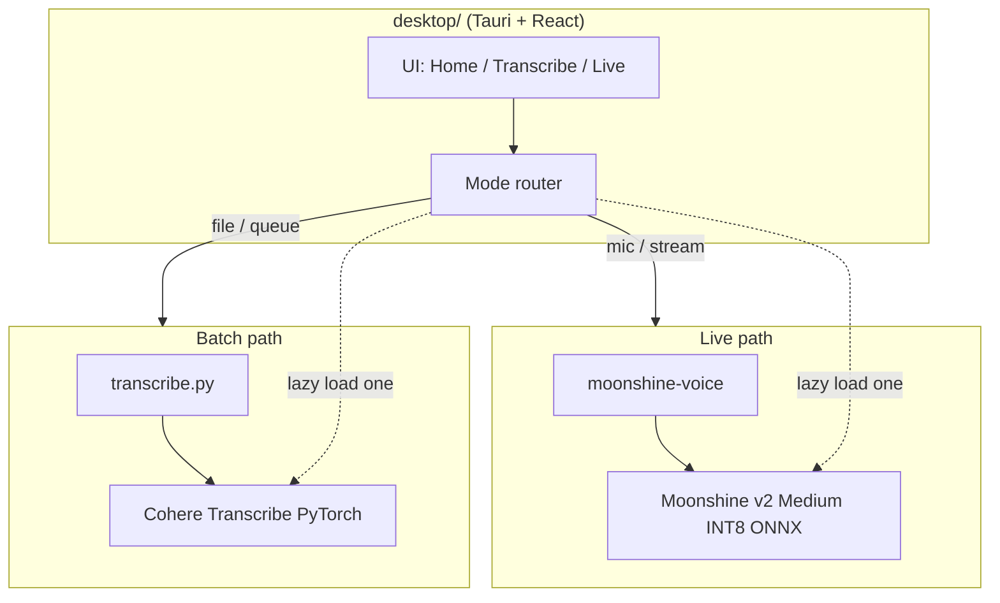

# ADR 0001: Dual STT backends — Moonshine for live, Cohere for batch

**Date:** 2026-06-30
**Status:** Accepted
**Amended by:** [ADR 0002](0002-crispasr-unified-stt-runtime.md) — runtime implementation (CrispASR + GGUF + warm sidecar) replaces the PyTorch / `moonshine-voice` ONNX paths described in this document. The **dual-model split** (streaming model for live, Cohere for batch) remains authoritative. **Live v1 is English-only** per ADR 0002 language policy. **Recordings = Cohere; LID + voice OS roadmap** in [ADR 0003](0003-long-term-voice-architecture.md).
**Amended by:** [ADR 0014](0014-server-tier-compute-topology.md) — in the **team profile**, the live path is server-hosted Moonshine GPU streaming ASR (Wispr-style WSS) rather than a local sidecar. The **solo/local-first profile** retains today's local CrispASR sidecar with Moonshine tiny. The dual-model principle (streaming for live, Cohere for batch) is preserved in both profiles.

## Context

Yap is a local-first transcription desktop app built with Tauri and React in `desktop/`, with batch transcription executed by a Python runner in `transcribe.py`. Today the product positions itself as **batch-only**: users drop audio or video files on disk, queue them, and receive accurate transcripts without sending data to the cloud. `PRODUCT.md` explicitly lists live dictation as an anti-reference (not a Wispr Flow clone).

The current speech-to-text (STT) stack is **Cohere Transcribe** (~2B parameters), loaded via PyTorch and Hugging Face Transformers:

- Default model: `ZoOtMcNoOt/yap-cohere-transcribe-03-2026` (project fork)
- Upstream fallback: `CohereLabs/cohere-transcribe-03-2026`
- Reported WER ~5.42%, 14 languages, strong accuracy on recorded media
- Runtime cost: heavy CPU/GPU footprint (~3.8 GB PyTorch weights in typical use; optional INT8 ONNX ~2.69 GB is a possible future optimization)

We want to add **live transcription** — microphone or streaming input with low latency and modest memory — without sacrificing batch quality for file-based workflows. **Moonshine v2 Medium** is a better fit for that mode:

- ~245M parameters, INT8 ONNX ~562 MB
- English streaming, WER ~6.65%
- Designed for on-device streaming via the `moonshine-voice` stack

Loading both models at once would waste RAM and slow startup on typical user machines. Neither stack will use GGUF quantization; we stay on PyTorch/ONNX paths appropriate to each upstream.

This ADR expands Yap’s architectural scope beyond batch-only STT while keeping batch transcription on the higher-accuracy backend.

## Decision

Use **two STT backends**, selected by **mode**, with **lazy loading** so only one is resident in memory at a time:

| Mode | Backend | Primary use |
|------|---------|-------------|
| **Live** (mic / streaming) | **Moonshine v2 Medium** (INT8 ONNX via `moonshine-voice`) | Real-time partial transcripts, low latency, ~562 MB footprint |
| **Batch** (files / queue) | **Cohere Transcribe** (existing PyTorch path in `transcribe.py`) | Dropped recordings, queue jobs, export-quality transcripts |

**Rules:**

1. Do **not** load Moonshine and Cohere simultaneously in normal operation.
2. Instantiate the backend when the user enters the corresponding mode (live session vs batch job).
3. Tear down or idle-unload when switching modes if memory pressure or UX requires it.
4. **No GGUF** for either backend in this architecture.

**Optional future enhancements** (out of scope for initial implementation but compatible with this decision):

- **Live capture + batch re-pass:** record live audio to WAV on disk, then run Cohere on the saved file for a higher-quality final transcript.
- **Cohere INT8 ONNX:** slimmer CPU-only batch path without changing the batch backend choice.

## Consequences

### Positive

- **Right tool per job:** streaming latency and RAM stay acceptable with Moonshine; file transcription keeps Cohere’s accuracy and multilingual support.
- **Clear product story:** live preview and dictation-style sessions become possible without replacing the batch pipeline users already rely on.
- **Lazy loading** avoids ~4+ GB combined resident weights and keeps cold start predictable.
- **Incremental rollout:** batch path remains largely unchanged; live is an additive subsystem.

### Negative

- **Two integration surfaces:** separate dependencies (`moonshine-voice` vs Transformers/Cohere), two test matrices, and two failure modes to surface in the UI.
- **English-only live path** (Moonshine v2 Medium) unless we add another streaming model later; batch still carries multilingual Cohere.
- **Slightly worse live WER** (~6.65% vs ~5.42%) — acceptable for streaming UX, not for final archival quality without a re-pass.
- **Product doc drift** until `PRODUCT.md` is updated: this ADR intentionally ahead of marketing copy.

### Neutral

- Desktop shell (`desktop/`) must route “live” vs “batch” to different runners or in-process modules; `transcribe.py` remains the batch entry point unless refactored into a shared package.
- Model download and cache sizes increase on disk (both backends may be installed) even though RAM usage stays single-backend at runtime.
- Status UI may need to show which backend is active without exposing raw model IDs on primary surfaces (per existing design principles).

## Implementation notes

### High-level architecture



ASCII equivalent:

```
┌─────────────────────────────────────────────────────────┐
│  desktop/ (Tauri + React)                              │
│  Home · Transcribe workbench · (future) Live session     │
└──────────────────────────┬──────────────────────────────┘
                           │ mode
           ┌───────────────┴───────────────┐
           ▼                               ▼
   ┌───────────────┐               ┌──────────────────┐
   │ Live          │               │ Batch             │
   │ moonshine-    │               │ transcribe.py     │
   │ voice         │               │ Cohere Transcribe │
   │ Moonshine v2  │               │ (PyTorch)         │
   │ Medium INT8   │               │                   │
   └───────────────┘               └──────────────────┘
        ~562 MB ONNX                      ~3.8 GB PT
        load on live                      load on batch
```

### Lazy loading

| Event | Action |
|-------|--------|
| User starts live session | Load Moonshine; do not load Cohere |
| User ends live / idle timeout | Release Moonshine (policy TBD: immediate vs grace period) |
| User queues file transcription | Load Cohere via existing `load_model()` in `transcribe.py`; do not load Moonshine |
| Batch queue drains / app background | Optionally unload Cohere to free RAM |

Implementation detail (TBD in code): live may run in a sidecar process or Tauri plugin; batch continues to invoke `transcribe.py` as today. The ADR only requires **exclusive residency**, not a specific IPC shape.

### Approximate resource budget

| Backend | Params | On-disk (typical) | In-memory (order of magnitude) | WER (ref.) | Languages |
|---------|--------|-------------------|----------------------------------|------------|-----------|
| Moonshine v2 Medium (live) | ~245M | INT8 ONNX ~562 MB | Sub-1 GB operational | ~6.65% | English (streaming) |
| Cohere Transcribe (batch) | ~2B | PyTorch ~3.8 GB | Several GB with activations | ~5.42% | 14 |
| Cohere INT8 ONNX (future) | ~2B | ~2.69 GB | Lower than full PT | ~5.42% (target) | 14 |

Figures are planning estimates; measure on target hardware before hardening UI copy about “minimum RAM.”

### Phased rollout

| Phase | Scope |
|-------|--------|
| **0 — Today** | Batch-only Cohere via `transcribe.py`; no Moonshine |
| **1 — Live MVP** | Moonshine live path behind explicit “live” entry; lazy load; partial transcripts in UI; batch unchanged |
| **2 — Polish** | Mode switching UX, unload policy, error handling when wrong backend unavailable |
| **3 — Optional** | Save live WAV + Cohere re-pass for final transcript; Cohere INT8 ONNX for CPU-only batch |

Update `PRODUCT.md` and in-app positioning when Phase 1 ships so live transcription is intentional, not a contradiction of anti-references.

## Alternatives considered

### Single model for both live and batch (Cohere only)

**Rejected.** Cohere’s ~2B PyTorch model is appropriate for offline file quality but too heavy for responsive streaming on typical laptops. Latency and RAM would degrade live UX.

### Single model for both (Moonshine only)

**Rejected.** Moonshine’s accuracy and language coverage are insufficient for Yap’s batch value proposition (multilingual, best-effort final transcripts from arbitrary media files).

### Wispr-style live-only product (drop batch centrality)

**Rejected.** Yap’s core loop — drop files, queue, export — is already built around batch Cohere. Live is an expansion, not a pivot.

### Cohere INT8 ONNX for everything (including live)

**Rejected for now.** Even quantized, Cohere is larger and not designed for the same streaming profile as Moonshine. INT8 ONNX remains a **batch** optimization candidate, not a live substitute.

### Load both models at startup

**Rejected.** Wastes memory and slows launch; most sessions use one mode predominantly.

### GGUF / llama.cpp-style weights for either stack

**Rejected.** Neither Moonshine nor Cohere integrations target GGUF in this project; ONNX (Moonshine) and PyTorch/ONNX (Cohere) align with upstream tooling.

### Cloud STT for live or batch

**Rejected.** Conflicts with local-first, privacy-first product purpose documented in `PRODUCT.md`.
