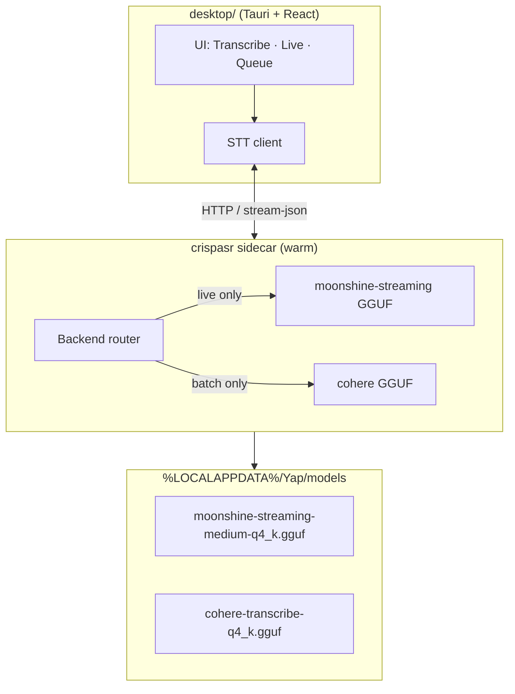

# ADR 0002: CrispASR as unified STT runtime (warm daemon + GGUF)

**Date:** 2026-06-30
**Status:** Accepted
**Amended by:** [ADR 0014](0014-server-tier-compute-topology.md) — in the **team profile**, model residency and the moonshine-XOR-cohere exclusivity rule move to the **server-side workload router**; the GPU pool can hold multiple models resident simultaneously. CrispASR on the client is demoted to an **offline/degraded-mode fallback** (local Moonshine tiny) for the team profile. The on-prem DGX Spark server is "our hardware, our network" — it is **not** a cloud service and does not conflict with local-first principles. The **solo/local-first profile** retains all decisions in this ADR unchanged.
**Supersedes:** Implementation details in [ADR 0001](0001-dual-stt-backends.md) (PyTorch `transcribe.py`, `moonshine-voice` ONNX, per-invocation subprocess, “no GGUF” rule). The **dual-model split** from ADR 0001 — Moonshine-class streaming for live, Cohere for batch files — remains in effect.

## Context

[ADR 0001](0001-dual-stt-backends.md) established that Yap should use **two STT models by mode**: a lightweight streaming model for live mic input and Cohere Transcribe for file/batch work, with **lazy loading** so only one is resident at a time.

The implementation sketched in ADR 0001 — Python + Transformers/PyTorch for batch (`transcribe.py`) and `moonshine-voice` ONNX for live — has predictable costs:

| Pain | Cause |
|------|--------|
| **Slow cold start** | Each batch run spawns a new Python process; `load_model()` imports torch/transformers and loads ~3.8 GB Cohere weights before the first file is transcribed (`desktop/src-tauri/src/lib.rs` → `transcribe.py`). |
| **Heavy RAM on CPU** | Full PyTorch Cohere is sized for GPU-class quality, not laptop CPU defaults. |
| **Two inference stacks** | Separate dependency trees (Python HF stack vs Moonshine ONNX SDK) double integration and test surface. |
| **Live latency** | Wispr-class responsiveness needs a **warm** streaming pipeline (sub-200 ms partials), not spawn-load-transcribe per utterance. |

[CrispASR](https://github.com/CrispStrobe/CrispASR) is a **native C++ inference runtime** (whisper.cpp lineage) that runs **GGUF weight files** for many ASR architectures, including:

- **`cohere`** — `CohereLabs/cohere-transcribe-03-2026` (same model family Yap uses today)
- **`moonshine-streaming`** — `UsefulSensors/moonshine-streaming-{tiny,small,medium}` (purpose-built streaming encoder)

CrispASR is the **engine**, not the model. Yap still chooses **which GGUF files** to ship/cache and **which backend** to activate per mode. This ADR records how we wire that engine for speed, caching, and Wispr-adjacent live UX without abandoning Cohere quality on files.

## Decision

Adopt **CrispASR as the single STT runtime** for both live and batch inference, backed by **GGUF models** and a **long-lived sidecar daemon** that stays warm across sessions.

### Runtime

| Piece | Choice |
|-------|--------|
| **Binary** | `crispasr` — bundled per platform in the Tauri app (same class of asset as other native deps) |
| **Process model** | **Warm sidecar** started with the app (or on first STT use); models loaded inside this process, not per job |
| **Dev fallback** | Keep `transcribe.py` (PyTorch) for development and emergency fallback until CrispASR path is proven; not the shipped happy path |

### Models (GGUF)

| Mode | CrispASR backend | Default GGUF | Approx. size | Role |
|------|------------------|--------------|--------------|------|
| **Live** (mic / streaming) | `moonshine-streaming` | `moonshine-streaming-medium-q4_k.gguf` ([cstr/moonshine-streaming-medium-GGUF](https://huggingface.co/cstr/moonshine-streaming-medium-GGUF)) | ~183 MB | Low-latency English partials; target &lt;200 ms class latency on capable hardware |
| **Batch** (files / queue) | `cohere` | `cohere-transcribe-q4_k.gguf` ([cstr/cohere-transcribe-03-2026-GGUF](https://huggingface.co/cstr/cohere-transcribe-03-2026-GGUF)) | ~1.2 GB | Multilingual file transcription; export-quality transcripts |

Quantization policy: **Q4_K as default** for size and CPU throughput; offer **Q8_0** (or user override) when quality regressions are reported on batch. Live may optionally expose **tiny / small / medium** size variants for speed vs accuracy (Settings → Live); that is **not** a language or backend picker.

### Language policy (v1)

**Live transcription is English-only for now.** Batch file transcription remains multilingual via Cohere (14 languages).

| Mode | Languages | User control |
|------|-----------|--------------|
| **Live** | **English (`en`) only** | Moonshine **size** (tiny / small / medium). **No** live language dropdown. |
| **Batch** | Cohere’s 14 (see table below) | Language picker per job or default in Settings; **required** — Cohere does not auto-detect language. |

**Live implementation rules:**

1. Sidecar live path always passes **`-l en`** (or equivalent fixed English config); do not expose other codes on the Live surface.
2. Do **not** route live mic through `cohere`, `parakeet`, `canary`, or other multilingual CrispASR backends in v1 — even if a user has batch language set to French or Japanese.
3. UI copy must state the asymmetry plainly, e.g. **“Live: English · Files: 14 languages”** — not buried in Advanced settings only.
4. Multilingual live (per-language streaming backends) is **explicitly out of scope** until a future ADR; do not imply parity between Live and Transcribe language support.

**Batch languages (Cohere `cohere-transcribe-03-2026`):**

| Code | Language |
|------|----------|
| `en` | English |
| `fr` | French |
| `de` | German |
| `it` | Italian |
| `es` | Spanish |
| `pt` | Portuguese |
| `el` | Greek |
| `nl` | Dutch |
| `pl` | Polish |
| `zh` | Chinese (Mandarin) |
| `ja` | Japanese |
| `ko` | Korean |
| `vi` | Vietnamese |
| `ar` | Arabic |

**Optional post-live path (Phase 4+):** save live WAV and re-transcribe with Cohere in the user’s batch language for a higher-quality final transcript — still not realtime multilingual live.

**Language detection (Phase 4+):** SpeechBrain LID with explicit user gate before batch — see [ADR 0003](0003-long-term-voice-architecture.md). Not in v1–v3.

### Residency rules (from ADR 0001, unchanged)

1. Do **not** keep Moonshine streaming and Cohere loaded simultaneously in normal operation.
2. **Load on mode entry** — live session → moonshine-streaming; batch job → cohere.
3. **Unload or idle-evict** when switching modes or after a configurable idle timeout (mirror llama-server / sidecar keep-warm semantics; today Ollama `keep_alive` in `desktop/src/polish.ts` until ADR 0005 migration).
4. GGUF files live on disk under a stable cache dir; mmap + OS page cache make repeat loads fast even after process restart.

### Model cache location

```
%LOCALAPPDATA%\Yap\models\     (Windows)
~/.yap/models/                 (Unix fallback)
```

- First-run or installer step downloads verified GGUF (+ tokenizer sidecars where required, e.g. `tokenizer.bin` beside moonshine-streaming).
- Bundling defaults in the installer is optional; **pre-cache on first launch** is the minimum bar.
- Environment overrides (e.g. `YAP_MODELS_DIR`, `YAP_LIVE_MODEL`, `YAP_BATCH_MODEL`) for dev and power users.

### IPC shape (Tauri ↔ sidecar)

Prefer CrispASR **server / streaming interfaces** over spawning a new `crispasr` per file:

| Operation | Interface (target) |
|-----------|-------------------|
| **Health / version** | HTTP or CLI ping on sidecar port |
| **Batch file** | `crispasr --backend cohere -m … -f path.wav -l <lang>` via sidecar API, or equivalent server endpoint |
| **Live mic** | `crispasr --live --stream-json --backend moonshine-streaming -l en …` with VAD; desktop consumes structured partial/final events (**English fixed**) |
| **Mode switch** | Sidecar command to unload current backend and load the other (exclusive residency) |

Exact port, auth (localhost-only), and JSON schema are implementation details; the ADR requires **one persistent process** and **structured streaming output** for live.

## Consequences

### Positive

- **Faster batch on CPU** — Cohere Q4_K ~1.2 GB, native ggml inference; reference ~1.08× realtime on 8 CPU threads for short clips vs multi-second Python cold starts.
- **Faster repeat loads** — GGUF mmap + OS cache; warm daemon avoids reload entirely during a session.
- **Wispr-adjacent live UX** — Moonshine streaming targets sub-200 ms partial latency; achievable only with a **warm** streaming pipeline, which this ADR mandates.
- **One inference stack** — single binary, two backends; simpler Tauri integration than Python + moonshine-voice + torch.
- **No Python at inference time** in production — smaller failure surface for end users (no venv/HF auth on the hot path if models are pre-cached).
- **ADR 0001 product split preserved** — live stays English/fast; batch stays Cohere/accurate/multilingual.

### Negative

- **Native binary shipping** — per-platform `crispasr` builds, code signing, and upgrade cadence become release responsibilities.
- **Younger runtime** — CrispASR streaming APIs and VAD/finalize behavior are still evolving; we own integration risk and must pin versions.
- **GGUF quant tradeoffs** — Q4 batch output may differ slightly from full PyTorch BF16; need spot-checks on real user media.
- **Community GGUF ports** — moonshine-streaming GGUF is converted for CrispASR; not identical path to Useful Sensors’ official ONNX SDK (acceptable if WER/latency validated).
- **Migration period** — `transcribe.py` and existing `transcribe_files` Tauri command must be rewired; dual maintenance until cutover.

### Neutral

- Disk footprint grows (~1.4 GB for both default GGUFs) but remains smaller than PyTorch Cohere alone (~3.8 GB).
- GPU acceleration (CUDA/Vulkan/Metal) is available in CrispASR but not required for v1; CPU-first story matches local-first laptops.
- `PRODUCT.md` still needs a live-transcription update when Phase 1 ships (same as ADR 0001).
- Long-term LID, language gates, and voice OS layers: [ADR 0003](0003-long-term-voice-architecture.md).

## Critical review (ADR 0002 scope)

Honest assessment of this decision — revisit when Phase 2 ships or CrispASR pins change.

### Strengths

- Removes Python cold start from the production hot path.
- GGUF + warm sidecar matches llama-server sidecar pattern for polish/agents ([ADR 0005](0005-llama-server-agents.md)).
- Recordings stay on Cohere where the product already invested (WER, 14 languages).
- English-only live avoids a 14-backend streaming matrix in v1.
- Lazy single-backend residency keeps RAM predictable on 8–16 GB machines.

### Weaknesses

- **Vendor coupling on CrispASR** — fast-moving project; we inherit breaking changes.
- **Two GGUF families to cache and verify** — download UX and checksum discipline required.
- **Sidecar ops** — second process to start, monitor, and debug; users may blame “Yap” for sidecar crashes.
- **Quantized batch Cohere** — Q4 may fail on rare accents/jargon; no automatic fallback unless we build it.
- **Live/batch asymmetry** — correct technically, confusing if UI copy is weak (mitigated in language policy).
- **No LID in v1** — users can still pick wrong batch language until ADR 0003 Phase 4.

### Room for improvement → promoted to decisions

The following are **required** for Phase 1–2 ship (see § Critical review):

1. Pin CrispASR version in `desktop/crispasr-version.txt` (or equivalent); CI smoke-test `--server` + one file per release.
2. Setup status: **“Transcription engine ready”** — sidecar health, model cache, not raw binary names.
3. Settings: **“Higher quality batch (Q8)”** toggle; optional re-run with Q8 when user reports garbled output.
4. Structured sidecar error codes (`MODEL_MISSING`, `OOM`, `BAD_LANG`, `SIDEcar_CRASH`) → actionable toasts.
5. Feature flag **`YAP_STT_BACKEND=crispasr|python`** during Phase 1–2 migration; default `crispasr` when sidecar healthy.

## Implementation notes

### Architecture



ASCII equivalent:

```
┌──────────────────────────────────────────────────────────────┐
│  Tauri + React                                                │
│  Live panel ──stream-json──┐    File queue ──batch API──┐      │
└──────────────────────────┼────────────────────────────┼──────┘
                             ▼                            ▼
                    ┌─────────────────────────────────────────┐
                    │  crispasr sidecar (one process, warm)    │
                    │  ┌─────────────────┐ ┌────────────────┐ │
                    │  │ moonshine-stream│ │ cohere         │ │
                    │  │ (live, ~183 MB) │ │ (batch, ~1.2GB)│ │
                    │  └─────────────────┘ └────────────────┘ │
                    │       exclusive — one loaded at a time     │
                    └──────────────────┬────────────────────────┘
                                       ▼
                         %LOCALAPPDATA%\Yap\models\*.gguf
                         (mmap + OS page cache)
```

### Performance targets (planning — measure before UI copy)

| Scenario | Target | Notes |
|----------|--------|-------|
| **Live first partial** | &lt;300 ms on mid-range laptop | Moonshine streaming medium; warm daemon required |
| **Live steady state** | Partial updates while speaking | `--stream-json` partial/final events |
| **Batch cold daemon** | Model load &lt;5 s from cached GGUF | First batch after app start |
| **Batch warm** | No reload between queued files | Same cohere backend stays loaded until idle timeout |
| **Batch throughput** | ≥1× realtime on CPU (short clips) | Cohere Q4_K reference ~1.08× RT on 8 threads |

Wispr Flow parity is a **product** goal for live only (hotkey, injection, polish) — not for file drops.

### Sidecar lifecycle

| Event | Action |
|-------|--------|
| App launch | Start sidecar (or lazy-start on first STT); optional: preload nothing |
| User opens Live | Load `moonshine-streaming`; start mic pipeline |
| User leaves Live / idle timeout | Unload moonshine-streaming |
| User queues files | Load `cohere` if not loaded; unload moonshine if loaded |
| Queue drains + idle | Keep cohere warm for `keep_alive` window (e.g. 10m, aligned with polish) then unload |
| App quit | Stop sidecar gracefully |

### Phased rollout

| Phase | Scope |
|-------|--------|
| **0 — Today** | Batch via `transcribe.py` (PyTorch); no sidecar |
| **1 — Batch spike** | Bundle `crispasr`; sidecar transcribes one file via cohere GGUF; Tauri calls sidecar instead of Python for batch |
| **2 — Batch production** | Full queue path, model download/cache, error surfacing, `transcribe.py` demoted to dev fallback |
| **3 — Live MVP** | moonshine-streaming + `--live` + stream-json → Live panel; **English only**; size selector (tiny/small/medium); exclusive residency with batch |
| **4 — Polish** | Optional live WAV save + cohere re-pass; Q8 batch option; GPU backend toggle |
| **5 — LID** | SpeechBrain batch probe + language gate UI (ADR 0003 Phase 4) |

See [ADR 0003](0003-long-term-voice-architecture.md) for live multilingual router, voice OS layers, and Phase 6+.

### Tauri integration touchpoints

- Replace or wrap `transcribe_files` in `desktop/src-tauri/src/lib.rs` to call the sidecar instead of `python transcribe.py`.
- Add sidecar manager (start, health, restart on crash).
- Extend setup status to report sidecar + model cache readiness (not raw GGUF paths on primary UI).
- Live UI: new panel/route (per product planning); consumes streaming JSON; **no live language selector** in v1.

### Validation checklist (before Phase 2 ship)

- [ ] English live: partial latency on target hardware
- [ ] Batch: WER spot-check vs PyTorch on representative clips (interview, podcast, phone)
- [ ] Mode switch: no dual residency; memory returns to baseline after unload
- [ ] Offline: works with pre-cached models, no HF hub on hot path
- [ ] Crash recovery: sidecar restart does not wedgie the desktop shell

## Alternatives considered

### Keep ADR 0001 implementation (PyTorch + moonshine-voice ONNX)

**Rejected as shipped path.** Correct product split, but Python cold start and dual stacks block Wispr-class live UX and CPU batch performance. Retained as dev fallback.

### CrispASR without daemon (spawn per job)

**Rejected.** Avoids sidecar complexity but re-pays model load every batch session and makes live latency unacceptable. Defeats GGUF mmap/cache benefits.

### CrispASR Cohere for live streaming

**Rejected.** Cohere GGUF streaming works in CrispASR but is ~1.2 GB+ and higher latency than moonshine-streaming; wrong fit for live preview (same rationale as ADR 0001).

### Cohere INT8 ONNX batch (no CrispASR)

**Rejected.** Smaller than PyTorch but still a second stack alongside moonshine-voice; does not unify runtime or enable warm daemon for live. ONNX remains a theoretical fallback if CrispASR batch regresses.

### Single moonshine model for everything

**Rejected** (ADR 0001). Insufficient batch accuracy and multilingual coverage.

### Multilingual live in v1 (parakeet / canary / per-language router)

**Rejected for v1.** No streaming model matches Moonshine’s English latency across all 14 Cohere languages. English-only live keeps scope, UX, and support burden manageable; batch carries multilingual work.

### Cloud STT

**Rejected.** Conflicts with local-first purpose in `PRODUCT.md`.
