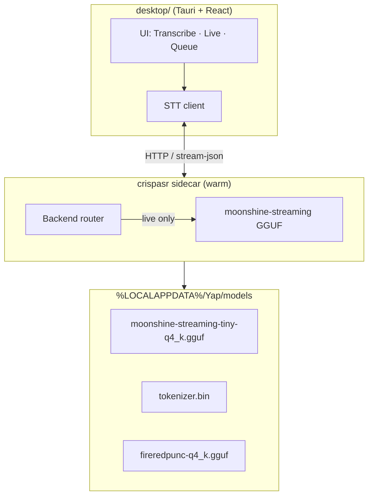

# ADR 0002: CrispASR as unified STT runtime (warm daemon + GGUF)

**Date:** 2026-06-30
**Status:** Historical runtime decision; the active local live runtime is superseded by ADR 0019
**Amended by:** [ADR 0019](0019-local-streaming-model-selection.md) — the committed local fallback pin is now Nemotron 3.5 ASR Streaming 0.6B INT8 through in-process `sherpa-onnx`. CrispASR remains historical runtime context and legacy helper code, not the active local live path.
**Amended by:** [ADR 0014](0014-server-tier-compute-topology.md) — in the **team profile**, model residency and client/server routing move to the **server-side workload router**; the GPU pool can hold multiple models resident simultaneously. The on-prem GB-class server node is "our hardware, our network" — it is **not** a cloud service and does not conflict with local-first principles.
**Supersedes:** Implementation details in [ADR 0001](0001-dual-stt-backends.md) (PyTorch `transcribe.py`, `moonshine-voice` ONNX, per-invocation subprocess, “no GGUF” rule). The product split from ADR 0001 remains: local streaming for live/offline fallback, server STT for larger recordings.

## Context

[ADR 0001](0001-dual-stt-backends.md) established that Yap should use **two STT models by mode**: a lightweight streaming model for live mic input and Cohere Transcribe for file/batch work, with **lazy loading** so only one is resident at a time.

The implementation sketched in ADR 0001 — Python + Transformers/PyTorch for batch (`transcribe.py`) and `moonshine-voice` ONNX for live — has predictable costs:

| Pain | Cause |
|------|--------|
| **Slow cold start** | Each batch run spawns a new Python process; `load_model()` imports torch/transformers and loads ~3.8 GB Cohere weights before the first file is transcribed (`desktop/src-tauri/src/lib.rs` → `transcribe.py`). |
| **Heavy RAM on CPU** | Full PyTorch Cohere is sized for GPU-class quality, not laptop CPU defaults. |
| **Two inference stacks** | Separate dependency trees (Python HF stack vs Moonshine ONNX SDK) double integration and test surface. |
| **Live latency** | Wispr-class responsiveness needs a **warm** streaming pipeline (sub-200 ms partials), not spawn-load-transcribe per utterance. |

[CrispASR](https://github.com/CrispStrobe/CrispASR) is a **native C++ inference runtime** (whisper.cpp lineage) that runs **GGUF weight files** for many ASR architectures, including:

- **`cohere`** — `CohereLabs/cohere-transcribe-03-2026` (same model family Yap uses today)
- **`moonshine-streaming`** — `UsefulSensors/moonshine-streaming-{tiny,small,medium}` (purpose-built streaming encoder)

CrispASR is the **engine**, not the model. Yap still chooses **which GGUF files** to ship/cache and **which backend** to activate per mode. This ADR records how we wire that engine for speed, caching, and Wispr-adjacent live UX without abandoning Cohere quality on files.

## Decision

Adopt **CrispASR as the local STT fallback runtime**, backed by a pinned **Moonshine v2 tiny GGUF** and a **long-lived sidecar daemon** that stays warm across sessions. Larger recording transcription moves to the GB-class server Cohere connector instead of the PR3 client fallback.

### Runtime

| Piece | Choice |
|-------|--------|
| **Binary** | `crispasr` — bundled per platform in the Tauri app (same class of asset as other native deps) |
| **Process model** | **Warm sidecar** started with the app (or on first STT use); models loaded inside this process, not per job |
| **Dev fallback** | Removed from the PR3 runtime. Historical Python/Cohere notes remain in ADR 0001 only as prior context. |

### Models (GGUF)

| Mode | CrispASR backend | Default GGUF | Approx. size | Role |
|------|------------------|--------------|--------------|------|
| **Live / offline fallback** | `moonshine-streaming` | `moonshine-streaming-tiny-q4_k.gguf` ([cstr/moonshine-streaming-tiny-GGUF](https://huggingface.co/cstr/moonshine-streaming-tiny-GGUF)) | small | Low-latency English fallback; target speed over official transcript quality |
| **Batch / larger recordings** | Server Cohere pool | Server-managed Cohere artifact | server-managed | Multilingual file transcription; export-quality transcripts when GB-class server path is available |

Quantization policy: **Q4_K as default** for the local fallback. The client does not expose a runtime backend selector in PR3; server Cohere quality/runtime choices belong to the GB-class server connector work.

### Language policy (v1)

**Live/offline fallback transcription is English-only for now.** Batch file transcription remains multilingual via Cohere (14 languages) when routed through the GB-class server path.

| Mode | Languages | User control |
|------|-----------|--------------|
| **Live / offline fallback** | **English (`en`) only** | No model-size or language picker in PR3. |
| **Batch / larger recordings** | Cohere’s 14 (see table below) | Server connector UX; language gate belongs with the GB-class server batch path. |

**Live implementation rules:**

1. Sidecar live path always passes **`-l en`** (or equivalent fixed English config); do not expose other codes on the Live surface.
2. Do **not** route live mic through `cohere`, `parakeet`, `canary`, or other multilingual CrispASR backends in v1 — even if a user has batch language set to French or Japanese.
3. UI copy must state the asymmetry plainly, e.g. **“Live: English · Files: 14 languages”** — not buried in Advanced settings only.
4. Multilingual live (per-language streaming backends) is **explicitly out of scope** until a future ADR; do not imply parity between Live and Transcribe language support.

**Batch languages (Cohere `cohere-transcribe-03-2026`):**

| Code | Language |
|------|----------|
| `en` | English |
| `fr` | French |
| `de` | German |
| `it` | Italian |
| `es` | Spanish |
| `pt` | Portuguese |
| `el` | Greek |
| `nl` | Dutch |
| `pl` | Polish |
| `zh` | Chinese (Mandarin) |
| `ja` | Japanese |
| `ko` | Korean |
| `vi` | Vietnamese |
| `ar` | Arabic |

**Optional post-live path (Phase 4+):** save live WAV and re-transcribe with server Cohere in the user’s batch language for a higher-quality final transcript — still not realtime multilingual live.

**Language detection (Phase 4+):** SpeechBrain LID with explicit user gate before batch — see [ADR 0003](0003-long-term-voice-architecture.md). Not in v1–v3.

### Residency rules (from ADR 0001, unchanged)

1. PR3 client fallback loads **Moonshine v2 tiny only**.
2. Cohere residency is a server workload-router concern once the GB-class server connector lands.
3. **Unload or idle-evict** local fallback sidecars after a configurable idle timeout (mirror llama-server / sidecar keep-warm semantics; today Ollama `keep_alive` in `desktop/src/polish.ts` until ADR 0005 migration).
4. GGUF files live on disk under a stable cache dir; mmap + OS page cache make repeat loads fast even after process restart.

### Model cache location

```
%LOCALAPPDATA%\Yap\models\     (Windows)
~/.yap/models/                 (Unix fallback)
```

- First-run or installer step makes the verified Moonshine GGUF, tokenizer, and punctuation companion available before local fallback is offered.
- Bundling defaults in the installer is optional; **pre-cache before offering fallback** is the minimum bar.
- Environment overrides for dev and power users: `YAP_MODELS_DIR`, `YAP_CRISPASR_BIN`, and `YAP_USE_GPU`.

### IPC shape (Tauri ↔ sidecar)

Prefer CrispASR **server / streaming interfaces** over spawning a new `crispasr` per file:

| Operation | Interface (target) |
|-----------|-------------------|
| **Health / version** | HTTP or CLI ping on sidecar port |
| **Batch file** | GB-class server Cohere connector; local PR3 fallback should queue/block rather than produce low-confidence official-looking large-recording output |
| **Live mic** | `crispasr --live --stream-json --backend moonshine-streaming -l en …` with VAD; desktop consumes structured partial/final events (**English fixed**) |
| **Mode switch** | Sidecar command to unload current backend and load the other (exclusive residency) |

Exact port, auth (localhost-only), and JSON schema are implementation details; the ADR requires **one persistent process** and **structured streaming output** for live.

## Consequences

### Positive

- **Faster fallback startup** — the client avoids Python cold start and loads a small pinned Moonshine fallback instead of importing torch/transformers for each run.
- **Faster repeat loads** — GGUF mmap + OS cache; warm daemon avoids reload entirely during a session.
- **Wispr-adjacent live UX** — Moonshine streaming targets sub-200 ms partial latency; achievable only with a **warm** streaming pipeline, which this ADR mandates.
- **One local inference stack** — single sidecar family for degraded/offline fallback; simpler Tauri integration than Python + moonshine-voice + torch.
- **No Python at inference time** in production — smaller failure surface for end users (no venv/HF auth on the hot path if models are pre-cached).
- **ADR 0001 product split preserved at the product level** — live/offline fallback stays English/fast; batch stays Cohere/accurate/multilingual through the server path.

### Negative

- **Native binary shipping** — per-platform `crispasr` builds, code signing, and upgrade cadence become release responsibilities.
- **Younger runtime** — CrispASR streaming APIs and VAD/finalize behavior are still evolving; we own integration risk and must pin versions.
- **GGUF quant tradeoffs** — Q4 local fallback output may differ from larger models; do not present degraded fallback as official large-recording quality.
- **Community GGUF ports** — moonshine-streaming GGUF is converted for CrispASR; not identical path to Useful Sensors’ official ONNX SDK (acceptable if WER/latency validated).
- **Migration period closed in PR3** — the Python runner and synchronous `transcribe_files` command are no longer part of the app runtime.

### Neutral

- Disk footprint grows by the pinned Moonshine/tokenizer/punctuation fallback artifacts, but avoids the older PyTorch Cohere footprint (~3.8 GB).
- GPU acceleration (CUDA/Vulkan/Metal) is available in CrispASR but not required for v1; CPU-first story matches local-first laptops.
- `PRODUCT.md` still needs a live-transcription update when Phase 1 ships (same as ADR 0001).
- Long-term LID, language gates, and voice OS layers: [ADR 0003](0003-long-term-voice-architecture.md).

## Critical review (ADR 0002 scope)

Honest assessment of this decision — revisit when Phase 2 ships or CrispASR pins change.

### Strengths

- Removes Python cold start from the production hot path.
- GGUF + warm sidecar matches llama-server sidecar pattern for polish/agents ([ADR 0005](0005-llama-server-agents.md)).
- Recordings stay on Cohere through the GB-class server path where the product already invested (WER, 14 languages).
- English-only live avoids a 14-backend streaming matrix in v1.
- Lazy single-backend residency keeps RAM predictable on 8–16 GB machines.

### Weaknesses

- **Vendor coupling on CrispASR** — fast-moving project; we inherit breaking changes.
- **Verified local artifacts** — download/install UX and checksum discipline are still required for the fallback binary, Moonshine GGUF, tokenizer, and punctuation companion.
- **Sidecar ops** — second process to start, monitor, and debug; users may blame “Yap” for sidecar crashes.
- **Server dependency for large recordings** — official-quality batch depends on the GB-class server path; offline client fallback should be clearly labeled as degraded.
- **Live/batch asymmetry** — correct technically, confusing if UI copy is weak (mitigated in language policy).
- **No LID in v1** — users can still pick wrong batch language until ADR 0003 Phase 4.

### Room for improvement → promoted to decisions

The following are **required** for Phase 1–2 ship (see § Critical review):

1. Pin local STT runtime artifacts in code or manifest files; CI smoke-test the selected runtime with one fixture per release.
2. Setup status: **“Transcription engine ready”** — sidecar health, model cache, not raw binary names.
3. Settings: expose only operational fallback status/preference in PR3; higher-quality batch controls belong with the server Cohere connector.
4. Structured sidecar error codes (`MODEL_MISSING`, `OOM`, `BAD_LANG`, `SIDEcar_CRASH`) → actionable toasts.
5. No runtime backend selector in PR3; local fallback means one pinned local runtime only.

## Implementation notes

### Architecture



ASCII equivalent:

```
┌──────────────────────────────────────────────────────────────┐
│  Tauri + React                                                │
│  Live/offline fallback ──HTTP──┐    File queue ──server API──┐  │
└──────────────────────────────┼──────────────────────────────┼──┘
                               ▼                              ▼
                    ┌─────────────────────────────────────────┐
                    │  crispasr sidecar (local fallback)       │
                    │  ┌─────────────────────────────────────┐ │
                    │  │ moonshine-streaming tiny + punc      │ │
                    │  └─────────────────────────────────────┘ │
                    └──────────────────┬────────────────────────┘
                                       ▼
                         %LOCALAPPDATA%\Yap\models\*
                         (mmap + OS page cache)
```

### Performance targets (planning — measure before UI copy)

| Scenario | Target | Notes |
|----------|--------|-------|
| **Live/offline fallback first result** | Measure on target hardware before UX promises | Moonshine streaming tiny; warm daemon preferred |
| **Live steady state** | Partial updates while speaking | `--stream-json` partial/final events |
| **Batch / larger recordings** | Server SLA, not local PR3 fallback | GB-class server Cohere connector owns throughput |

Wispr Flow parity is a **product** goal for live only (hotkey, injection, polish) — not for file drops.

### Sidecar lifecycle

| Event | Action |
|-------|--------|
| App launch | Start sidecar (or lazy-start on first STT); optional: preload nothing |
| User opens Live / offline fallback | Load pinned `moonshine-streaming` tiny artifacts; start mic/fallback pipeline |
| User leaves Live / idle timeout | Unload moonshine-streaming |
| User queues larger files | Prefer GB-class server Cohere connector; queue/block if unavailable instead of silently using local fallback |
| App quit | Stop sidecar gracefully |

### Phased rollout

| Phase | Scope |
|-------|--------|
| **0 — Historical** | Batch via `transcribe.py` (PyTorch); no sidecar |
| **1–2 — Local fallback sidecar** | Bundle/resolve `crispasr`; pinned Moonshine v2 tiny + tokenizer + punctuation; evented Tauri path replaces Python runtime |
| **3 — Live MVP** | moonshine-streaming + stream-json → Live panel; **English only**; no backend selector |
| **4 — Polish / server handoff** | Optional live WAV save + server Cohere re-pass; GPU/server connector copy |
| **5 — LID** | SpeechBrain batch probe + language gate UI (ADR 0003 Phase 4) |

See [ADR 0003](0003-long-term-voice-architecture.md) for live multilingual router, voice OS layers, and Phase 6+.

### Tauri integration touchpoints

- Use the evented `start_transcribe` Tauri command for queued transcription.
- Add sidecar manager (start, health, restart on crash).
- Extend setup status to report sidecar + model cache readiness (not raw GGUF paths on primary UI).
- Live UI: new panel/route (per product planning); consumes streaming JSON; **no live language selector** in v1.

### Validation checklist (before Phase 2 ship)

- [ ] English live: partial latency on target hardware
- [ ] Local fallback: spot-check Moonshine v2 tiny on representative short clips; label output as degraded/offline where appropriate
- [ ] Mode switch: no dual residency; memory returns to baseline after unload
- [ ] Offline: works with pre-cached models, no HF hub on hot path
- [ ] Crash recovery: sidecar restart does not wedgie the desktop shell

## Alternatives considered

### Keep ADR 0001 implementation (PyTorch + moonshine-voice ONNX)

**Rejected as shipped path.** Correct product split, but Python cold start and dual stacks block Wispr-class live UX and CPU batch performance. Not retained in the PR3 runtime.

### CrispASR without daemon (spawn per job)

**Rejected.** Avoids sidecar complexity but re-pays model load every batch session and makes live latency unacceptable. Defeats GGUF mmap/cache benefits.

### CrispASR Cohere for live streaming

**Rejected.** Cohere GGUF streaming works in CrispASR but is ~1.2 GB+ and higher latency than moonshine-streaming; wrong fit for live preview (same rationale as ADR 0001).

### Cohere INT8 ONNX batch (no CrispASR)

**Rejected.** Smaller than PyTorch but still a second stack alongside moonshine-voice; does not unify runtime or enable warm daemon for live. ONNX remains a theoretical fallback if CrispASR batch regresses.

### Single moonshine model for everything

**Rejected** (ADR 0001). Insufficient batch accuracy and multilingual coverage.

### Multilingual live in v1 (parakeet / canary / per-language router)

**Rejected for v1.** No streaming model matches Moonshine’s English latency across all 14 Cohere languages. English-only live keeps scope, UX, and support burden manageable; batch carries multilingual work.

### Cloud STT

**Rejected.** Conflicts with local-first purpose in `PRODUCT.md`.
