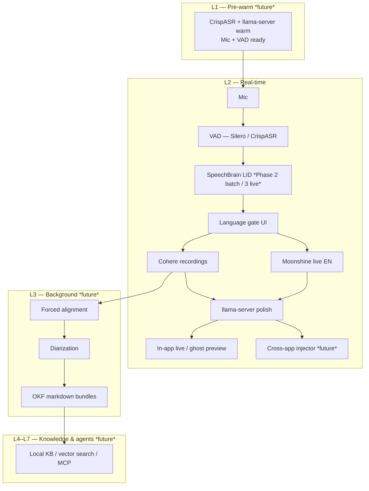

# ADR 0003: Long-term voice architecture — recordings, SpeechBrain LID, and phased voice OS

**Date:** 2026-06-30
**Status:** Accepted (roadmap — not all phases in scope for current Yap releases)
**Builds on:** [ADR 0001](0001-dual-stt-backends.md) (dual-model split), [ADR 0002](0002-crispasr-unified-stt-runtime.md) (CrispASR sidecar, English-only live v1)
**Amended by:** [ADR 0014](0014-server-tier-compute-topology.md) — the "local-first" layer architecture (L1–L7) described here is reframed as the **solo/local-first deployment profile**. In the **team profile**, the STT inference (streaming + batch), LLM pool, and L3 background worker all relocate to the `yap-server` tier on the DGX Spark. The DGX Spark is on-prem org-owned hardware and is **not** a cloud service; this is consistent with the "no cloud STT" principle. Client layers (L1 hotkey, L2 mic/VAD/UI, ghost preview) remain client-side in both profiles.

## Context

Yap began as a **local-first batch transcription app** — drop recordings, queue, export text. A separate **long-term vision** describes a **local agentic dictation engine / voice OS**: global hotkey, cross-app text injection, live ghost preview, post-LLM cleanup, forced alignment, diarization, an Open Knowledge Format (OKF) knowledge base, and agentic Q&A over personal transcripts.

Those visions diverged and then **reconverged**:

| Origin | Focus | STT assumption |
|--------|--------|----------------|
| **Early voice OS diagram** | Live dictation into any text field; no file queue | Cohere on the hot path via llama.cpp-style GGUF |
| **Yap (shipped direction)** | Recordings on disk; queue; history; polish | Cohere for **files**; live added later |
| **Current ADRs (0001–0002)** | Recordings = **Cohere**; live = **Moonshine streaming** (English v1); **CrispASR** sidecar | Explicit language for Cohere; no auto-detect today |

**Recordings are the moat for Cohere.** The original diagram did not center file drops, but Yap’s users do. Cohere’s strengths — 14 languages, long-form chunking, best-in-class WER on recorded media — map to **batch / recordings**, not to sub-200 ms live typing. Live stays on a streaming model; recordings stay on Cohere whether the source is a dropped MP3 or a WAV saved after a live session.

**Language is a product problem, not only an ML problem.** Cohere requires an explicit `-l` code and does not auto-detect. Users will pick wrong languages, drop multilingual files, and eventually speak non-English into live mode. **SpeechBrain language identification (LID)** is the planned bridge: detect (or estimate) language, map to supported codes, and **ask the user before proceeding** when confidence is low or the language is unsupported — not silent mis-transcription.

This ADR records the **long-term architecture**, how it relates to current ADRs, and an honest **strengths / weaknesses / improvement** review.

## Decision

### 1. Mode ownership (unchanged from 0001–0002)

| Input type | Primary STT | Runtime |
|------------|-------------|---------|
| **Recordings** (drop, queue, saved live WAV) | **Cohere Transcribe** GGUF | CrispASR `--backend cohere` |
| **Live mic** (in-app v1; global hotkey later) | **Moonshine streaming** GGUF (English v1) | CrispASR `--backend moonshine-streaming` |
| **Live re-pass** (optional, Phase 4+) | Cohere on saved audio | Same batch path |

Recordings and live are **different jobs**; do not put Cohere on the live hot path for v1–v2 except as an explicit “accuracy re-pass” on saved audio.

### 2. SpeechBrain LID — role and UX (Phase 2+ batch, Phase 3+ live)

Introduce **SpeechBrain** (or equivalent local LID) as a **language gate**, not as a silent auto-router that bypasses user consent on first use.

**Batch / recordings (first LID integration — lower risk):**

```
File selected → extract probe audio (e.g. first 15–30 s)
            → SpeechBrain LID → { code, confidence }
            → map to Cohere-supported set (14 codes)
            → UI gate (see below)
            → cohere -l <confirmed> via sidecar
```

**Live (later — higher risk, on critical path):**

```
VAD speech start → accumulate min duration (e.g. 1–2 s)
                 → LID → { code, confidence }
                 → if en + v1 policy: continue Moonshine
                 → if non-en + live still EN-only: gate UI (“Live is English-only — switch to Transcribe for French?”)
                 → future: router picks streaming backend from code (ADR amendment)
```

**Language gate UX (required pattern):**

| LID outcome | User-facing behavior |
|-------------|----------------------|
| **High confidence + supported** | Prefill language; toast: “Detected French — transcribe in French?” **[Continue]** / **[Pick another]** |
| **Low confidence** | “We couldn’t detect the language confidently.” **[Choose language]** (14-list) / **[Cancel]** |
| **Unsupported language** | “This language isn’t supported yet (detected: …). Supported: …” **[Choose closest]** / **[Cancel]** / link to batch with manual pick |
| **Live + non-English while EN-only** | Block live ASR; offer **save & transcribe with Cohere** or **change batch language** — do not pretend live works |

Copy principle: **never silently run Cohere with the wrong `-l`** because LID guessed once at 60% confidence.

**Implementation notes for SpeechBrain:**

- Run LID in a **separate lightweight process** or Python micro-service initially — acceptable for **batch probe**; for live, measure added latency and consider CrispASR-adjacent native LID later.
- Cache LID result **per file** (batch) or **per session** (live) to avoid re-running every chunk.
- Map LID ISO codes → Cohere’s 14; maintain explicit **unsupported** list and **ambiguous** pairs (e.g. `zh` dialects → `zh`).
- SpeechBrain model choice TBD (e.g. `speechbrain/lang-id-voxlingua107-ecapa` class); pin version and document RAM/CPU cost in settings.

### 3. Long-term layers (voice OS roadmap)

Phased relative to current Yap. Layers **not in v1** are marked *future*.



**Reconciliation with original diagram:**

| Original box | Updated decision |
|--------------|------------------|
| Cohere on live hot path | **Rejected for live** — Moonshine (or future per-lang streamers); Cohere for recordings + re-pass |
| llama.cpp cache | **CrispASR sidecar** for STT; **llama-server** for LLM ([ADR 0005](0005-llama-server-agents.md)) |
| Llama 3 8B post-processor | **llama-server** (~2B Q4 GGUF); Ollama dev fallback |
| Global OS injector / hotkey | *Future* product surface — shares STT sidecar, not required for Yap v1 |
| OKF / diarization / agents | *Future* — consumes **batch** Cohere output + timestamps from alignment layer |

### 4. Phased delivery (master roadmap)

| Phase | Deliverable | LID | Cohere | Live |
|-------|-------------|-----|--------|------|
| **0** | Yap batch via PyTorch | — | Files | — |
| **1–2** | CrispASR sidecar batch (ADR 0002) | — | Files | — |
| **3** | Live English MVP | — | Files | Moonshine EN |
| **4** | Batch LID + language gate | SpeechBrain on file probe | Files + suggest `-l` | EN only |
| **5** | Live WAV save + Cohere re-pass | Optional on saved WAV | Recordings | EN live |
| **6** | Multilingual live router | LID on mic | Files | Per-lang backends *new ADR* |
| **7+** | Injector, OKF, diarization, agents | Session LID | Recordings hub | Optional |

Background pipeline detail (diarization, micro-batches, Speaker Vault, OKF, agents, failure states): **[ADR 0004](0004-background-diarization-okf-agents.md)**.

Phases 4–7 require separate release planning; this ADR does **not** commit ship dates.

## Consequences

### Positive

- **Clear product story:** “Yap transcribes **recordings** accurately (Cohere); **live** is fast (Moonshine); **language** is confirmed, not guessed.”
- **SpeechBrain fits batch first** — off hot path, high value (prefill `-l`), low latency risk.
- **Gate UX** builds trust and avoids garbage output from wrong `-l`.
- **Voice OS layers** stay on the roadmap without blocking Yap v1.
- **Recordings as first-class** aligns with journalists/researchers in `PRODUCT.md`.

### Negative

- **Three ML stacks at steady state:** CrispASR (STT) + SpeechBrain (LID) + llama-server (LLM) — ops, disk, and support burden.
- **LID on live path** adds latency and failure modes; English-only v1 avoids this until Phase 6.
- **Vision scope creep** — OKF/agents/injector can distract from batch + live MVP; phases must be gated.
- **SpeechBrain in Python** reintroduces Python beside CrispASR for LID only — acceptable if isolated micro-service, ugly if sprawling.

### Neutral

- Original diagram remains a **north star**, not a commitment to every box in v1.
- Unsupported languages stay unsupported until a backend exists — LID makes that explicit instead of silent failure.

## Critical review

### Strengths of the combined plan (0001 + 0002 + 0003)

1. **Separation of concerns** — latency (live) vs fidelity (recordings) vs language (LID gate) vs prose (llama-server polish).
2. **CrispASR + llama-server sidecars** — warm processes; same pattern for STT and LLM ([ADR 0005](0005-llama-server-agents.md)).
3. **English-only live v1** — ships something testable without 14 streaming backends.
4. **Cohere on recordings** — uses the model where WER and multilingual chunking matter.
5. **SpeechBrain as gate, not autopilot** — product-safe; reduces wrong-language transcripts.
6. **Incremental path** — batch CrispASR → live EN → LID batch → live expansion → voice OS layers.

### Weaknesses and risks

| Risk | Severity | Mitigation |
|------|----------|------------|
| **CrispASR maturity** — streaming API churn | High | Pin git release; integration tests; fallback to `transcribe.py` |
| **Q4 Cohere quality vs PyTorch** | Medium | WER spot-checks; Q8 option; user-visible “higher quality” mode |
| **Moonshine GGUF vs official ONNX** | Medium | Benchmark on target hardware before live ship |
| **Sidecar crash / port conflict** | Medium | Health checks; auto-restart; single-user localhost binding |
| **LID wrong but high confidence** | Medium | Always show detected language before long batch jobs; allow override |
| **LID latency on live** | High (Phase 6) | Default EN without LID until router exists; min speech duration |
| **Exclusive model residency** | Low | Mode switch UX (“Switching to transcription model…”) |
| **Scope: voice OS vs Yap app** | High | Keep OKF/injector/agents in Phase 7+; separate product decision |
| **No Cohere auto-detect** | Low (batch) | LID + gate; never imply auto-detect |
| **Diarization + Cohere without timestamps** | Medium (future) | Forced alignment layer before diarization intersection |
| **Three runtimes to install** | Medium | First-run wizard; bundled sidecars; clear Setup status |

### Room for improvement

1. **Unified “Models” settings panel** — CrispASR GGUF, llama-server polish GGUF, SpeechBrain LID model, disk budget; one place, secondary UI per `PRODUCT.md`.
2. **Probe-audio strategy** — for long files, sample multiple windows (start + middle) when LID disagrees; document in implementation.
3. **Language memory** — remember last confirmed `-l` per file type or project folder; reduces repeated gates.
4. **Live → recording handoff** — one click “Save session & transcribe with Cohere” with LID on saved WAV; bridges modes.
5. **Native LID later** — evaluate CrispASR `-l auto` + lightweight classifier before permanent Python SpeechBrain dependency.
6. **ADR for Phase 6 only when needed** — multilingual live router deserves its own record once backends are chosen per language.
7. **PRODUCT.md sync** — when Phase 3 ships: live entry, “Recordings: 14 languages”, “Live: English”, anti-reference softened to “not global dictation **yet**”.
8. **Telemetry-free logging** — local logs for LID confidence, sidecar timing, gate outcomes; helps debug without cloud.

### Open questions (unresolved)

- [ ] Which SpeechBrain LID checkpoint and expected RAM/CPU?
- [ ] Minimum probe duration for batch LID (15 s vs 30 s vs adaptive)?
- [ ] Bundle SpeechBrain in installer vs download on first “Detect language” use?
- [ ] Does global hotkey/injector share the Yap Tauri process or a second tray app?
- [ ] OKF bundle layout — adopt verbatim from diagram or simplify for v1 history export?

## Alternatives considered

### Silent LID → auto `-l` with no user gate

**Rejected.** Cohere punishes wrong language severely; low-trust UX. Gate pattern is mandatory.

### Cohere-only for live and batch (original diagram)

**Rejected for live** (ADR 0001/0002). Acceptable for **recordings and re-pass** only.

### Skip LID; manual language only forever

**Rejected as long-term.** Manual picker remains **always available**; LID is assistive for batch and prerequisite for multilingual live router.

### Whisper / cloud detect-language

**Rejected.** Local-first; Whisper adds another STT stack without Cohere batch quality.

### Fold entire voice OS into Yap v1

**Rejected.** Ship Yap transcription loop first; voice OS layers are phased (Section 4).

## References

- Cohere languages: `en`, `fr`, `de`, `it`, `es`, `pt`, `el`, `nl`, `pl`, `zh`, `ja`, `ko`, `vi`, `ar`
- CrispASR: https://github.com/CrispStrobe/CrispASR
- SpeechBrain: https://speechbrain.github.io/
- Related ADRs: [0001](0001-dual-stt-backends.md), [0002](0002-crispasr-unified-stt-runtime.md)
