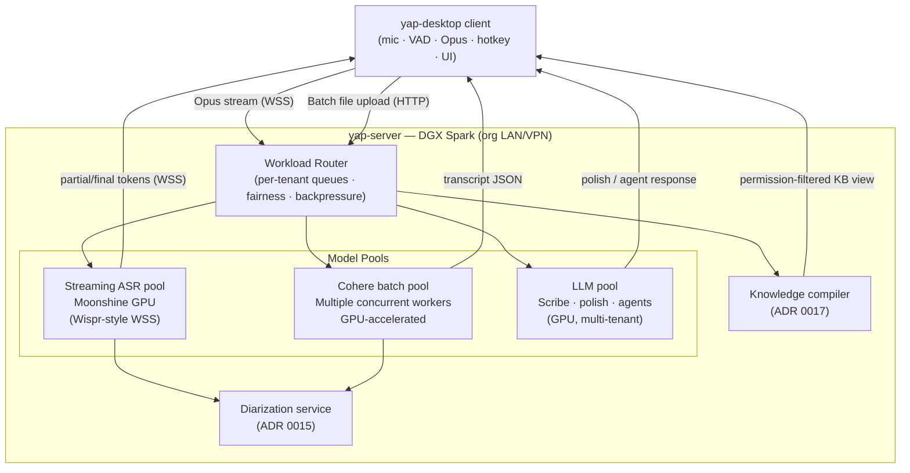

# ADR 0014: Server-tier compute topology — thin client + DGX Spark workload router

**Date:** 2026-07-01
**Status:** Accepted (roadmap — Phase 8)
**Builds on:** [ADR 0001](0001-dual-stt-backends.md) (dual-model split), [ADR 0002](0002-crispasr-unified-stt-runtime.md) (CrispASR sidecar), [ADR 0005](0005-llama-server-agents.md) (LLM sidecar), [ADR 0006](0006-silero-agents-state-machine.md) (runtime state machine)
**Amended by:** [ADR 0016](0016-auth-identity-bridge.md) (auth gates the server connector)

## Context

Yap's existing architecture is **local-first**: the CrispASR STT sidecar, llama-server LLM, and knowledge worker all run on the client machine. Benchmarks against a typical 16 GB i5 laptop CPU reveal hard limits:

| Workload | Result | Significance |
|----------|--------|--------------|
| Cohere batch (45-min file, CPU) | ~1 576 s (~26 min) | Longer than the meeting itself |
| Moonshine medium, batch use | ~0.55× realtime | Not a batch win; slower than real speed |
| Concurrent batch workers | 1 (CPU serialised) | No per-user throughput scaling |

At the same time, the organisation has access to an **on-prem NVIDIA DGX Spark GPU server** on a network it controls and owns. This is explicitly **not a public cloud service** — it is org-owned hardware inside an org-controlled LAN/VPN. There is no conflict with Yap's "local-first / no cloud STT" principle: **"our hardware, our network"** extends the trust boundary of the local-first stance to the org's private infrastructure.

This ADR records the pivot to a **two-profile architecture** that preserves the solo/offline experience while enabling a GPU-accelerated team profile.

## Decision

### Deployment profiles

Yap supports two deployment profiles. Neither profile is deleted. The team profile is the new **default for multi-user org deployments**.

| Attribute | Solo / local-first profile | Team / server profile |
|-----------|---------------------------|----------------------|
| Target | Individual users, offline, privacy-max | Org teams on a shared DGX Spark |
| STT (live) | Local Moonshine tiny (CrispASR sidecar) | Server-hosted Moonshine GPU (streaming ASR pool) |
| STT (batch) | Queue/block larger recordings when offline; no local Cohere default in PR3 | Server Cohere batch pool (concurrent GPU workers) |
| LLM | Local llama-server (`-ngl 0`) | Server LLM pool (Scribe/polish/agents on GPU) |
| Diarization | Server-less (L3 worker, Phase 7b) | Two-pass server pipeline (ADR 0015, Phase 10) |
| Knowledge base | Local OKF markdown (Phase 7c) | `yap-knowledge` Git repo + KB compiler (ADR 0017, Phase 11) |
| Auth | None / local | Entra ID / MSAL (ADR 0016, Phase 9) |
| Network | None required | LAN/VPN to DGX Spark |

### Client-side responsibilities (both profiles)

The Tauri desktop app (`yap-desktop`) retains everything that cannot be delegated — functions tied to the OS, the microphone, or the screen:

| Responsibility | Notes |
|----------------|-------|
| **Mic capture** | Platform audio API; always local |
| **VAD / endpointing** | Silero ONNX in Rust (ADR 0006); produces Opus chunks + `vad_segments` |
| **Opus chunk encoding** | Compress before wire transfer; reduces bandwidth by ~10× vs PCM |
| **Global hotkey + text injection** | ADR 0013; OS-level; cannot be delegated |
| **Ghost / preview UI** | Tauri webview overlay; latency-sensitive rendering |
| **Local file selection** | OS file picker; files may be uploaded to server for batch |
| **Server connector** | Manages WSS (live) and HTTP/job (batch) connections to `yap-server` |
| **Offline / solo fallback** | Local Moonshine tiny; larger recordings should queue/block when server unreachable |

### Server-side architecture (`yap-server` on DGX Spark)

The server is the compute brain. It runs inside the org's private network and is never exposed to the public internet.



#### Workload router responsibilities

| Concern | Mechanism |
|---------|-----------|
| **Per-tenant queues** | One queue per authenticated user (ADR 0016); fairness prevents one user monopolising GPU |
| **Priority** | Interactive live (ASR pool) always prioritised over background batch jobs |
| **Backpressure** | Router signals client when all pool workers are busy; client falls back to local sidecar or queues |
| **Model residency** | Moonshine XOR Cohere exclusivity rule from ADR 0002 **relaxes on the server**: a GPU pool can hold multiple models resident simultaneously; the router allocates to the appropriate pool per request type |

#### Model pools

| Pool | Model | Mode | Notes |
|------|-------|------|-------|
| **Streaming ASR pool** | Moonshine (GPU) | Live mic, real-time WSS | Wispr-Flow-style; thin client streams Opus chunks; server returns partial/final tokens |
| **Cohere batch pool** | Cohere Transcribe (GPU) | File / queue jobs | Multiple concurrent workers; GPU throughput removes the 26-min CPU bottleneck |
| **LLM pool** | Scribe/polish + agent models (GPU) | Scribe polish, Student/Curator/Analyst/Coordinator | Multi-tenant; `-ngl` not 0 on GPU |

### Live path options

| Path | When used | Notes |
|------|-----------|-------|
| **Server streaming ASR** (team default) | Team profile; server reachable | Client streams Opus → server Moonshine GPU → partial tokens returned over WSS; lowest latency on LAN |
| **Local Moonshine tiny** (offline/degraded fallback) | Solo profile; server unreachable; degraded mode | CrispASR sidecar on client; ~183 MB GGUF; quality lower than server GPU |

**Local Moonshine tiny is a fallback flag, not the product.** In team profile, the default live path is server-hosted streaming ASR. The client connector detects server reachability and falls back automatically.

### On-prem is not cloud

The DGX Spark server:

- Is **org-owned hardware** on the org's physical or virtualised network.
- Is **not** a third-party cloud SaaS (AWS, Azure, GCP, etc.).
- Audio and transcripts stay inside the org's network perimeter.
- Aligns with Yap's "no cloud STT" principle for regulated/clinical orgs: the constraint is "no third-party cloud processing," not "no GPU compute." An on-prem GPU satisfies that constraint.

### Live path tradeoffs

| Concern | Server streaming ASR (team) | Local Moonshine (solo/fallback) |
|---------|----------------------------|---------------------------------|
| **Latency** | LAN round-trip (~1–5 ms) + server inference; typically competitive | Pure local; no network |
| **Bandwidth** | ~16 kbps Opus audio upstream | Zero |
| **Privacy** | Audio leaves device → server (org-controlled LAN) | Audio never leaves device |
| **Offline** | Requires LAN/VPN | Fully offline |
| **Quality** | GPU Moonshine; potentially larger model | Moonshine tiny Q4 |
| **Throughput** | GPU pool; multiple users concurrently | Single user, single thread |

## Consequences

### Positive

- **CPU bottleneck removed** — Cohere batch drops from ~26 min (CPU) to a few minutes on the GPU pool, with concurrent multi-user throughput. (Exact GPU wall time is unbenchmarked; see § Open questions.)
- **Better live quality** — GPU Moonshine can run a larger model variant than the client can afford locally.
- **Solo profile preserved** — no regression for offline or privacy-max users.
- **Clear trust framing** — "our hardware, our network" resolves the local-first/GPU tension cleanly.
- **Scalable LLM** — GPU LLM pool enables richer agents without CPU constraints.

### Negative

- **Team profile requires LAN/VPN** — users outside the org network get solo/degraded quality.
- **Audio-on-wire** — Opus audio stream leaves the device within the org LAN; this is a new trust hop vs purely local. Must be TLS-encrypted in transit; E2E encryption is an open question (see § Open questions).
- **Server operational complexity** — `yap-server` adds deployment, monitoring, and upgrade responsibilities.
- **Two code paths to maintain** — solo and team profiles diverge; feature flags and profile detection add complexity.

### Neutral

- The client binary (`yap-desktop`) ships to all users; profile is determined at runtime by server connectivity and auth status.
- Phases 1–7e (local-first track) continue in parallel for the solo profile; they are not blocked by the server-tier work.

## Implementation notes

### Profile detection

```rust
enum DeploymentProfile { Solo, Team }

fn detect_profile(config: &AppConfig) -> DeploymentProfile {
    if config.server_url.is_some() && server_reachable(&config.server_url) {
        DeploymentProfile::Team
    } else {
        DeploymentProfile::Solo
    }
}
```

The server URL is set in Settings (org onboarding). Missing or unreachable → solo profile automatically.

### Client connector state machine (team profile)

```
Disconnected → Connecting → Connected
                              │
              ┌───────────────┴──────────────────┐
              ▼                                   ▼
     LiveStreaming (WSS)                 BatchUploading (HTTP)
```

On `Connected` loss → switch to solo/local fallback; toast "Using local transcription (server unreachable)."

### Phase 8 deliverables

- [ ] `yap-server` repo scaffolded (ADR 0018)
- [ ] Workload router: per-user queues, priority, pool dispatch
- [ ] Streaming ASR pool: Moonshine GPU, WSS endpoint
- [ ] Cohere batch pool: concurrent GPU workers, job queue
- [ ] Client server-connector: WSS live path + HTTP batch upload + profile detection
- [ ] Local-fallback logic: auto-switch on server unreachability

## Open questions

1. **E2E audio encryption** — TLS in transit is required. Does the org require E2E (audio encrypted client-to-GPU, not decryptable on the server host)? This would require a different key architecture.
2. **LAN vs VPN topology** — Is the DGX Spark reachable over a corporate VPN for remote workers, or LAN-only? Affects offline-fallback frequency.
3. **Server auth for audio endpoints** — WSS and batch upload endpoints require auth tokens (ADR 0016); exact token format (JWT, Entra access token) TBD.

## Alternatives considered

### GPU cloud (AWS/Azure/GCP)

**Rejected.** Violates the "no third-party cloud STT" principle that is core to Yap's trust positioning with regulated/clinical orgs. The DGX Spark is org-owned hardware; cloud is not.

### Upgrade client hardware targets (require GPU)

**Rejected.** Many users work on standard i5 laptops; requiring a GPU client locks out the majority of the user base.

### Keep CPU-only; accept slow batch

**Rejected.** 26 minutes for a 45-minute file is not a viable team product. The bottleneck is architectural, not tunable.

### Separate GPU client add-on

**Rejected.** A CUDA-equipped plugin for the client would help only users who happen to have a GPU; the org already owns a DGX Spark.
