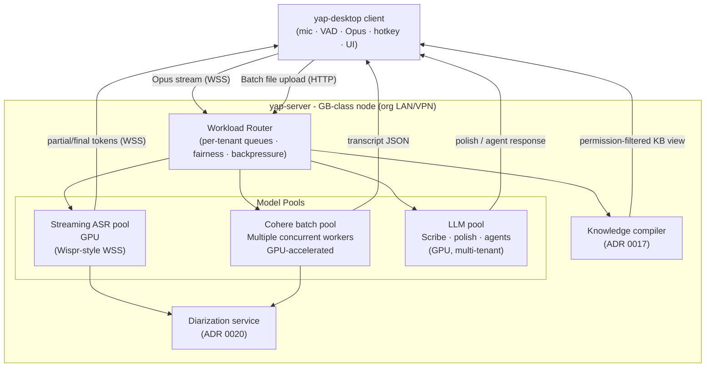
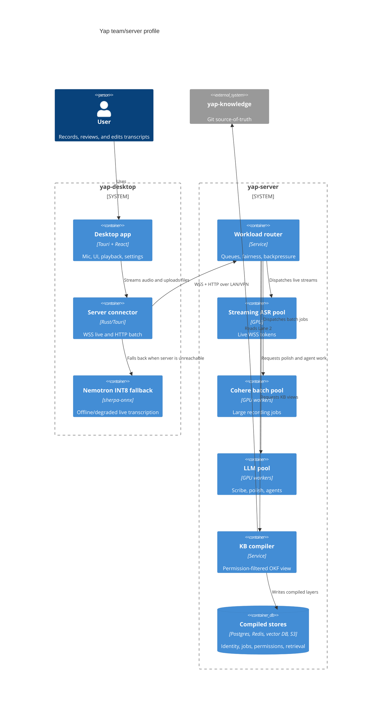
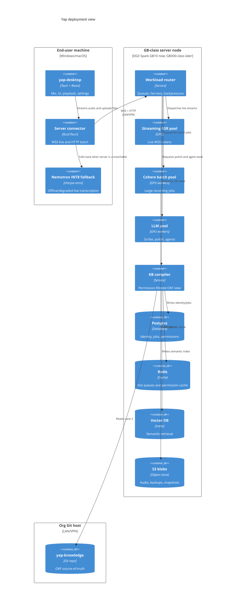
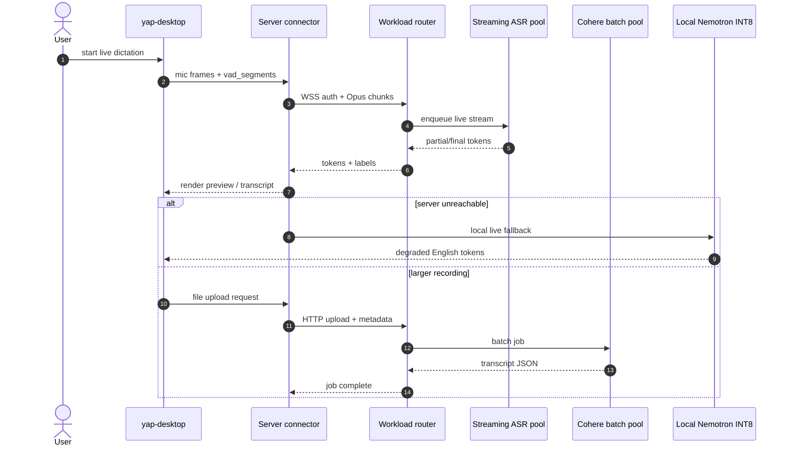
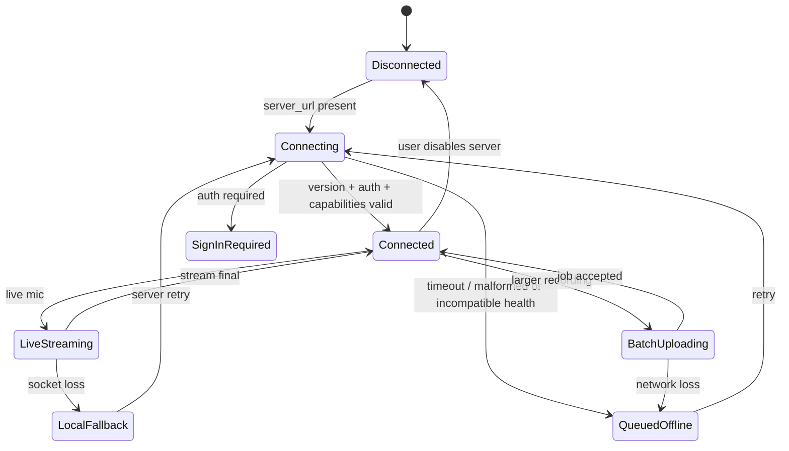

# ADR 0014: Server-tier compute topology — thin client + GB-class workload router

**Date:** 2026-07-01
**Status:** Accepted (roadmap — canonical Phases 3–5)
**Builds on:** [ADR 0001](0001-dual-stt-backends.md) (dual-model split), [ADR 0002](0002-crispasr-unified-stt-runtime.md) (local fallback runtime history), [ADR 0005](0005-llama-server-agents.md) (LLM sidecar), [ADR 0006](0006-silero-agents-state-machine.md) (runtime state machine)
**Amended by:** [ADR 0019](0019-local-streaming-model-selection.md) — the team profile still defaults to server-hosted live ASR when connected, but the desktop-local offline/degraded fallback is Nemotron 3.5 ASR Streaming 0.6B INT8 through `sherpa-onnx`.
**Amended by:** [ADR 0016](0016-auth-identity-bridge.md) (auth gates the server connector)
**Amended by:** [ADR 0020](0020-meeting-capture-diarization-authority.md) (track-aware capture, optional local anonymous evidence, and server-authoritative reconciliation replace the ADR 0015 profile split)
**Amended by:** [ADR 0021](0021-http3-secure-edge-transport.md) (HTTP/3 is the gated future client-facing edge; the bounded application service remains private with TCP fallback)
**Implementation status:** Client capture/local fallback, machine-readable HTTP/live contracts, the bounded loopback capability-health service, the desktop health connector/state machine, and the durable SQLite imported-job ledger exist. Upload/drain, WSS, authenticated sessions, model pools, TLS/QUIC edge, and server inference are not implemented.

## Context

The earlier local-first architecture proposed that local STT, a llama-server LLM, and a knowledge worker would all run on the client. Only local Nemotron STT is implemented; llama-server and the knowledge worker remain unimplemented. Benchmarks against a typical 16 GB i5 laptop CPU motivated moving the heavier target workloads server-side:

| Workload | Result | Significance |
|----------|--------|--------------|
| Cohere batch (45-min file, CPU) | ~1 576 s (~26 min) | Longer than the meeting itself |
| Moonshine medium, batch use | ~0.55× realtime | Not a batch win; slower than real speed |
| Concurrent batch workers | 1 (CPU serialised) | No per-user throughput scaling |

At the same time, the organisation has access to an **on-prem NVIDIA GB-class GPU server node** on a network it controls and owns. The first supported profile is DGX Spark GB10; a later GB300-class node should keep the same `yap-server` contract and change only host-specific config and capacity. This is explicitly **not a public cloud service** — it is org-owned hardware inside an org-controlled LAN/VPN. There is no conflict with Yap's "local-first / no cloud STT" principle: **"our hardware, our network"** extends the trust boundary of the local-first stance to the org's private infrastructure.

This ADR records the pivot to a **two-profile architecture** that preserves the solo/offline experience while enabling a GPU-accelerated team profile.

## Decision

### Deployment profiles

Yap supports two deployment profiles. Neither profile is deleted. The team profile is the new **default for multi-user org deployments**.

| Attribute | Solo / fallback profile | Team / server profile |
|-----------|---------------------------|----------------------|
| Target | Individual users with local live fallback | Org teams on a shared GB-class server node |
| STT (live) | Local Nemotron INT8 (`sherpa-onnx`) | Server-hosted streaming ASR pool |
| STT (batch) | Queue/block every imported recording when offline; no local file-ASR path | Server Cohere batch pool (concurrent GPU workers) |
| LLM | Future local llama-server (`-ngl 0`); not shipped | Future server LLM pool (Scribe/polish/agents on GPU) |
| Diarization | Optional local anonymous evidence; no durable voice profiles | Server-authoritative reconciliation and purpose-authorized identity (ADR 0020, canonical Phase 8) |
| Knowledge base | Local OKF markdown (legacy phase map) | `yap-knowledge` Git repo + KB compiler (ADR 0017, canonical Phase 9) |
| Auth | None / local | Entra ID / MSAL (ADR 0016, canonical Phase 7) |
| Network | None required for live fallback; server required for official recordings | LAN/VPN to the GB-class server node |

### Client-side responsibilities (both profiles)

The Tauri desktop app (`yap-desktop`) retains everything that cannot be delegated — functions tied to the OS, the microphone, or the screen:

| Responsibility | Notes |
|----------------|-------|
| **Track-aware capture** | Platform audio API; microphone now and optional system loopback later; always local |
| **VAD / endpointing** | Client-side advisory boundaries and endpointing; source audio remains authoritative |
| **Transport encoding** | Negotiate PCM/Opus with the server contract; preserve source-track and gap metadata |
| **Global hotkey + text injection** | ADR 0013; OS-level; cannot be delegated |
| **Ghost / preview UI** | Tauri webview overlay; latency-sensitive rendering |
| **Local file selection** | OS file picker; files may be uploaded to server for batch |
| **Server connector** | Manages WSS (live) and HTTP/job (batch) connections to `yap-server` |
| **Offline / solo fallback** | Local Nemotron INT8; larger recordings should queue/block when server unreachable |

### Server-side architecture (`yap-server` on a GB-class server node)

The server is the compute brain. It runs inside the org's private network and is never exposed to the public internet.



#### Experimental C4/container view



#### Experimental C4/deployment view



#### Workload router responsibilities

| Concern | Mechanism |
|---------|-----------|
| **Per-tenant queues** | One queue per authenticated user (ADR 0016); fairness prevents one user monopolising GPU |
| **Priority** | Interactive live (ASR pool) always prioritised over background batch jobs |
| **Backpressure** | Router signals client when all pool workers are busy; client falls back to local sidecar or queues |
| **Model residency** | Client local-model exclusivity **relaxes on the server**: a GPU pool can hold multiple models resident simultaneously; the router allocates to the appropriate pool per request type |

#### Model pools

| Pool | Model | Mode | Notes |
|------|-------|------|-------|
| **Streaming ASR pool** | Server-selected GPU ASR | Live mic, real-time WSS | Wispr-Flow-style; thin client streams Opus chunks; server returns partial/final tokens |
| **Cohere batch pool** | Cohere Transcribe (GPU) | File / queue jobs | Multiple concurrent workers; expected to improve on the 26-min CPU result, subject to GB10 benchmarks |
| **LLM pool** | Scribe/polish + agent models (GPU) | Scribe polish, Student/Curator/Analyst/Coordinator | Multi-tenant; `-ngl` not 0 on GPU |

#### Client/server protocol shape



### Live path options

| Path | When used | Notes |
|------|-----------|-------|
| **Server streaming ASR** (team default) | Team profile; server reachable | Client streams Opus → server ASR pool → partial tokens returned over WSS; lowest latency on LAN |
| **Local Nemotron INT8** (offline/degraded fallback) | Solo profile; server unreachable; degraded mode | sherpa-onnx recognizer on client; quality/language coverage lower than server GPU |

**Local Nemotron INT8 is a fallback route, not official imported-file ASR.** In team profile, server streaming is preferred only after version, authentication state, and the required live capability validate. A connector outage may route live dictation to Nemotron, but imported recordings remain queued server jobs.

### On-prem is not cloud

The GB-class server node:

- Is **org-owned hardware** on the org's physical or virtualised network.
- Currently means DGX Spark GB10; GB300-class nodes are an allowed future profile.
- Is **not** a third-party cloud SaaS (AWS, Azure, GCP, etc.).
- Audio and transcripts stay inside the org's network perimeter.
- Aligns with Yap's "no cloud STT" principle for regulated/clinical orgs: the constraint is "no third-party cloud processing," not "no GPU compute." An on-prem GPU satisfies that constraint.

### Live path tradeoffs

| Concern | Server streaming ASR (team) | Local Nemotron (solo/fallback) |
|---------|----------------------------|---------------------------------|
| **Latency** | LAN round-trip planning estimate (~1–5 ms) + unbenchmarked server inference | Pure local; no network |
| **Bandwidth** | ~16 kbps Opus audio upstream | Zero |
| **Privacy** | Audio leaves device → server (org-controlled LAN) | Audio never leaves device |
| **Offline** | Requires LAN/VPN | Fully offline |
| **Quality** | GPU model chosen by the router; potentially larger model | Nemotron INT8 fallback |
| **Throughput** | GPU pool; multiple users concurrently | Single user, single thread |

## Consequences

### Positive

- **CPU bottleneck can move off the client** — the GPU pool is expected to improve on the ~26 min CPU result and permit concurrent work, but GB10 wall time and safe concurrency remain benchmark gates.
- **Better live quality** — the server can run larger or more specialized ASR models than the client can afford locally.
- **Solo profile preserved** — no regression for offline or privacy-max users.
- **Clear trust framing** — "our hardware, our network" resolves the local-first/GPU tension cleanly.
- **Scalable LLM** — GPU LLM pool enables richer agents without CPU constraints.

### Negative

- **Team profile requires LAN/VPN** — users outside the org network get solo/degraded quality.
- **Audio-on-wire** — Opus audio stream leaves the device within the org LAN; this is a new trust hop vs purely local. Must be TLS-encrypted in transit; E2E encryption is an open question (see § Open questions).
- **Server operational complexity** — `yap-server` adds deployment, monitoring, and upgrade responsibilities.
- **Two code paths to maintain** — solo and team profiles diverge; feature flags and profile detection add complexity.

### Neutral

- The client binary (`yap-desktop`) ships to all users. Deployment intent comes from local/org configuration; connectivity, version, authentication, and advertised capabilities determine connector state and route without silently changing a configured team deployment into Solo.
- Client-local live fallback remains available through all canonical phases; server work in Phases 3–9 does not turn imported recordings into local jobs.

## Implementation notes

### Profile and connector state

```rust
enum DeploymentProfile { Solo, TeamConfigured }
enum ConnectorState { NotSet, Disabled, Connecting, Offline, SignInRequired, Retrying, Ready }
```

The server URL is set in Settings during organization onboarding. A configured but unreachable server remains `TeamConfigured` and unavailable; it does not silently become Solo. Its observable connector state may be `Offline` and then `Retrying` when retry backoff arms. Imported recordings stay queued or blocked and preserve their intended server route. Live dictation may use the local fallback while the connector is unavailable. `Ready` means a compatible, healthy service is reachable and its auth projection does not require sign-in; advertised capabilities may all be false. Batch and live routing additionally require the matching advertised capability.

The implemented Phase 3 connector covers configured-origin validation, bounded health checks, capability and auth-required state projection, fail-closed retries, and settings-generation cancellation. It does not stream audio, upload or drain recording jobs, authenticate a user, or process a queued job.

### Client connector state machine (team profile)



On `Connected` loss, live dictation may switch to local fallback with a visible route notice. Imported recordings remain server jobs in `QueuedOffline`; they never run through local Nemotron.

### Canonical Phases 3–5 deliverables

- [x] `server/` staging area, machine-readable Phase 3 contract, and loopback capability-health process in the MVP monorepo (ADR 0018; split to `yap-server` in canonical Phase 10)
- [x] Client capability-health connector: validated settings, bounded HTTP checks, fail-closed state/capability projection, generation safety, and retry cancellation
- [x] Rust-owned SQLite imported-job ledger with restart recovery and idempotent legacy migration
- [ ] Workload router: per-user queues, priority, pool dispatch
- [ ] Streaming ASR pool: GPU ASR, WSS endpoint
- [ ] Cohere batch pool: concurrent GPU workers, job queue
- [ ] Client transport: WSS live path + HTTP batch upload/drain + authenticated profile detection
- [ ] Local-fallback logic: auto-switch on server unreachability

## Open questions

1. **E2E audio encryption** — TLS in transit is required. Does the org require E2E (audio encrypted client-to-GPU, not decryptable on the server host)? This would require a different key architecture.
2. **LAN vs VPN topology** — Is the server node reachable over a corporate VPN for remote workers, or LAN-only? Affects offline-fallback frequency.
3. **Server auth for audio endpoints** — WSS and batch upload endpoints require auth tokens (ADR 0016); exact token format (JWT, Entra access token) TBD.

## Alternatives considered

### GPU cloud (AWS/Azure/GCP)

**Rejected.** Violates the "no third-party cloud STT" principle that is core to Yap's trust positioning with regulated/clinical orgs. The GB-class server node is org-owned hardware; cloud is not.

### Upgrade client hardware targets (require GPU)

**Rejected.** Many users work on standard i5 laptops; requiring a GPU client locks out the majority of the user base.

### Keep CPU-only; accept slow batch

**Rejected.** 26 minutes for a 45-minute file is not a viable team product. The bottleneck is architectural, not tunable.

### Separate GPU client add-on

**Rejected.** A CUDA-equipped plugin for the client would help only users who happen to have a GPU; the org already owns a GB-class server node.
