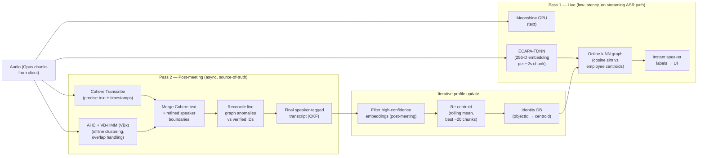

# ADR 0015: Two-pass diarization and speaker identity

**Date:** 2026-07-01
**Status:** Superseded by [ADR 0020](0020-meeting-capture-diarization-authority.md)
**Builds on:** [ADR 0014](0014-server-tier-compute-topology.md) (server tier, model pools), [ADR 0016](0016-auth-identity-bridge.md) (identity DB, Entra objectId → centroid bridge)
**Supersedes diarization details in:** [ADR 0004](0004-background-diarization-okf-agents.md) (WeSpeaker + spectral clustering, vault-first design)

> **2026-07-10:** ADR 0020 replaces this server-only ECAPA/VBx decision with source-aware capture, optional local anonymous evidence, server-authoritative reconciliation, calibrated model-versioned matching, and explicit privacy boundaries. This document remains as decision history and must not be used as the current implementation contract.

## Context

[ADR 0004](0004-background-diarization-okf-agents.md) specified a CPU diarizer (WeSpeaker ResNet34 ONNX + spectral clustering + Rolling Speaker Vault) appropriate for the solo/local-first profile on a 16 GB laptop. The pivot to a server tier (ADR 0014) opens the design space: the GB-class server node can run more accurate models with lower latency.

Three unresolved problems with the ADR 0004 design at team scale:

| Problem | Manifestation |
|---------|---------------|
| **Live speaker labelling is absent** | ADR 0004 diarization is post-hoc only; no live speaker ID during the meeting |
| **Spectral clustering is session-local** | Cannot match against a persistent multi-user identity store |
| **WeSpeaker 256-D embeddings underfit cross-session** | Centroids from one meeting do not reliably match the same speaker in the next |

This ADR defines a **two-pass approach** that separates low-latency live attribution (Pass 1) from high-accuracy post-meeting reconciliation (Pass 2), both running on the server tier.

## Decision

### Architecture overview



### Pass 1 — Live, low-latency, in the streaming path

**Goal:** produce instant speaker labels in the UI while the meeting is in progress.

| Step | Detail |
|------|--------|
| **Text** | Moonshine v2 GPU produces partial/final transcript tokens (existing streaming ASR pool, ADR 0014) |
| **Embeddings** | Concurrently with ASR, an **ECAPA-TDNN** model extracts a **256-D speaker embedding** per ~2 s audio chunk |
| **Online k-NN matching** | Each new embedding is compared (cosine similarity) against the organisation's known employee voice centroids stored in the identity DB (ADR 0016) |
| **Above threshold** | Cosine sim ≥ **0.82** → map to known employee identity (Entra `displayName`) |
| **Below threshold** | Assign a temporary session graph-node ID (`SESSION_XX`) for the remainder of the session |
| **Live UI** | Speaker labels delivered to the client alongside partial transcript tokens over WSS |

**Pass 1 is approximate.** It is optimised for latency, not accuracy. Anomalies (mismatches near the 0.82 boundary, overlapping speakers) are corrected in Pass 2.

### Pass 2 — Post-meeting, asynchronous, source-of-truth

**Goal:** produce a precise, verified, speaker-attributed transcript after the meeting ends.

| Step | Detail |
|------|--------|
| **Precise text** | Send the full session audio (stored Opus) to **Cohere Transcribe** for accurate text + timestamps |
| **Offline clustering** | Concurrently run **AHC (Agglomerative Hierarchical Clustering) + VB-HMM (VBx)** on the full-session embeddings to compute smooth, verified speaker boundaries; handles overlap speech, late entries, and mislabelled live tags |
| **Merge** | Align Cohere text timeline with VBx speaker segments |
| **Reconcile** | Compare Pass 1 live session graph labels against Pass 2 verified identities; flag and resolve transient anomalies (e.g. live `SESSION_01` matches `Alice Chen` in Pass 2) |
| **Final OKF** | Write final speaker-tagged OKF conversation file to `yap-knowledge` Lane 2 (ADR 0017) |

### Iterative profile optimisation — rolling centroid

A person's voice biometric profile is a **rolling centroid**: the mathematical mean of their best ~20 high-confidence embedding chunks. It is never a single snippet.

| Rule | Value |
|------|-------|
| **Pool size** | Best ~20 high-confidence chunks per speaker (more is not always better; quality over quantity) |
| **Update trigger** | After each meeting where the speaker appears with verified identity (Pass 2 result) |
| **Filter** | Keep only high-confidence embeddings (cosine sim to current centroid ≥ **0.85** after Pass 2 reconciliation); discard anomalies |
| **Update formula** | New centroid = (old centroid + mean(clean new embeddings)) normalised; not a raw append |
| **Persistence** | Save updated centroid to identity DB (ADR 0016) `voice_vector` field |
| **Cap** | Roll off oldest chunks when pool exceeds 20 |

This approach means the system **improves its speaker recognition over time** as it accumulates more clean meeting data for each enrolled user.

### ECAPA-TDNN model

| Property | Value |
|----------|-------|
| **Architecture** | ECAPA-TDNN (Emphasized Channel Attention, Propagation and Aggregation TDNN) |
| **Embedding dimension** | 256-D speaker vector |
| **Checkpoint** | `speechbrain/spkrec-ecapa-voxceleb` class or equivalent; pin version in `yap-server` |
| **Inference** | Server-side GPU; shared with Pass 1 live path and Pass 2 offline clustering |
| **Runtime** | Alongside the streaming ASR pool; embeddings computed per ~2 s audio chunk in parallel with Moonshine |

Reference: Desplanques et al., "ECAPA-TDNN: Emphasized Channel Attention, Propagation and Aggregation in TDNN Based Speaker Verification," Interspeech 2020.

### AHC + VB-HMM (VBx) for Pass 2

| Property | Value |
|----------|-------|
| **Algorithm** | Agglomerative Hierarchical Clustering followed by Variational Bayes HMM (VBx) |
| **Input** | Full-session ECAPA-TDNN embeddings + Cohere-derived timestamps |
| **Output** | Precise speaker-boundary segments `[{ t0_ms, t1_ms, speaker_id }]` |
| **Advantages** | Handles overlapping speech, late speaker entries, cross-session consistency better than one-pass spectral clustering |
| **Implementation** | Python service in `yap-server`; runs at `BACKGROUND` priority; triggered on `session_end` |

Reference: Diez et al., "Speaker Diarization Using Variational Bayes HMM After Agglomerative Hierarchical Clustering," Odyssey 2018.

For real-time online diarization framing, see also: Fujita et al., "End-to-End Neural Diarization with Self-Attention" / online turn-taking EEND literature (NeurIPS 2019 onward).

### Cosine similarity thresholds

| Threshold | Role | Rationale |
|-----------|------|-----------|
| **0.82** | Pass 1 live k-NN match | High enough to avoid false positives with similar voices; low enough for quick identification |
| **0.85** | Rolling centroid update filter | Only high-confidence chunks improve the profile; anomalies discarded |
| **< 0.82** | Assign `SESSION_XX` | Better than a wrong name in live UI; Pass 2 will resolve |

These thresholds are **initial values**. They must be tuned against representative org voice data before production; document the tuning run in a post-Phase-10 ADR amendment.

### Solo profile (unchanged)

ADR 0004's WeSpeaker + spectral clustering pipeline is **retained as-is for the solo profile**. The two-pass system is server-only and requires the identity DB (ADR 0016). Solo users on the local-first profile continue with the Phase 7b pipeline.

## Consequences

### Positive

- **Live speaker labels** — meeting participants see real-time attribution, not a post-hoc annotation.
- **High-accuracy final transcript** — VBx Pass 2 corrects live anomalies; Cohere Transcribe improves text quality.
- **Improves over time** — rolling centroid optimisation means the system gets better with each meeting.
- **Handles overlapping speech** — VBx explicitly models overlap; WeSpeaker + spectral clustering does not.
- **Cross-session identity** — identity DB (ADR 0016) enables consistent speaker names across meetings.

### Negative

- **Two passes = two latency windows** — Pass 1 is immediate; Pass 2 adds post-meeting processing time (minutes, not hours on GPU).
- **Identity DB required** — Pass 1 k-NN match is only meaningful if the employee centroid pool is populated; new enrollees get `SESSION_XX` until their centroid matures (~2–3 meetings).
- **Privacy** — voice biometrics are sensitive personal data; ADR 0016 addresses consent and compliance.
- **Server dependency** — two-pass diarization requires the GB-class server node; solo profile falls back to ADR 0004 pipeline.

### Neutral

- Pass 1 and Pass 2 share the same ECAPA-TDNN embedding model; no duplicate model loading.
- The OKF conversation file schema (ADR 0010) is unchanged; Pass 2 output writes to the same frontmatter structure; the `speakers[].name` field is populated from the identity DB `displayName`.

## Implementation notes

### Pass 1 service (streaming, `yap-server`)

```
WSS connection → audio chunk (Opus, ~2s)
  → decode to PCM
  → Moonshine GPU → partial tokens → emit to client
  → ECAPA-TDNN → 256-D embedding
  → k-NN lookup (identity DB, cosine sim)
  → if sim ≥ 0.82 → speaker_id = entra.displayName
  → else          → speaker_id = "SESSION_XX"
  → emit speaker_label event to client over WSS
```

### Pass 2 service (async, `yap-server`)

```
session_end event
  → retrieve stored Opus audio for session
  → Cohere Transcribe → text + word timestamps
  → ECAPA-TDNN over full session → embedding stream
  → AHC → VBx → refined speaker segments
  → merge Cohere text + VBx segments
  → reconcile Pass 1 labels → final speaker map
  → write OKF conversation → yap-knowledge (Lane 2)
  → update rolling centroids for verified speakers → identity DB
```

### Phase 10 deliverables

- [ ] ECAPA-TDNN inference service (shared Pass 1 + Pass 2)
- [ ] Pass 1 online k-NN (cosine sim against identity DB centroids)
- [ ] Pass 2 AHC + VBx pipeline
- [ ] Rolling centroid update job (post-session)
- [ ] Session reconciliation service (Pass 1 → Pass 2 label resolution)
- [ ] Live speaker label events over WSS
- [ ] Solo profile: retain ADR 0004 WeSpeaker pipeline unchanged

## Alternatives considered

### WeSpeaker + spectral clustering (ADR 0004) for team profile

**Adopted for solo profile; replaced for team.** WeSpeaker + spectral clustering is appropriate for a 16 GB CPU laptop. On a GPU server, ECAPA-TDNN + VBx is more accurate, handles overlap, and cross-session identity is possible. ADR 0004 design is preserved for solo.

### pyannote/NeMo full pipelines

**Reconsidered for server profile.** ADR 0004 rejected these due to 8 GB RAM cost on laptops. On the GB-class server node, the RAM constraint is lifted; evaluate pyannote 3.x against ECAPA-TDNN + VBx at Phase 10 build time and document the decision in an amendment.

### Single-pass post-meeting diarization only

**Rejected.** Live speaker labels are a key product differentiator. A purely post-hoc approach means participants see no names during the meeting.

### External speaker-ID API (cloud vendor)

**Rejected.** Sends voice biometrics to a third party; conflicts with on-prem trust model and biometric consent requirements (ADR 0016).

## References

- Desplanques, B. et al. (2020). "ECAPA-TDNN: Emphasized Channel Attention, Propagation and Aggregation in TDNN Based Speaker Verification." _Interspeech 2020._ [arXiv:2005.07143](https://arxiv.org/abs/2005.07143)
- Diez, M. et al. (2018). "Speaker Diarization Using Variational Bayes HMM After Agglomerative Hierarchical Clustering." _Odyssey 2018._ [doi:10.21437/Odyssey.2018-11](https://www.isca-speech.org/archive/odyssey_2018/diez18_odyssey.html)
- Fujita, Y. et al. (2019). "End-to-End Neural Speaker Diarization with Self-Attention." _IEEE ASRU 2019._ [arXiv:1909.06247](https://arxiv.org/abs/1909.06247)
- [ADR 0004](0004-background-diarization-okf-agents.md) — solo profile pipeline (WeSpeaker, vault-first)
- [ADR 0016](0016-auth-identity-bridge.md) — identity DB, biometric consent
