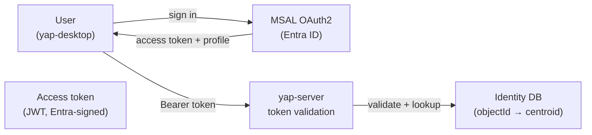

# ADR 0016: Authentication and voice identity bridge (Entra ID + MSAL)

**Date:** 2026-07-01
**Status:** Accepted (roadmap — Phase 9)
**Builds on:** [ADR 0014](0014-server-tier-compute-topology.md) (server tier; auth gates the server connector)
**Related to:** [ADR 0015](0015-two-pass-diarization-speaker-identity.md) (this ADR defines the identity DB that Pass 1 k-NN matching consumes), [ADR 0017](0017-knowledge-base-compiler.md) (auth objectId drives KB permission compilation)

## Context

The team profile (ADR 0014) introduces a server tier that processes audio and stores knowledge on behalf of multiple users. Two things are now required that were absent in the solo profile:

1. **Who is the user?** — the server needs a verified identity to enforce per-user queuing, fairness, and permission gating.
2. **Whose voice is this?** — the two-pass diarization system (ADR 0015) matches live audio against known employee voice centroids; those centroids must be linked to a real identity.

**Microsoft Entra ID** (formerly Azure AD) is the assumed corporate identity provider for org deployments of Yap. Sign-in uses the **MSAL** (Microsoft Authentication Library) OAuth2 / OIDC flow, which is standard for corporate apps.

**Critical distinction:** Entra ID stores only text metadata (displayName, email, objectId, jobTitle, department — all alphanumeric strings). It does **not** store voice vectors. The **app database is the bridge** that links the Entra `objectId` to the mathematical voice centroid. This separation keeps biometric data under the org's direct control, not in a third-party identity store.

## Decision

### Sign-in flow



1. User clicks **Sign in** in `yap-desktop`.
2. MSAL performs the OAuth2 Authorization Code + PKCE flow against the org's Entra ID tenant.
3. On success, MSAL returns an **access token** (JWT) and the user's Entra profile: `objectId`, `displayName`, `userPrincipalName` (email), `jobTitle`, `department`.
4. `yap-desktop` presents the access token as a `Bearer` header on all requests to `yap-server`.
5. `yap-server` validates the token (signature + audience + expiry) against the Entra tenant's JWKS endpoint.
6. On first sign-in, `yap-server` upserts a row in the identity DB keyed by `objectId`.

### Entra profile fields used

| Entra field | Type | Usage |
|-------------|------|-------|
| `objectId` | UUID string | Primary key in identity DB; never changes even if email changes |
| `displayName` | String | Speaker name shown in live UI + OKF transcripts |
| `userPrincipalName` | Email string | Notifications, KB permission checks |
| `jobTitle` | String | Optional KB metadata / department tagging |
| `department` | String | Optional KB permission grouping |

### Identity DB — the bridge

The identity DB is the **only store that links text identity to voice biometric**. It lives inside `yap-server` and is never exported to Entra or any third party.

**Conceptual schema:**

```sql
CREATE TABLE speaker_identity (
    id              TEXT PRIMARY KEY,      -- Entra objectId (UUID string)
    display_name    TEXT NOT NULL,         -- from Entra displayName
    email           TEXT NOT NULL,         -- from Entra userPrincipalName
    department      TEXT,                  -- from Entra department
    job_title       TEXT,                  -- from Entra jobTitle
    voice_vector    BLOB,                  -- 256-D ECAPA-TDNN centroid (float32[256])
    centroid_chunks INTEGER DEFAULT 0,     -- number of embeddings averaged into centroid
    enrolled_at     TIMESTAMP,             -- when voice enrollment was first confirmed
    updated_at      TIMESTAMP,             -- last centroid update
    enrolled        BOOLEAN DEFAULT FALSE  -- explicit enrollment consent given
);
```

- `id` = Entra `objectId`. This is the join key between text identity and voice vector.
- `voice_vector` is `NULL` until the user explicitly enrolls (see § Consent).
- `enrolled` flag must be `TRUE` before any k-NN matching is performed in Pass 1 (ADR 0015).

### KB permission gating

Authentication drives the knowledge-base permission model (ADR 0017):

- The access token's `objectId` is used to resolve the user's compiled permission set (which KB documents they may read/write).
- Permission is checked on every KB query against the Postgres compiled-permission ledger (ADR 0017), **not** against the raw Git files.
- `yap-server` does not expose raw `yap-knowledge` repo access; all access is through the permission-filtered compiled view.

---

## Biometric consent, privacy, and compliance

**Voice embeddings are biometric personal data** under GDPR Article 9, CCPA, BIPA, and many sector-specific regulations (including HIPAA in healthcare settings). The following requirements are **non-negotiable** and must be implemented before any voice centroid is stored or used.

### Explicit opt-in enrollment consent

| Requirement | Implementation |
|-------------|----------------|
| **No passive enrollment** | A user's voice is **never** silently enrolled from meeting audio. Enrollment requires an explicit, informed action. |
| **Clear consent UI** | A dedicated "Enroll my voice" step in Settings, separate from sign-in; explains what is collected, how it is used, and how to delete it. |
| **Consent record** | Store `enrolled_at` timestamp and the consent text version in the identity DB; required for audit. |
| **Separate from SSO** | Signing in with Entra ID does **not** imply voice enrollment. The two are independent. |

### Biometric data handling

| Requirement | Implementation |
|-------------|----------------|
| **Data minimisation** | Store only the 256-D centroid vector (mathematical average), not raw audio snippets used to derive it. The source audio is not retained for enrollment purposes beyond the session retention period. |
| **Access control** | `voice_vector` column is readable only by the diarization service within `yap-server`; not exposed via the API to clients or agents. |
| **Encryption at rest** | The identity DB must be encrypted at rest on the DGX Spark server (OS-level disk encryption or Postgres transparent data encryption). |
| **Isolation** | Voice vectors never leave `yap-server`; they are not copied to `yap-knowledge`, S3, or any external service. |

### Retention and deletion

| Requirement | Implementation |
|-------------|----------------|
| **Right to deletion** | A user who withdraws consent (or leaves the org) must be able to delete their voice centroid. Yap must provide a "Delete my voice profile" action. |
| **Deletion is complete** | Deletion sets `voice_vector = NULL`, `enrolled = FALSE`, `centroid_chunks = 0`, `enrolled_at = NULL`. The `objectId` row may be retained for transcript attribution in existing meetings, but the biometric vector must be irreversibly removed. |
| **Retention limit** | Org admins set a centroid retention policy (e.g. delete after 12 months of no meeting activity); default is perpetual-while-enrolled. |
| **Audit log** | All enrollment, update, and deletion events are logged to the audit table in Postgres (ADR 0017). |

### On-prem deployment and regulated industries

This system is designed for **on-prem org-controlled deployments only**. The following properties make it suitable for regulated/clinical environments:

| Property | Relevance |
|----------|-----------|
| **No third-party cloud processing** | Audio and voice vectors never leave the org's network. Satisfies "no cloud biometrics" requirements common in healthcare and government. |
| **Org controls the data** | Entra ID stores only text metadata; voice vectors are in the org's own database on the org's own hardware. |
| **Auditability** | Postgres audit log (ADR 0017) records all identity and permission changes. |
| **Data residency** | All processing happens on the DGX Spark inside the org's physical perimeter. |

**For HIPAA-covered orgs:** voice biometrics of patients or patient-adjacent staff may be PHI or de-identified PHI depending on context. A covered entity must conduct a HIPAA Privacy/Security risk assessment before deploying the voice enrollment feature for roles where conversations include patient information. Yap provides the technical controls (isolation, deletion, audit); the org provides the administrative safeguards and BAA if applicable.

---

## Consequences

### Positive

- **Single sign-on** — users sign in once with their corporate Entra credentials; no separate Yap account.
- **Accurate speaker attribution** — identity DB links voice centroids to real names without sending biometrics to Entra or any cloud provider.
- **Clean permission model** — `objectId` as the stable key survives email changes and renames.
- **Biometric isolation** — voice vectors are strictly org-local and never embedded in transcript content.

### Negative

- **Entra dependency** — orgs without an Entra ID tenant cannot use the team profile as specified. Alternative IdP support (Okta, Google Workspace) is a future ADR.
- **Enrollment friction** — passive enrollment is prohibited; the explicit consent step adds onboarding friction. This is required, not optional.
- **Regulated-industry complexity** — HIPAA/GDPR reviews may delay deployment for some orgs. Yap provides technical controls; legal review is the org's responsibility.

### Neutral

- Solo/local-first profile is unaffected; no auth required, no voice enrollment.
- The Entra access token is scoped per session; token refresh is MSAL's responsibility.

## Implementation notes

### MSAL integration (`yap-desktop`)

```typescript
import { PublicClientApplication } from "@azure/msal-browser";

const msalConfig = {
  auth: {
    clientId: process.env.ENTRA_CLIENT_ID,
    authority: `https://login.microsoftonline.com/${process.env.ENTRA_TENANT_ID}`,
    redirectUri: "yap://auth/callback",   // Tauri custom URI scheme
  },
};

const msalInstance = new PublicClientApplication(msalConfig);

async function signIn(): Promise<AuthResult> {
  const result = await msalInstance.loginPopup({
    scopes: ["openid", "profile", "User.Read"],
  });
  return { token: result.accessToken, profile: result.account };
}
```

The access token is stored in Tauri's secure storage (OS keychain); refreshed silently on expiry.

### Token validation (`yap-server`)

- Validate JWT signature against Entra JWKS (`https://login.microsoftonline.com/{tenant}/discovery/v2.0/keys`).
- Check `aud` (must match app's client ID) and `exp`.
- Extract `oid` claim as `objectId`.
- Middleware rejects unauthenticated requests to all server endpoints except `/health`.

### Phase 9 deliverables

- [ ] MSAL sign-in flow in `yap-desktop` (popup or system browser)
- [ ] Token storage in OS keychain via Tauri
- [ ] Token validation middleware in `yap-server`
- [ ] Identity DB schema + migration (Postgres, ADR 0017)
- [ ] Upsert-on-first-sign-in logic
- [ ] Consent UI: "Enroll my voice" Settings panel with explicit opt-in
- [ ] Enrollment state flag (`enrolled` column)
- [ ] "Delete my voice profile" action + audit log
- [ ] KB permission gating wired to `objectId` (ADR 0017)

## Open questions

1. **Alternative IdP** — What is the plan for orgs on Okta or Google Workspace? Deferred; design the server auth layer to be IdP-agnostic behind a token-validation abstraction.
2. **Biometric jurisdiction** — Which data-protection regime governs this deployment (GDPR, CCPA, BIPA, HIPAA)? Each has different retention/deletion SLAs. Org legal must confirm before enrollment is enabled in production.
3. **Enrollment UX** — Passive accumulation (enroll from first few meetings, with consent) vs explicit "say these phrases" enrollment session? Both are compatible with consent; UX decision deferred to Phase 9 design.
4. **Guest/contractor accounts** — Entra guest accounts have different `objectId` scopes across tenants. Cross-tenant speaker matching is out of scope for Phase 9.

## Alternatives considered

### No auth; IP-based access control

**Rejected.** IP-based controls do not provide user-level identity for per-user queuing, KB permissions, or speaker attribution.

### Yap-native user accounts (no Entra)

**Rejected for team profile.** Introduces a separate credential management burden for orgs that already have Entra. Optional for solo/self-hosted deployments in a future ADR.

### Store voice vectors in Entra custom attributes

**Rejected.** Entra stores only text attributes. Embedding binary float vectors (256×4 bytes = 1 KB per user) is outside Entra's intended use and would require the biometrics to leave `yap-server`.

### Cloud biometric service (Azure Speaker Recognition, AWS Transcribe Speaker ID)

**Rejected.** Sends voice biometrics to a third-party cloud service; conflicts with on-prem trust model and defeats the purpose of running on DGX Spark.
