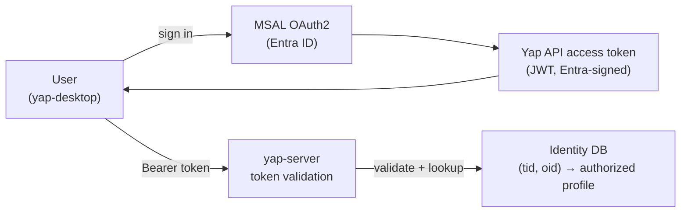

# ADR 0016: Authentication and voice identity bridge (Entra ID + MSAL)

**Date:** 2026-07-01
**Status:** Accepted (roadmap - Phase 7); voice-profile behavior amended by [ADR 0020](0020-meeting-capture-diarization-authority.md)
**Builds on:** [ADR 0014](0014-server-tier-compute-topology.md) (server tier; auth gates the server connector)
**Related to:** [ADR 0020](0020-meeting-capture-diarization-authority.md) (diarization authority, contact boundary, and profile-update rules), [ADR 0017](0017-knowledge-base-compiler.md) (authenticated identity drives KB permission compilation)

> **2026-07-10 correction:** Yap API tokens and Microsoft Graph tokens are resource-specific and must not be interchanged. Yap identities are tenant-scoped `(tid, oid)` pairs, display names are presentation snapshots, and no model prediction may authorize its own biometric-profile update.

## Context

The team profile (ADR 0014) introduces a server tier that processes audio and stores knowledge on behalf of multiple users. Two things are now required that were absent in the solo profile:

1. **Who is the user?** — the server needs a verified identity to enforce per-user queuing, fairness, and permission gating.
2. **Whose voice is this?** - the authoritative diarization service may match meeting evidence against explicitly enrolled employee profiles; those profiles must be linked to a stable tenant-scoped identity.

**Microsoft Entra ID** (formerly Azure AD) is the assumed corporate identity provider for org deployments of Yap. Sign-in uses the **MSAL** (Microsoft Authentication Library) OAuth2 / OIDC flow, which is standard for corporate apps.

**Critical distinction:** Entra ID stores identity metadata. It does **not** store Yap voice vectors. The app database is the bridge between the tenant-scoped Entra identity `(tid, oid)` and a separately enrolled, purpose-authorized, model-versioned voice profile. This separation keeps biometric data under the organization's direct control.

## Decision

### Sign-in flow



1. User clicks **Sign in** in `yap-desktop`.
2. MSAL performs the OAuth2 Authorization Code + PKCE flow against the org's Entra ID tenant.
3. The native client requests a Yap API scope, such as `api://<yap-server-app-id>/access_as_user`.
4. `yap-desktop` presents that Yap API access token as a `Bearer` header on requests to `yap-server`.
5. `yap-server` validates signature, issuer, tenant, audience, expiry, and the `tid` and `oid` claims against the configured Entra tenant policy.
6. On first sign-in, `yap-server` upserts a principal keyed by `(tid, oid)`.
7. Microsoft Graph data, when required, is fetched with a separate Graph-scoped token or by an authorized server integration. A Graph `User.Read` token is never accepted as a Yap API token.

### Entra profile fields used

| Entra field | Type | Usage |
|-------------|------|-------|
| `tid` + `objectId` | Tenant UUID + subject UUID | Composite identity key; `objectId` is not globally unique across tenants |
| `displayName` | String | Presentation snapshot; never used as an identity key |
| `userPrincipalName` | Email string | Fetched or retained only for an enabled notification/permission purpose |
| `jobTitle` | String | Optional purpose-bound metadata; not part of the base principal record |
| `department` | String | Optional purpose-bound metadata; not part of the base principal record |

### Identity DB — the bridge

The identity DB is the **only store that links text identity to voice biometric**. It lives inside `yap-server` and is never exported to Entra or any third party.

**Conceptual schema:**

```sql
CREATE TABLE principal_identity (
    tenant_id            TEXT NOT NULL,
    subject_id           TEXT NOT NULL,
    display_name_snapshot TEXT NOT NULL,
    updated_at           TIMESTAMPTZ NOT NULL,
    PRIMARY KEY (tenant_id, subject_id)
);

CREATE TABLE profile_purpose_grant (
    tenant_id             TEXT NOT NULL,
    subject_id            TEXT NOT NULL,
    grant_id              TEXT NOT NULL,
    purpose               TEXT NOT NULL CHECK (purpose IN ('enrollment', 'matching', 'adaptation')),
    legal_basis_code      TEXT NOT NULL,
    basis_record_ref      TEXT NOT NULL,
    special_category_condition TEXT,
    notice_text_version   TEXT NOT NULL,
    consent_text_version  TEXT,
    granted_at            TIMESTAMPTZ NOT NULL,
    revoked_at            TIMESTAMPTZ,
    revocation_epoch      BIGINT NOT NULL,
    PRIMARY KEY (tenant_id, subject_id, grant_id, purpose),
    FOREIGN KEY (tenant_id, subject_id)
        REFERENCES principal_identity (tenant_id, subject_id)
);

CREATE TABLE speaker_profile (
    tenant_id             TEXT NOT NULL,
    subject_id            TEXT NOT NULL,
    model_id               TEXT NOT NULL,
    model_revision         TEXT NOT NULL,
    embedding_dimension    INTEGER NOT NULL,
    normalization_version  TEXT NOT NULL,
    calibration_version    TEXT NOT NULL,
    voice_vector           BYTEA NOT NULL,
    effective_sample_count INTEGER NOT NULL,
    enrollment_grant_id    TEXT NOT NULL,
    enrollment_grant_epoch BIGINT NOT NULL,
    matching_grant_id      TEXT NOT NULL,
    matching_grant_epoch   BIGINT NOT NULL,
    adaptation_grant_id    TEXT,
    adaptation_grant_epoch BIGINT,
    enrolled_at            TIMESTAMPTZ NOT NULL,
    updated_at             TIMESTAMPTZ NOT NULL,
    expires_at             TIMESTAMPTZ NOT NULL,
    withdrawn_at           TIMESTAMPTZ,
    PRIMARY KEY (tenant_id, subject_id, model_id, model_revision),
    FOREIGN KEY (tenant_id, subject_id)
        REFERENCES principal_identity (tenant_id, subject_id)
);
```

- `(tenant_id, subject_id)` corresponds to the validated Entra `(tid, oid)` claims.
- No `speaker_profile` row exists until explicit enrollment succeeds.
- Profiles with expired or withdrawn consent are excluded from matching and updates.
- Embeddings from incompatible model, normalization, or calibration versions are never compared or merged.
- Enrollment, matching, and adaptation are purpose-limited. Every match and publication rechecks active enrollment and matching grants and their revocation epochs. Adaptation also requires a current adaptation grant and independent authorization.
- Optional email, department, job-title, and Graph claims are fetched on demand or stored in separate purpose-bound records with their own retention. They are not copied into the base principal merely because Entra exposes them.
- All server jobs, chunks, results, profiles, object keys, and audit events are namespaced by the token-derived tenant and owner. A client-provided owner identifier is never authoritative.

The minimum sign-in record is `(tenant_id, subject_id, display_name_snapshot, updated_at)`. Optional Graph claims are not persisted by default. If an enabled feature needs a short-lived claim cache, its default TTL is 24 hours and its schema records the purpose and expiry. Authorization material compiled under ADR 0017 follows that ledger's separately reviewed lifecycle. Principal snapshots are reviewed on sign-in and removed through account-offboarding/deletion policy; they are not an indefinite directory mirror.

The purpose-grant row records the deployment-approved legal-basis code, any required special-category condition, and a reference to the supporting privacy assessment. Yap does not infer those values. Explicit enrollment remains a product requirement, but clicking its button is not itself proof that consent is a valid legal basis. In employment settings, the deployment privacy review must determine whether consent can be freely given and select an applicable lawful basis before identity matching is enabled.

### KB permission gating

Authentication drives the knowledge-base permission model (ADR 0017):

- The validated token's `(tid, oid)` pair is used to resolve the user's compiled permission set.
- Permission is checked on every KB query against the Postgres compiled-permission ledger (ADR 0017), **not** against the raw Git files.
- `yap-server` does not expose raw `yap-knowledge` repo access; all access is through the permission-filtered compiled view.

---

## Biometric consent, privacy, and compliance

Voice embeddings used to identify a person are biometric data and may be sensitive or specially regulated depending on purpose and jurisdiction. Under GDPR, biometric data processed to uniquely identify a person is a special category. Deployment owners must establish a legal basis, complete the required privacy review, and define retention and deletion before enrollment is enabled. The following technical requirements are non-negotiable, but they do not replace legal review.

### Explicit enrollment and purpose authorization

| Requirement | Implementation |
|-------------|----------------|
| **No passive enrollment** | A user's voice is **never** silently enrolled from meeting audio. Enrollment requires an explicit, informed action. |
| **Clear enrollment notice** | A dedicated "Enroll my voice" step in Settings, separate from sign-in; explains what is collected, the authorized purposes and basis, and how to disable matching or delete it. |
| **Purpose record** | Store an auditable purpose grant with immutable grant metadata, notice version, legal-basis reference, optional consent-text version, grant time, and an append-only revocation event/epoch; required for audit and checked on every use. |
| **Separate from SSO** | Signing in with Entra ID does **not** imply voice enrollment. The two are independent. |
| **Separate from contacts and renaming** | Importing a contact, attending a meeting, or renaming `Speaker N` does not create or update a voice profile. |
| **Separate matching purpose** | Retaining an enrolled profile does not make it matchable unless the matching purpose is also active. |
| **Separate adaptation authorization** | Continuing profile adaptation has its own active purpose grant and independent authorization; a model prediction cannot validate its own update. |

### Biometric data handling

| Requirement | Implementation |
|-------------|----------------|
| **Data minimisation** | Store only the versioned aggregate required by the selected model, not meeting-derived exemplar audio or unbounded embedding lists. Client session embeddings are transient. |
| **Access control** | `voice_vector` column is readable only by the diarization service within `yap-server`; not exposed via the API to clients or agents. |
| **Encryption at rest** | The identity DB must be encrypted at rest on the GB-class server node (OS-level disk encryption or Postgres transparent data encryption). |
| **Isolation** | Voice vectors never leave the authorized identity service; they are not copied to contacts, transcripts, `yap-knowledge`, object storage, clients, or peer devices. |

### Retention and deletion

| Requirement | Implementation |
|-------------|----------------|
| **Right to deletion** | A user who withdraws consent (or leaves the org) must be able to delete their voice centroid. Yap must provide a "Delete my voice profile" action. |
| **Deletion is complete** | Withdrawal excludes the profile immediately, then removes active records, caches, replicas, and backups according to a documented deletion SLA. Historical transcripts may retain a display-name snapshot without retaining the biometric template. |
| **Retention limit** | Enrollment cannot be enabled until the deployment defines a finite retention or review period. There is no perpetual-by-default profile policy. |
| **Audit log** | All enrollment, update, and deletion events are logged to the audit table in Postgres (ADR 0017). |
| **Restore safety** | A non-biometric revocation/deletion tombstone prevents an old replica or backup from making a withdrawn profile matchable again. |

### On-prem deployment and regulated industries

This system is designed for **on-prem organization-controlled deployments only**. The following properties support regulated deployments, but they do not establish legal or security compliance by themselves:

| Property | Relevance |
|----------|-----------|
| **No third-party biometric processing** | Audio and voice vectors remain inside the authorized organization-controlled deployment boundary. |
| **Org controls the data** | Entra ID stores only text metadata; voice vectors are in the org's own database on the org's own hardware. |
| **Auditability** | Postgres audit log (ADR 0017) records all identity and permission changes. |
| **Data residency** | All processing happens on the GB-class server node inside the org's physical perimeter. |

**For HIPAA-covered orgs:** voice biometrics of patients or patient-adjacent staff may be PHI or de-identified PHI depending on context. A covered entity must conduct a HIPAA Privacy/Security risk assessment before deploying the voice enrollment feature for roles where conversations include patient information. Yap provides the technical controls (isolation, deletion, audit); the org provides the administrative safeguards and BAA if applicable.

---

## Consequences

### Positive

- **Single sign-on** — users sign in once with their corporate Entra credentials; no separate Yap account.
- **Accurate speaker attribution** — identity DB links voice centroids to real names without sending biometrics to Entra or any cloud provider.
- **Clean permission model** - `(tid, oid)` as the stable tenant-scoped key survives email changes and renames.
- **Biometric isolation** — voice vectors are strictly org-local and never embedded in transcript content.

### Negative

- **Entra dependency** — orgs without an Entra ID tenant cannot use the team profile as specified. Alternative IdP support (Okta, Google Workspace) is a future ADR.
- **Enrollment friction** — passive enrollment is prohibited; the explicit consent step adds onboarding friction. This is required, not optional.
- **Regulated-industry complexity** — HIPAA/GDPR reviews may delay deployment for some orgs. Yap provides technical controls; legal review is the org's responsibility.

### Neutral

- Solo/local-first profile is unaffected; no auth required, no voice enrollment.
- The Entra access token is scoped per session; token refresh is MSAL's responsibility.

## Implementation notes

### MSAL integration (`yap-desktop`)

Use an MSAL native/public-client Authorization Code + PKCE flow through the system browser. The exact Rust or native-client library is selected in the implementation spec; `msal-browser` popup code is not the architecture contract for a Tauri desktop app.

Request the Yap API scope for Yap calls. Request Microsoft Graph scopes only for separate Graph operations. Tokens and refresh material are stored through OS credential storage and are never exposed to ordinary frontend persistence.

### Token validation (`yap-server`)

- Validate JWT signature against Entra JWKS (`https://login.microsoftonline.com/{tenant}/discovery/v2.0/keys`).
- Check `iss`, allowed `tid`, `aud` (the Yap server API application ID), `exp`, and other deployment-required claims.
- Extract `(tid, oid)` as the tenant-scoped principal key.
- Middleware rejects unauthenticated requests to all server endpoints except `/health`.

### Phase 7 deliverables

- [ ] Native/public-client MSAL sign-in flow in `yap-desktop` through the system browser
- [ ] Token storage in OS keychain via Tauri
- [ ] Token validation middleware in `yap-server`
- [ ] Identity DB schema + migration (Postgres, ADR 0017)
- [ ] Upsert-on-first-sign-in logic
- [ ] Enrollment UI: "Enroll my voice" Settings panel with explicit opt-in and the approved notice
- [ ] Versioned purpose-grant and profile records; absence of a profile row means not enrolled
- [ ] "Delete my voice profile" action + audit log
- [ ] KB permission gating wired to `(tid, oid)` (ADR 0017)

## Open questions

1. **Alternative IdP** — What is the plan for orgs on Okta or Google Workspace? Deferred; design the server auth layer to be IdP-agnostic behind a token-validation abstraction.
2. **Biometric jurisdiction** — Which data-protection regime governs this deployment (GDPR, CCPA, BIPA, HIPAA)? Each has different retention/deletion SLAs. Org legal must confirm before enrollment is enabled in production.
3. **Enrollment UX** - Use a deliberate enrollment session. Passive meeting accumulation is not an enrollment mechanism. Separately authorized profile adaptation may be evaluated later.
4. **Guest/contractor accounts** - Guest subjects remain tenant-scoped through `(tid, oid)`. Cross-tenant speaker-profile matching is out of scope.

## Alternatives considered

### No auth; IP-based access control

**Rejected.** IP-based controls do not provide user-level identity for per-user queuing, KB permissions, or speaker attribution.

### Yap-native user accounts (no Entra)

**Rejected for team profile.** Introduces a separate credential management burden for orgs that already have Entra. Optional for solo/self-hosted deployments in a future ADR.

### Store voice vectors in Entra custom attributes

**Rejected.** Entra custom attributes are not the store for model-defined binary embeddings and their calibration, consent, retention, and deletion metadata. Using them would also move biometrics outside Yap's authorized identity service.

### Cloud biometric service (Azure Speaker Recognition, AWS Transcribe Speaker ID)

**Rejected.** Sends voice biometrics to a third-party cloud service; conflicts with on-prem trust model and defeats the purpose of running on an org-owned server node.

## References

- European Commission, [Sensitive personal data](https://commission.europa.eu/law/law-topic/data-protection/rules-business-and-organisations/legal-grounds-processing-data/sensitive-data/what-personal-data-considered-sensitive_en)
- European Data Protection Board, [Guidelines 05/2020 on consent](https://www.edpb.europa.eu/documents/guideline/guidelines-052020-on-consent-under-regulation-2016679_en)
