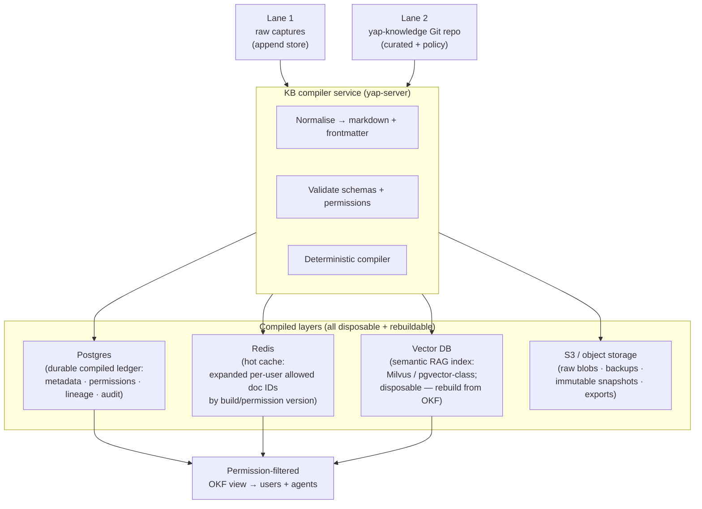

# ADR 0017: Team knowledge base — source-of-truth, compiled disposable indexes, and permission model

**Date:** 2026-07-01
**Status:** Accepted (roadmap — canonical Phase 9)
**Builds on:** [ADR 0014](0014-server-tier-compute-topology.md) (server tier), [ADR 0016](0016-auth-identity-bridge.md) (auth drives permissions), [ADR 0010](0010-okf-conversation-schema.md) (OKF file schema), [ADR 0011](0011-vector-rag-retrieval.md) (vector retrieval), [ADR 0012](0012-mcp-server-surface.md) (MCP surface)
**Identity-key rule:** Per [ADR 0016](0016-auth-identity-bridge.md), every user and group reference is tenant-scoped. Bare Entra object IDs are historical shorthand and are not valid cache, index, or authorization keys.
**Consolidates / supersedes server-profile details in:** [ADR 0009](0009-knowledge-worker-protocol.md) (knowledge worker IPC → server KB compiler API), [ADR 0010](0010-okf-conversation-schema.md) (adds two-lane store context), [ADR 0011](0011-vector-rag-retrieval.md) (SQLite → server-side vector DB for team profile), [ADR 0012](0012-mcp-server-surface.md) (MCP now runs in yap-server)

## Context

The solo-profile knowledge base (ADR 0004, 0009–0012) stores everything as local OKF markdown and a SQLite index on the client machine. This is correct for one user; it breaks for a team:

| Problem | Manifestation |
|---------|---------------|
| **No shared knowledge** | Each user has their own private markdown; meeting notes are not visible to other participants |
| **No permission model** | Local files have no per-user access control |
| **No history/blame** | Markdown files can be overwritten without any diff or rollback |
| **High-volume writes from raw captures** | Meeting transcripts are high-frequency machine writes; Git commits per transcript cause commit storms |
| **Search across all users** | The local SQLite index is per-user; team search is impossible |

The knowledge base for the team profile is primarily **text**: meeting transcripts, Wispr-style notes, agent summaries, decisions, markdown documents. This shapes the right storage primitives.

### Mental model

> **Git = knowledge base / "source code of knowledge."
> Markdown = storage format.
> Frontmatter = metadata.
> Permission files = mutable access source-of-truth.
> Postgres = compiled ledger.
> Redis = speed layer.
> Vector DB = disposable semantic search index.
> S3 = raw blobs, backups, and snapshots.
> Agent artifacts = generated knowledge with provenance + inherited permissions.**

This is **not** OneDrive-style file sync. It **compiles** authorised, versioned knowledge views from source, similar to how a build system compiles source code into an executable.

## Decision

### Two-lane store

The central design insight is that raw machine writes and curated human writes have fundamentally different versioning needs:

| Lane | Content | Write pattern | Version primitive |
|------|---------|---------------|-------------------|
| **Lane 1 — raw capture** | Meeting transcripts, live notes, conversation imports | High-volume, append-heavy, machine-generated | Content-addressed immutable versions (content hash + monotonic IDs / append-only rows) |
| **Lane 2 — curated / policy** | OKF markdown docs, agent summaries, permission files, schemas, relationship edges, decision records | Low-volume, human/agent-paced | Git commits in `yap-knowledge` repo |

**Lane 1 does not use Git commits.** Committing every meeting transcript would create commit storms and make `main` a write bottleneck. Content-addressed versioning (hash + ID) is the correct primitive for write-once, append-heavy data.

**Lane 2 does use Git.** PRs, review, blame, rollback, and citation to an exact `commit:line-span` are genuinely valuable for curated knowledge and policy files.

**Migration path:** Lane 1 can start as a Git-compatible store (append-only subdirectory, not committed) and migrate to a dedicated content-addressed store when transcript write volume crosses a monitoring threshold. Because all indexes are disposable and rebuilt from source, this migration is cheap.

### Source-of-truth: `yap-knowledge` Git repo

The `yap-knowledge` repository (ADR 0018) is the **source-of-truth for curated content (Lane 2)**:

```
yap-knowledge/
  meetings/               # Lane 1 entry point (normalised OKF, before curated)
  conversations/          # curated conversation bundles (Lane 2)
  jargon_glossary/        # term cards (Lane 2)
  work_artifacts/         # todos, exports, agent summaries (Lane 2)
  team_knowledge/         # shared team docs (Lane 2)
  permissions/            # mutable permission source-of-truth (Lane 2)
    _team.yml             # org-wide defaults
    <path-prefix>.yml     # path-scoped overrides
  schemas/                # document schemas (Lane 2)
  agent_artifacts/        # immutable provenance-tracked artifacts (Lane 2)
```

**Access rule:** only the KB compiler service in `yap-server` reads the `yap-knowledge` repo in full. End users never clone it directly. A raw Git repo has no per-file access control; the compiled, permission-filtered OKF view is what users and agents receive.

### Compiled, disposable layers

All indexes are **rebuildable from source**. Editing permissions or schema never requires a data migration — just a recompile.



#### Postgres — durable compiled ledger

| Content | Notes |
|---------|-------|
| Document metadata (title, path, source, version/commit, content hash) | Used to build the allowed-path list |
| Compiled permission sets (JSONB) | Denormalised per-user, per-path for fast lookup |
| Lineage records (agent artifact → source files + versions) | Provenance for audit |
| Audit log (identity + permission events, compile runs) | Required for regulated environments |
| Build run metadata (compile version, source commit, timestamp) | Reproducibility |

JSONB is used for compiled policies and provenance blobs; these are **compiler output**, not schema-locked relational data.

#### Redis — hot cache

| Content | Notes |
|---------|-------|
| Expanded per-user allowed doc IDs / paths | Pre-computed at compile time; keyed by `(tenant_id, subject_id, build_version)` |
| Allowed knowledge-tree by build version | Invalidated on permission recompile; never the source-of-truth |
| Session tokens (short TTL) | Auth adjacency |

Redis is **never** the permission source-of-truth. It is a speed layer over Postgres. A Redis miss falls back to Postgres, never to the raw permission file.

#### Vector DB (Milvus / pgvector-class)

| Schema field | Notes |
|--------------|-------|
| `chunk_id` | Unique ID for this retrieval chunk |
| `doc_id` | Document identifier in Postgres |
| `source_path` | Path in `yap-knowledge` repo |
| `repo_commit` / `content_hash` | Links chunk to exact source version |
| `permission_hash` | Hash of compiled permissions at index time; stale chunks are skipped on lookup |
| `access_tags` | Pre-compiled tenant-scoped principal references such as `(tenant_id, subject_id)` or `(tenant_id, group_id)` (denormalised for fast filter) |
| `heading` | Section heading for citation |
| `char_span` | `[start, end]` character offsets in source document |
| `embedding` | 384-D or 768-D semantic vector |

The vector DB is **disposable** — it is rebuilt from OKF sources at any time. It is **not** the permission source-of-truth: every search result must still pass through the Postgres/Redis compiled-permission check before being returned to the user. The `permission_hash` field enables efficient cache-key invalidation when permissions change.

#### S3 / object storage

| Content | Notes |
|---------|-------|
| Original audio/video files (if retained) | Optional; org-policy decision |
| Backups of `yap-knowledge` repo + Postgres | Disaster recovery |
| Compiled immutable snapshots/bundles | Point-in-time exports |
| Lane 1 raw transcript blobs | Append-only, content-addressed |

S3 is **not** the knowledge system's heart. It is a raw/backup tier.

### Permission model — invariants

These invariants are **non-negotiable** for correctness and security:

| Invariant | Rule |
|-----------|------|
| **Permission source-of-truth** | The permission/metadata file in `yap-knowledge` is the sole mutable source-of-truth. Every index is disposable. |
| **Compile trigger** | Editing permissions = edit file → commit → webhook → deterministic compiler → Postgres + Redis + vector/OKF rebuild-or-invalidate. |
| **No inline permission checks** | Viewing a knowledge tree never opens a markdown file to check access. It checks the compiled Postgres/Redis permission cache for allowed paths, then returns the allowed OKF view from the current source version. |
| **Redis miss fallback** | A Redis miss falls back to Postgres, never to the raw permission file (which is not deployed to the app server). |
| **Agent artifact inheritance** | An artifact (summary, entity card, decision record, relationship graph) inherits the **strictest effective permissions** of all its sources: audience = INTERSECTION; denials = UNION; classification = MOST RESTRICTIVE. An artifact can never leak from its most-restricted source. |

#### Agent artifact permissions

Agent artifacts are **immutable paths** with provenance back to exact source files + versions:

```yaml
---
type: agent_artifact
artifact_id: "2026-07-01-action-items-meeting-abc"
generated_by: coordinator
sources:
  - path: meetings/2026-07-01-abc.md
    commit: a3b2c1d
    char_span: [0, 4200]
  - path: team_knowledge/project-x.md
    commit: f1e2d3c
    char_span: [100, 800]
effective_audience:  # intersection of source audiences
  - alice@org.com
  - bob@org.com
effective_classification: confidential  # most restrictive of sources
denials: []  # union of source denials
schema: 1
---
```

### Compile flow

```
Capture / edit
  ↓
Normalise to markdown + YAML frontmatter
  ↓
Lane 1: append to content-addressed store (raw captures)
Lane 2: commit to yap-knowledge Git repo (curated/policy)
  ↓
Webhook / event fires on Lane 1 threshold or Lane 2 commit
  ↓
KB compiler:
  1. Validate schemas (reject malformed docs)
  2. Validate permissions (reject policy conflicts)
  3. Deterministic compile:
     a. Postgres — upsert metadata, compiled permissions, lineage, audit
     b. Redis — refresh expanded per-user allowed paths (keyed by build version)
     c. Vector DB — re-embed changed docs; invalidate stale chunks by permission_hash
     d. Allowed OKF tree — recreate permission-filtered view from current source
  ↓
Users + agents see updated knowledge
```

**Important:** the compile is **deterministic** — given the same source version and permission files, it always produces the same Postgres rows, Redis keys, and vector embeddings. This enables incremental recompiles (only reprocess changed files) and full rebuilds (delete all indexes, replay from source).

### Solo profile (unchanged)

ADR 0009–0012's local OKF markdown + SQLite index is **retained as-is for the solo profile**. The two-lane store, permission compilation, and server-side indexes are team-profile-only.

## Consequences

### Positive

- **Version history + blame** — every curated document and permission change is traceable to a Git commit and author.
- **Permission correctness** — the compiled-permissions model means a permission change propagates atomically to all indexes on the next compile, rather than scattered across file ACLs.
- **Disposable indexes** — any index can be fully rebuilt from source at any time; no index state is canonical.
- **Agent artifact isolation** — the inheritance model ensures agents cannot accidentally leak restricted source content into broadly-visible artifacts.
- **Citation precision** — every RAG result and agent artifact can cite an exact `commit:char_span` in `yap-knowledge`.

### Negative

- **Compile latency** — a permission change is not instantaneous; it triggers a compile run. Compile time grows with corpus size. Mitigated by incremental compiles and the Redis hot cache for reads.
- **Operational complexity** — Postgres + Redis + vector DB + S3 + Git repo + compiler service is a multi-component system. All are standard, widely-operated technologies; the IaC lives in `yap-server/infra/`.
- **Two ingestion lanes** — Lane 1 and Lane 2 have different write paths; the KB compiler must handle both without confusion.

### Neutral

- The OKF conversation schema (ADR 0010) frontmatter fields are unchanged; the KB compiler is a new consumer of that schema, not a replacement.
- The vector DB schema adds `permission_hash`, `access_tags`, `repo_commit`/`content_hash` fields to the ADR 0011 chunk schema; the retrieval flow and confidence gate are preserved.

## Implementation notes

### Lane 1 ingestion path

```
Client captures meeting audio → Pass 2 produces OKF conversation
  → KB compiler receives OKF via yap-server API
  → Normalise frontmatter
  → Assign content hash + monotonic ID
  → Append to Lane 1 store (Postgres `raw_captures` table)
  → Compiler event: embed + index in vector DB; update Redis
  → (No Git commit for Lane 1 raw captures)
```

### Lane 2 ingestion path

```
Human / agent edits curated document or permission file
  → Commit to yap-knowledge repo (PR or direct depending on policy)
  → GitHub/Gitea webhook fires on push to main
  → KB compiler service pulls latest commit
  → Validate → compile → Postgres + Redis + vector DB + OKF view
```

### Permission file format (normative)

```yaml
# yap-knowledge/permissions/<path-prefix>.yml
path_prefix: meetings/2026-Q3/
audience:
  users:
    - alice@org.com
    - bob@org.com
  groups:
    - engineering
classification: internal
denials:
  users:
    - contractor-x@org.com
```

The compiler resolves permission-file names inside the configured tenant and expands group membership from Entra ID (ADR 0016) to tenant-scoped `(tenant_id, subject_id)` principal keys at compile time. Group IDs are tenant-scoped as well. Unresolved or cross-tenant principals fail closed.

### Canonical Phase 9 deliverables

- [ ] `yap-knowledge` repo scaffolding (ADR 0018)
- [ ] KB compiler service in `yap-server`
- [ ] Lane 1 append store (Postgres `raw_captures` + content hash)
- [ ] Lane 2 webhook handler (push → compile trigger)
- [ ] Postgres schema: metadata, permissions, lineage, audit
- [ ] Redis hot cache: allowed-paths by user + build version
- [ ] Vector DB integration (Milvus or pgvector; schema above)
- [ ] S3 integration: raw blob storage + backup lifecycle
- [ ] Permission inheritance for agent artifacts
- [ ] Deterministic rebuild CLI (`yap-server rebuild-index`)
- [ ] Permission-filtered OKF view API (replaces ADR 0012 local MCP for team profile)
- [ ] IaC under `yap-server/infra/` (Postgres migrations, Redis config, vector index config, S3 lifecycle)

## Open questions

1. **Lane 1 migration threshold** — What specific metric (e.g. transcript commits/day, repo size, CI time) triggers migration from the Git-compatible Lane 1 design to a dedicated content-addressed store? Monitoring-driven; not a fixed number.
2. **Vector DB choice** — Milvus vs pgvector vs Qdrant? Evaluate at Phase 11 build time against the GB-class server node profile (RAM, storage IOPS, GPU-accelerated ANN). Record the decision in an ADR amendment.
3. **Permission compile latency SLA** — How quickly must a permission change propagate to all users? (Seconds? Minutes?) This drives the compile pipeline design (incremental vs full rebuild).
4. **`yap-knowledge` repo host** — Self-hosted Gitea on the org LAN vs GitHub Enterprise? Must be reachable from `yap-server`; must satisfy the org's data-residency requirements.

## Alternatives considered

### Git for everything (Lane 1 and Lane 2)

**Rejected for Lane 1.** A Git commit per meeting transcript creates commit storms, makes `main` a write bottleneck under concurrent users, and bloat the repo history with machine-generated content. Git is excellent for Lane 2 curated content but wrong for Lane 1 raw volume.

### SQLite for the team profile (extend ADR 0011)

**Rejected for team.** A single SQLite file does not scale to multi-user concurrent reads/writes and cannot be deployed on a server without significant serialisation overhead. SQLite remains correct for the solo profile.

### OneDrive / SharePoint / cloud file sync

**Rejected.** File sync provides no compiled permission model, no deterministic rebuilds, no version-to-line-span citations, and sends data to a third-party cloud. The Git + compiler model is architecturally superior for knowledge management.

### Single-permission check at read time (open files, check ACL)

**Rejected.** Opening every markdown file to check an in-file ACL on every knowledge-tree view is slow, inconsistent (what if the file is corrupted?), and leaves no audit trail. Compiled permissions in Postgres + Redis are faster, auditable, and deterministic.
