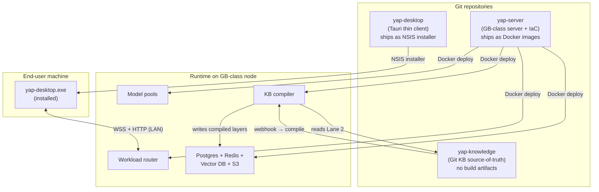

# ADR 0018: Three-repo topology

**Date:** 2026-07-01
**Status:** Accepted (roadmap — Phase 12)
**Builds on:** [ADR 0014](0014-server-tier-compute-topology.md) (server tier), [ADR 0017](0017-knowledge-base-compiler.md) (yap-knowledge as Git source-of-truth)

## Context

Today the entire codebase lives in a single monorepo (`cohere-transcribe-local`), which contains the Tauri desktop app under `desktop/`. With the introduction of a server tier (ADR 0014) and a Git-based knowledge source-of-truth (ADR 0017), a monorepo no longer maps cleanly to the deployment units:

| Concern | Single-repo problem |
|---------|---------------------|
| **yap-server** is a backend service deployed on a GB-class server node | It has a different release cadence, runtime (Python/Rust services), and deployment target than the desktop app |
| **yap-knowledge** is a data repo, not code | It is written by the KB compiler and edited by humans/agents; it must never ship build artifacts |
| **Desktop installers and server containers** have different CI/CD pipelines | A monorepo requires complex path-based CI filtering or a monorepo build tool; for two services this is unnecessary overhead |
| **Per-repo access control** is simpler | `yap-knowledge` should be readable only by the KB compiler; a mixed repo cannot enforce this at the repo level |

## Decision

Split the codebase into **three repositories**, each with a single, clear deployment identity.

This is the **long-term Phase 12 target**, not the MVP working layout. Through MVP and early server phases, keep a staged monorepo:

```text
cohere-transcribe-local/
  desktop/              # installed Tauri client; future yap-desktop
  server/               # Phase 8 yap-server staging area
  infra/yap-server-node/ # GB-class host setup, independent of app code
  docs/                 # authoritative ADRs, specs, and runbooks
```

Do not add Nx, Turborepo, or a separate contracts repo during MVP. OpenAPI/types should start inside `server/` and move only when type drift becomes real.

### Repo 1: `yap-desktop`

| Attribute | Value |
|-----------|-------|
| **Contents** | Tauri + React thin client |
| **Primary language** | Rust (Tauri backend) + TypeScript (React frontend) |
| **Deployment** | NSIS installer (Windows); future: macOS DMG, Linux AppImage |
| **Responsibilities** | Mic capture; Silero VAD; Opus encoding; global hotkey + text injection (ADR 0013); ghost / preview UI; server connector (WSS + HTTP); local file selection; local Nemotron INT8 fallback; Settings UI |
| **Maps from** | `cohere-transcribe-local/desktop/` |

`yap-desktop` ships to end-user machines. It must be code-signed and notarised per-platform. It contains no server-side logic and no knowledge data.

### Repo 2: `yap-server`

| Attribute | Value |
|-----------|-------|
| **Contents** | GB-class server node: workload router, model pools, KB compiler, auth middleware, APIs |
| **Primary language** | Python (ML inference services) + Rust (router / API server) |
| **Deployment** | Docker Compose / Kubernetes on org-managed GB-class hardware |
| **Responsibilities** | Workload router (per-tenant queues, fairness, backpressure); Streaming ASR pool (WSS); Cohere batch pool (concurrent GPU workers); LLM pool (Scribe/polish/agents); ECAPA-TDNN + two-pass diarization service (ADR 0015); KB compiler service (ADR 0017); Auth middleware + identity DB (ADR 0016); APIs: live WSS, batch job queue, KB query |
| **Infrastructure-as-code** | `yap-server/infra/` contains Postgres migrations, Redis config, vector index config, S3 bucket/lifecycle policy, docker-compose/k8s manifests. The storage **data** lives on the running server node; the repo holds migrations + IaC only. |
| **Maps from** | `cohere-transcribe-local/server/` plus `infra/yap-server-node/` after MVP staging |

`yap-server` is never installed on end-user machines. Its Docker images are built and deployed by the org's infrastructure team. The `infra/` subdirectory is the single source of truth for all storage infrastructure — do **not** create a separate `yap-infra` repo.

### Repo 3: `yap-knowledge`

| Attribute | Value |
|-----------|-------|
| **Contents** | Git data source-of-truth for curated knowledge (Lane 2) |
| **Format** | Markdown + YAML frontmatter (OKF, ADR 0010); permission files; schemas; agent artifacts |
| **Deployment** | Git repo hosted on the org's LAN (self-hosted Gitea or GitHub Enterprise) |
| **Write access** | KB compiler service (automated commits/PRs); team members for curated edits |
| **Read access** | KB compiler service **in full**; end users/agents receive only the compiled permission-filtered view; never raw clone |
| **Does NOT contain** | Lane 1 raw transcripts; source code; infrastructure config |
| **Maps from** | No direct predecessor; emerges from ADR 0017 KB design |

**Why not put `yap-knowledge` in `yap-server`?** The knowledge repo must be editable by humans (not just the server), have its own Git history and PR review workflow, and potentially be accessible from tools like Obsidian or VS Code. Mixing it with server code creates the wrong access pattern.

**Why not put `yap-knowledge` in `yap-desktop`?** Desktop releases would bundle knowledge data into the installer, which is wrong. Knowledge lives on the server.

### Repository topology diagram



### Current workspace mapping

The current `cohere-transcribe-local` workspace maps as follows:

| Current path | Destination repo |
|--------------|-----------------|
| `desktop/` | `yap-desktop` |
| `server/` | MVP staging area for `yap-server`; split in Phase 12 |
| `infra/yap-server-node/` | `yap-server` host/bootstrap docs and scripts |
| `docs/` | Stay in the monorepo through MVP; split or copy with repo ownership in Phase 12 |
| Historical `transcribe.py`, `requirements.txt` | Not migrated; larger-recording transcription moved toward the server path while local live fallback moved to the Tauri runtime |
| `PRODUCT.md`, `DESIGN.md` | `yap-desktop` (product docs) |
| *New server code* | `server/` now; `yap-server` repo in Phase 12 |
| *Knowledge data* | `yap-knowledge` (new repo) |

The migration is **not** Phase 12's only scope; it also includes updating all CI/CD pipelines, cross-repo references, and the ADR cross-links. Phase 12 is a logistics phase, not a feature phase.

### Optional future: `yap-contracts`

A fourth repo (`yap-contracts`) for shared API type definitions (protobuf, OpenAPI, or TypeScript types shared between `yap-desktop` and `yap-server`) is a common pattern at larger scale.

**Recommendation: defer.** Start with API type definitions **inside `yap-server`** (e.g. as a TypeScript types package or OpenAPI spec). Extract to `yap-contracts` only when:

- `yap-desktop` and `yap-server` have divergent release cadences that make in-repo type updates painful, **and**
- Type drift between repos has caused a real bug.

Extracting prematurely adds a third dependency to manage without a proven need.

## Consequences

### Positive

- **Clear deployment identity** — each repo ships to exactly one target; no path-based CI filtering.
- **`yap-knowledge` access control** — the Git repo can be configured so only the compiler service has read access; human editors work through PRs with review.
- **Independent release cadences** — `yap-desktop` can ship an installer fix without redeploying the server, and vice versa.
- **Smaller clone size** — a desktop developer never clones `yap-server`'s model weights or migration history.

### Negative

- **Cross-repo coordination** — API changes require coordinated updates in two repos (`yap-desktop` and `yap-server`). Mitigated by starting with API types in `yap-server` and a clear versioning policy.
- **Migration cost** — splitting the monorepo requires updating CI/CD, cross-repo links, and developer tooling. Phase 12 has non-trivial logistics.
- **Git history fragmentation** — `git log` on `yap-desktop` will not show the server history. Acceptable: the two systems were merged only temporarily.

### Neutral

- All existing ADR cross-links within `docs/adr/` continue to work as long as the docs folder moves with `yap-desktop` (or is maintained as a shared docs umbrella).
- The solo-profile local-first stack in `yap-desktop` is unchanged by the repo split.

## Implementation notes

### Phase 12 deliverables

- [ ] Create/extract `yap-server` repo from `server/` and `infra/yap-server-node/`; preserve router, pool stubs, KB compiler stub, and IaC structure
- [ ] Create `yap-knowledge` repo; initial permission schema, placeholder OKF directories
- [ ] Migrate `desktop/` to `yap-desktop` repo (with full Git history via `git filter-repo`)
- [ ] Update CI pipelines for all three repos
- [ ] Update cross-repo documentation links
- [ ] Verify `yap-knowledge` repo access control (only KB compiler + designated editors)
- [ ] Document API versioning policy between `yap-desktop` and `yap-server`

## Alternatives considered

### Single monorepo (keep `cohere-transcribe-local`)

**Rejected for the long term.** A monorepo works for Phase 0–7 but conflates a data repo (`yap-knowledge`), a server service, and a desktop installer. Path-based CI filtering becomes fragile. Access control on `yap-knowledge` cannot be enforced at the repo level.

**Acceptable short-term:** the repo split is Phase 12; earlier server-tier phases (8–11) can build in a `server/` subdirectory of the monorepo as a staging area before the formal split.

### Two repos (yap-desktop + yap-server, merge yap-knowledge into server)

**Rejected.** Including `yap-knowledge` in `yap-server` would require server deployments to be blocked on knowledge repo changes, and human editors would need server-repo write access. The knowledge repo has a different audience (authors, curators) from the server repo (engineers).

### Nx / Turborepo monorepo tooling

**Deferred.** If the repos multiply beyond three, a monorepo tool is worth revisiting. For exactly three clearly-separated concerns, separate repos with a clean API versioning policy are simpler.

## References

- [ADR 0014](0014-server-tier-compute-topology.md) — server tier rationale
- [ADR 0017](0017-knowledge-base-compiler.md) — `yap-knowledge` repo design
- [ADR 0013](0013-global-hotkey-injection.md) — stays in `yap-desktop`
