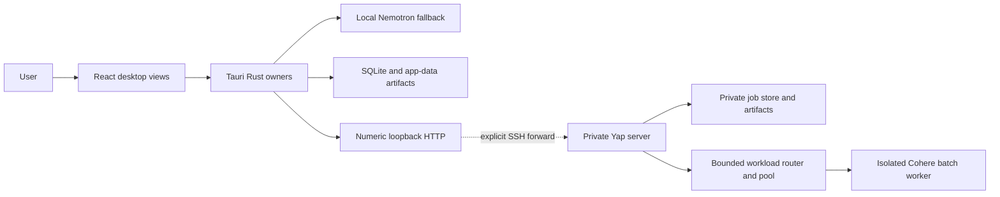

# Current Architecture

This document describes the executable Phase 1–5 system. The
[Voice OS architecture](../VOICE-OS-ARCHITECTURE.md) remains the first-class
long-term frame; accepted future work is sequenced by the
[roadmap](../roadmap/ROADMAP.md) and ADRs, not promoted into current-state
claims before it executes.

## System context



The SSH forward is a development access boundary managed outside Yap. It is
not an application TLS endpoint or enterprise deployment.

## Desktop

### React projection layer

`desktop/src/` renders the installed desktop experience. `App.tsx` composes
feature hooks and views; it does not own native job, recording, connector,
path, or result transitions. Feature hooks hold navigation, selected-item,
preview, draft, and loading state. Native snapshots/events are re-read after
missed or stale events instead of being promoted into a second durable owner.

The live surface is one renderer hosted in the native `live-overlay` window.
View variants, waveform, reduced-motion behavior, and presentation timing live
under `components/live/`; native code owns window identity, bounds, placement,
visible region, and lifecycle. The renderer reads the OS reduced-motion
preference synchronously for its initial state before subscribing to changes.

### Tauri/native boundary

`desktop/src-tauri/src/app.rs` composes startup/shutdown, the tray, windows, and
owned background tasks. `commands/*` and `jobs/commands/*` authorize and adapt
WebView requests; domain owners below them perform transitions. Blocking
interactive workflows acquire their owner lease before opening a native picker
or awaiting server-origin confirmation.

Major native owners are:

| Area | Authority |
| --- | --- |
| Capture/frame/timeline/recording | `audio/*` |
| Live state, actions, shortcut runtime, and local stream resources | `live/*` |
| Imported job state, scheduling, spool, retry, cancel, and result verification | `jobs/*` |
| Connector configuration, health, generations, retry, and batch contract | `server_connector/*` |
| Source/path admission and playback leases | `media_protocol/*` and `recording_access/*` |
| Transcript/catalog/file actions | `live/recordings/*`, `commands/history/*`, and `file_actions/*` |
| Local model download/integrity/Nemotron lifecycle | `stt/*` |
| Canonical and legacy app-data paths | `paths/*` |

Desktop durable truth is native SQLite plus hash-bound, atomically published
files under Tauri's canonical app-data directory. On Windows this is
`%APPDATA%\com.mcnatg1.yap`. Recognized legacy entries from
`%LOCALAPPDATA%\Yap` migrate through a serialized, non-following,
conflict-aware, hash-verified process. An unsafe conflict stops startup and
leaves source data recoverable. Persisted file consumers use bounded,
no-follow regular-file reads with opened-handle identity/extent checks; the
install namespace and connector configuration fail closed on unsafe state.

### Local live fallback

The user explicitly installs the pinned local model bundle. Native code
re-verifies artifacts at load, preflights the input device, creates bounded
capture/worker paths, records exact loss evidence, streams to one in-process
Nemotron recognizer, and atomically finalizes recoverable audio/transcript
artifacts. A failed worker cannot manufacture a complete capture.

Shortcut enrollment is a deliberate native interaction. One runtime owner
normalizes physical input, dispatches through 16-event and 4-action queues on
two fixed process-lifetime workers, and records registration/startup failures.
Window and UI callers request transitions; they do not implement a second
shortcut state machine or create per-event threads.

### Imported Phase 5 job

```text
native source admission
  -> bounded canonical-WAV validation/extraction
  -> immutable Yap spool + manifest/chunks
  -> SQLite transition
  -> create/upload/commit/status/result through bound origin
  -> native result verification and atomic publication
  -> native history catalog
  -> React projection
```

The external source is immutable from Yap's perspective and is never deleted
by cancel, retry, or retention. Cancellation is a durable outbox action. A
retry creates a new server binding while preserving the source. Configuration
generation and origin bind all in-flight work so stale responses cannot become
current truth. OS drops enter one fixed worker with a one-batch backlog and a
200-path admission bound; one lease spans each blocking native picker.

## Private server

`server/src/yap_server/api/*` owns bounded HTTP parsing and response projection.
`jobs/service.py` coordinates the job transaction through separate contract,
store, upload, completion, artifact, and runtime owners. The service supports
idempotent create, exact chunk replay, manifest-bound commit, status, immutable
result, cancellation, restart recovery, bounded retention, and safe private
artifact cleanup. Uploaded chunks are reopened as bounded regular files and
must still match their declared exact extent and SHA before exclusive atomic
WAV publication.

`workload_router/*` and `pools/*` own bounded admission and the isolated GPU
worker. The custom worker image uses the digest-pinned NVIDIA PyTorch 26.06
base, Python 3.12, the locked NVIDIA Torch/CUDA runtime, a hash-locked minimal
overlay, and the immutable Cohere model/runtime contract. The worker runs
non-root with no network, read-only/bounded resources, and explicit cleanup.

The server's dynamic health response advertises batch/status only when the
Phase 5 runtime actually initializes. Live streaming remains false and
`/v1/live` remains unimplemented.

## Persistence and recovery

| Durable boundary | Recovery invariant |
| --- | --- |
| Desktop SQLite job ledger | Transactional migration and replay preserve one job identity and accepted remote progress. |
| Recording commit/sidecar/transcript | Only hash-valid, atomically published lineage becomes complete History truth. |
| Prepared spool/chunks | Only verified Yap-owned paths are cleaned; external sources are preserved. |
| Install identity | Bounded no-follow regular-file admission rejects linked, oversized, or invalid namespace state. |
| Connector configuration | Bounded no-follow regular-file admission precedes schema validation; one save lease spans confirmation, publication, approval, generation change, and applied-state projection. |
| Server job/chunk/result state | Idempotency survives process restart; interrupted processing becomes explicit retryable terminal state. |
| Deletion intent/quarantine | Destructive work revalidates identity and resumes without following replacement paths. |

## Trust boundaries and limits

- WebView commands require the intended window/command authorization and typed
  validation.
- Imported files, native paths, server requests/responses, worker output, and
  persisted JSON/SQLite rows are untrusted at their admission boundary.
- Reads, files, chunks, responses, queues, retries, request workers, retention,
  model output, and process resources are bounded.
- Links, Windows reparse points, path replacement, physical file extent, and
  time-of-check/time-of-use races are handled by admission plus identity
  revalidation/leases where mutation requires it.
- Logs and public errors describe stable codes/state without private audio or
  transcript content.
- The application boundary is numeric loopback during development. External
  networking, authentication, certificates, DNS, firewall policy, ZPA, and
  enterprise deployment are not implied.

See the complete [ownership map](boundaries/PHASE-1-5-OWNERSHIP.md) and public
[security posture](../security/SECURITY-POSTURE.md).

## Build and verification boundaries

The frontend uses Node 24 and pnpm 11.7.0. Native code uses Rust 1.96. The
portable server supports Python 3.12 only. Windows automation requires
PowerShell Core 7.4 or newer. Installer lifecycle tests run only in a
disposable Windows environment.

Focused suites protect each extraction. Browser automation allocates an
OS-selected loopback port, and native restart automation terminates only its
exact isolated app process before bounded session cleanup. The full
local/native/server/GB10 matrix runs once only after an exact phase/checkpoint
implementation head is ready. Hosted CI and disposable installer automation
then verify the final PR head before merge.
