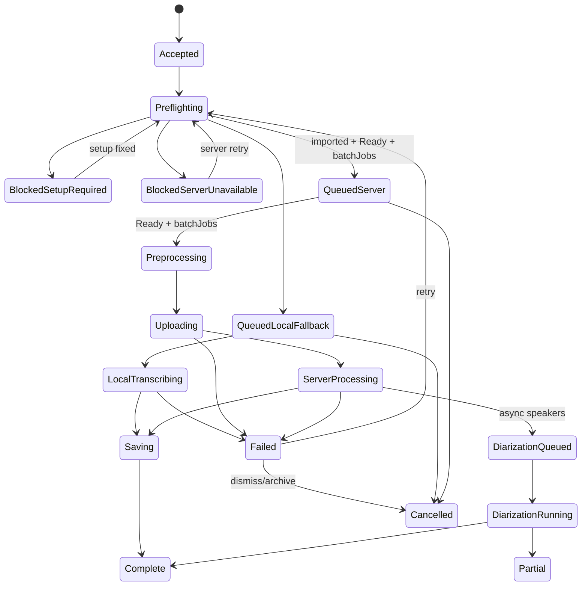
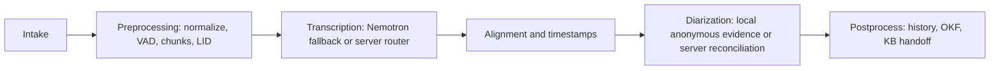

# Spec: Client Recording State Machine

**Status:** Accepted client workflow contract; Phase 3 durable imported-job ownership and connector state are implemented, while upload/server-processing transitions remain deferred
**Scope:** Desktop client workflow for the thin-client MVP, with explicit hooks for server STT, preprocessing, and diarization.

This is the build contract for the client workflow. It replaces the cosmetic readiness-layer approach: the queue and runtime state must model the actual recording lifecycle.

## Product Direction

- Yap desktop is a thin client.
- Local Nemotron INT8 is the live/offline fallback.
- Larger recordings use the GB-class server Cohere path when available.
- Without a server path, larger recordings queue or block instead of silently producing official-looking fallback output.
- Preprocessing and diarization are future compute phases, but the client job model must reserve their state now.

## Ownership

Imported recording-job authority belongs in Tauri Rust. `RecordingJobs`, the SQLite `JobLedger`, and the connector/runtime state own durable identity and lifecycle mutations; React projects typed snapshots/events.

The desktop bridge uses Rust-minted string IDs and a SQLite ledger. `yap.recordingQueue.v1` is supported only as an idempotent one-time migration source: React deletes it after Rust acknowledges every legacy row, and replay after an interrupted acknowledgement cannot create duplicate rows. Do not add a second readiness or queue owner in React or localStorage.

## State Axes

### Setup State

| State | Meaning | UI label |
|-------|---------|----------|
| `checking` | Reading local fallback status. | Checking |
| `fallback_missing` | Required fallback artifacts are missing or failed verification. | Setup |
| `fallback_installing` | Setup is downloading/verifying artifacts. | Installing |
| `fallback_ready` | Local runtime, model, tokenizer, and punctuation assets are ready and enabled. | Ready |
| `fallback_disabled` | User disabled local fallback. | Disabled |
| `setup_error` | Setup check, install, or removal failed. | Needs attention |

### Server Connector State

| State | Meaning | Phase |
|-------|---------|-------|
| `not_set` | No server URL/profile is configured. | 1 |
| `connecting` | Version, health, auth state, and capability checks are running. | 3 |
| `ready` | A compatible, healthy service is reachable and its auth projection does not require sign-in; advertised capabilities may all be false. Batch and live routing additionally require the matching advertised capability. | 3 |
| `offline` | Server URL exists but health timed out or failed; server routing is unavailable. This state may be observed before retry backoff is armed. | 3 |
| `sign_in_required` | Server is reachable but sign-in is required. | 7 |
| `retrying` | Retry backoff is armed after a retryable health failure; server routing remains unavailable. | 3/5 |
| `disabled` | User/org policy disabled server connection. | 3 |

### Runtime State

These match ADR 0006's Rust-owned runtime shape.

| State | Meaning |
|-------|---------|
| `idle` | No active STT/live/upload work. |
| `fallback_ready` | Local Nemotron fallback is ready/warm. |
| `fallback_running` | Local fallback is transcribing. |
| `server_queued` | A recording is reserved for server processing. |
| `server_uploading` | Desktop is uploading a server job. |
| `live_ready` | Mic/live path is ready. |
| `live_active` | Mic is open and streaming. |
| `background_enriching` | Background preprocessing/diarization/knowledge work is active. |
| `degraded_background` | Background queue overflowed or was postponed. |

### Recording Job State

| State | Meaning | UI label |
|-------|---------|----------|
| `accepted` | Client accepted the file/mic session. | Ready |
| `preflighting` | Client is checking setup, server, auth, and file metadata. | Checking |
| `blocked_setup_required` | Local fallback is needed but unavailable. | Setup |
| `blocked_server_unavailable` | Recording requires server path but server is unavailable. | Server |
| `blocked_sign_in_required` | Server path requires auth. | Sign in |
| `queued_local_fallback` | Job is queued for local fallback. | Fallback |
| `queued_server` | Job is queued for server path. | Server queued |
| `preprocessing` | Normalization/VAD/chunk/LID/manifest work is active. | Preparing |
| `uploading` | Desktop is uploading to server. | Uploading |
| `server_processing` | The server-selected batch backend is processing. | Server |
| `local_transcribing` | Nemotron fallback is transcribing. | Fallback |
| `saving` | Client is writing output/history. | Saving |
| `diarization_queued` | Speaker work is queued. | Speakers queued |
| `diarization_running` | Speaker work is running. | Speakers |
| `complete` | Transcript/history entry is saved. | Saved |
| `partial` | Transcript exists but later pipeline stages failed or are deferred. | Partial |
| `failed` | Job failed and may be retried. | Needs attention |
| `cancelled` | User removed a non-running job. | Cancelled |

## Recording Job Shape

```ts
export type SessionMode = "dictation" | "meeting";
export type SessionOrigin = "liveCapture" | "importedFile";
export type RecordingRoute = "localFallback" | "serverBatch" | "serverLive";

export type PipelineStageStatus =
  | "notStarted"
  | "queued"
  | "running"
  | "done"
  | "error"
  | "skipped";

export type RecordingPipelineState = {
  intake: PipelineStageStatus;
  preprocessing: PipelineStageStatus;
  transcription: PipelineStageStatus;
  alignment: PipelineStageStatus;
  diarization: PipelineStageStatus;
  postprocessing: PipelineStageStatus;
};

export type RecordingJobView = {
  id: string;
  sourcePath?: string;
  name: string;
  sessionMode: SessionMode;
  sessionOrigin: SessionOrigin;
  status: RecordingJobStatus;
  route?: RecordingRoute;
  outputPath?: string;
  error?: string;
  progressPhase?: string;
  progressPercent?: number;
  progressMessage?: string;
  pipeline: RecordingPipelineState;
};
```

Rust can use snake_case names internally and serialize typed snapshots/events to React. React can keep camelCase type aliases for UI code, but the values must remain aligned.

`SessionMode` describes the product workflow. `SessionOrigin` describes how audio entered Yap. Neither is a physical track source; microphone, system loopback, and unknown/mixed imported provenance remain track metadata under ADR 0020. A live capture has no required `sourcePath` until the recording sink commits an artifact.

## Route Policy

| Input | Server route condition | Fallback ready | Result |
|-------|------------------------|----------------|--------|
| Live mic | `Ready` + `liveStreaming` | Any | `serverLive` |
| Live mic | Not `Ready` or no `liveStreaming` | Yes | `localFallback` |
| Live mic | Not `Ready` or no `liveStreaming` | No | `blocked_setup_required` |
| Larger recording | `Ready` + `batchJobs` | Any | `serverBatch` |
| Larger recording | Not `Ready` or no `batchJobs` | Any | `blocked_server_unavailable` or `queued_server` for retry |
| Explicit local fallback test/dev file | No server route | Yes | `localFallback` |

The current desktop bridge never executes an ordinary imported file through local Nemotron; imports remain queued or blocked. The explicit test/dev-file row is a contract-only diagnostic route and must not become reachable from normal import UX.

## Transitions



Pipeline stages are orthogonal to the coarse job state:



### Implemented recording-job command boundary

The main WebView can call six Rust commands:

- `recording_jobs_snapshot`
- `recording_jobs_create_imports`
- `recording_jobs_import_legacy`
- `recording_job_cancel`
- `recording_job_retry`
- `recording_job_dismiss`

The sixth command is deliberate. Failed rows would otherwise consume the bounded 200-job recoverable capacity forever. `recording_job_dismiss` applies the centrally classified `Dismiss` policy for `failed -> cancelled`; generic transition and cancellation paths reject that archival edge. Dismissal sets `cancellation_requested`, preserves source/error provenance and external source bytes, and releases Yap's playback authority.

## Implementation Boundary

Client cleanup changes should touch existing state owners before adding runtime breadth:

- `desktop/src/lib/app-types.ts` owns shared TypeScript projection types and pure label helpers.
- `desktop/src/App.tsx` composes the React queue projection; it does not own durable job identity or transitions.
- `desktop/src/components/stacked-upload.tsx` renders recording jobs but does not own app state types.
- `desktop/src/components/panels/queue-panel.tsx` renders queue controls and progress.
- `desktop/src/components/panels/app-sheets.tsx` renders setup/server labels.
- `desktop/src/lib/history-utils.ts` maps history into `complete` recording views.
- `desktop/src-tauri/src/jobs/` owns the SQLite ledger, source validation, lifecycle policy, playback authority, and six-command boundary.
- `desktop/src-tauri/src/runtime/` owns the current `RuntimeOrchestrator` projection.
- `desktop/src-tauri/src/server_connector/` owns validated settings, bounded capability-health requests, generation safety, and retry cancellation.
- `desktop/src-tauri/src/stt/dispatch.rs` now holds only shared busy/error projection state. Live transcription is owned by `live/runtime.rs` and `live/stream.rs`.

Phase 3 adds only bounded health HTTP calls. It does not add job upload/drain, WSS transport, server processing/ASR, authentication, model pools, diarization inference, or a local Cohere fallback. The source-aware capture/preprocessing foundation landed separately under `desktop/src-tauri/src/audio/`.

## Acceptance

- No standalone readiness helper module exists.
- Queue state uses recording-job/workflow types, not component-owned upload types.
- Rust-minted IDs, statuses, attempts, and cancellation intent survive native process restart in SQLite.
- Legacy localStorage migration is acknowledged and idempotent across native restart; localStorage is not queue authority.
- Jobs can be blocked, queued, local-fallback running, server queued, uploading, server processing, saving, complete, partial, failed, or cancelled.
- Pipeline fields exist for preprocessing, alignment, and diarization before those phases ship.
- Setup/server labels are typed projections from app/runtime state.
- UI labels stay terse; docs carry the explanation.
