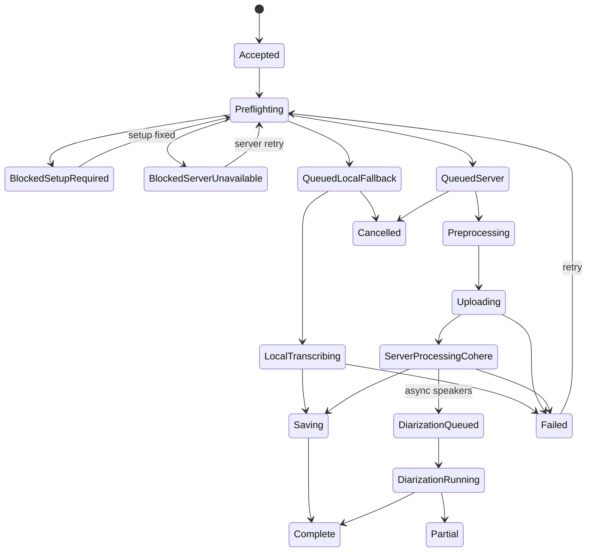
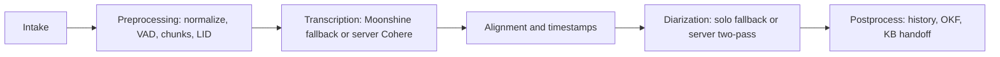

# Spec: Client Recording State Machine

**Status:** Draft
**Scope:** Desktop client workflow for Phases 1-2, with explicit hooks for server STT, preprocessing, and diarization.

This is the build contract for the client workflow. It replaces the cosmetic readiness-layer approach: the queue and runtime state must model the actual recording lifecycle.

## Product Direction

- Yap desktop is a thin client.
- Local Moonshine v2 tiny is the live/offline fallback.
- Larger recordings use the GB-class server Cohere path when available.
- Without a server path, larger recordings queue or block instead of silently producing official-looking fallback output.
- Preprocessing and diarization are future compute phases, but the client job model must reserve their state now.

## Ownership

The long-term state machine belongs in Tauri Rust as a `RuntimeOrchestrator` or equivalent. React should project typed snapshots/events from that orchestrator.

The Phase 1/2 bridge is allowed to keep React as the temporary owner of queue projection while we refactor the current UI, but it must use the same vocabulary the Rust orchestrator will own later. Do not add a standalone readiness helper.

## State Axes

### Setup State

| State | Meaning | UI label |
|-------|---------|----------|
| `checking` | Reading local fallback status. | Checking |
| `fallback_missing` | Required fallback artifacts are missing or failed verification. | Setup |
| `fallback_installing` | Setup is downloading/verifying artifacts. | Installing |
| `fallback_ready` | Sidecar, model, tokenizer, and punctuation assets are ready and enabled. | Ready |
| `fallback_disabled` | User disabled local fallback. | Disabled |
| `setup_error` | Setup check, install, or removal failed. | Needs attention |

### Server Connector State

| State | Meaning | Phase |
|-------|---------|-------|
| `not_set` | No server URL/profile is configured. | 1 |
| `connecting` | Health/auth check is running. | 3 |
| `ready` | Health and auth passed. | 3 |
| `offline` | Server URL exists but health timed out or failed. | 3 |
| `sign_in_required` | Server is reachable but sign-in is required. | 7 |
| `retrying` | Connector is retrying after network loss. | 3/5 |
| `disabled` | User/org policy disabled server connection. | 3 |

### Runtime State

These match ADR 0006's Rust-owned runtime shape.

| State | Meaning |
|-------|---------|
| `idle` | No active STT/live/upload work. |
| `fallback_ready` | Local Moonshine fallback is ready/warm. |
| `fallback_running` | Local fallback is transcribing. |
| `server_queued` | A recording is reserved for server processing. |
| `server_uploading` | Desktop is uploading a server job. |
| `live_ready` | Mic/live path is ready. |
| `live_active` | Mic is open and streaming. |
| `background_enriching` | Background preprocessing/diarization/knowledge work is active. |
| `degraded_background` | Background queue overflowed or was postponed. |

### Recording Job State

| State | Meaning | UI label |
|-------|---------|----------|
| `accepted` | Client accepted the file/mic session. | Ready |
| `preflighting` | Client is checking setup, server, auth, and file metadata. | Checking |
| `blocked_setup_required` | Local fallback is needed but unavailable. | Setup |
| `blocked_server_unavailable` | Recording requires server path but server is unavailable. | Server |
| `blocked_sign_in_required` | Server path requires auth. | Sign in |
| `queued_local_fallback` | Job is queued for local fallback. | Fallback |
| `queued_server` | Job is queued for server path. | Server queued |
| `preprocessing` | Normalization/VAD/chunk/LID/manifest work is active. | Preparing |
| `uploading` | Desktop is uploading to server. | Uploading |
| `server_processing_cohere` | Server Cohere batch job is processing. | Server |
| `local_transcribing` | Moonshine fallback is transcribing. | Fallback |
| `saving` | Client is writing output/history. | Saving |
| `diarization_queued` | Speaker work is queued. | Speakers queued |
| `diarization_running` | Speaker work is running. | Speakers |
| `complete` | Transcript/history entry is saved. | Saved |
| `partial` | Transcript exists but later pipeline stages failed or are deferred. | Partial |
| `failed` | Job failed and may be retried. | Needs attention |
| `cancelled` | User removed a non-running job. | Cancelled |

## Recording Job Shape

```ts
export type RecordingIntent = "live" | "recording";
export type RecordingRoute = "localFallback" | "serverBatch" | "serverLive";

export type PipelineStageStatus =
  | "notStarted"
  | "queued"
  | "running"
  | "done"
  | "error"
  | "skipped";

export type RecordingPipelineState = {
  intake: PipelineStageStatus;
  preprocessing: PipelineStageStatus;
  transcription: PipelineStageStatus;
  alignment: PipelineStageStatus;
  diarization: PipelineStageStatus;
  postprocessing: PipelineStageStatus;
};

export type RecordingJobView = {
  id: string;
  sourcePath: string;
  name: string;
  intent: RecordingIntent;
  status: RecordingJobStatus;
  route?: RecordingRoute;
  outputPath?: string;
  error?: string;
  progressPhase?: string;
  progressPercent?: number;
  progressMessage?: string;
  pipeline: RecordingPipelineState;
};
```

Rust can use snake_case names internally and serialize typed snapshots/events to React. React can keep camelCase type aliases for UI code, but the values must remain aligned.

## Route Policy

| Input | Server ready | Fallback ready | Result |
|-------|--------------|----------------|--------|
| Live mic | Yes | Any | `serverLive` |
| Live mic | No | Yes | `localFallback` |
| Live mic | No | No | `blocked_setup_required` |
| Larger recording | Yes | Any | `serverBatch` |
| Larger recording | No | Any | `blocked_server_unavailable` or `queued_server` for retry |
| Explicit local fallback test/dev file | No | Yes | `localFallback` |

Phase 1/2 may still run selected files through local fallback while the server does not exist, but the state model must label that path as fallback/dev behavior, not the official large-recording product path.

## Transitions



Pipeline stages are orthogonal to the coarse job state:



## Implementation Boundary

Phase 1/2 changes should touch existing state owners before adding runtime breadth:

- `desktop/src/lib/app-types.ts` owns shared TypeScript projection types and pure label helpers.
- `desktop/src/App.tsx` temporarily owns React queue projection while Rust orchestration is being introduced.
- `desktop/src/components/stacked-upload.tsx` renders recording jobs but does not own app state types.
- `desktop/src/components/panels/queue-panel.tsx` renders queue controls and progress.
- `desktop/src/components/panels/app-sheets.tsx` renders setup/server labels.
- `desktop/src/lib/history-utils.ts` maps history into `complete` recording views.
- `desktop/src-tauri/src/runtime/` becomes the Rust `RuntimeOrchestrator` home when implementation reaches the backend state-machine slice.
- `desktop/src-tauri/src/stt/dispatch.rs` keeps local fallback transcription but reports job/runtime events instead of only path-based progress.

No server HTTP/WSS calls, diarization engine, preprocessing engine, or local Cohere fallback are introduced by the Phase 1/2 cleanup.

## Acceptance

- No standalone readiness helper module exists.
- Queue state uses recording-job/workflow types, not component-owned upload types.
- Jobs can be blocked, queued, local-fallback running, server queued, uploading, server processing, saving, complete, partial, failed, or cancelled.
- Pipeline fields exist for preprocessing, alignment, and diarization before those phases ship.
- Setup/server labels are typed projections from app/runtime state.
- UI labels stay terse; docs carry the explanation.
