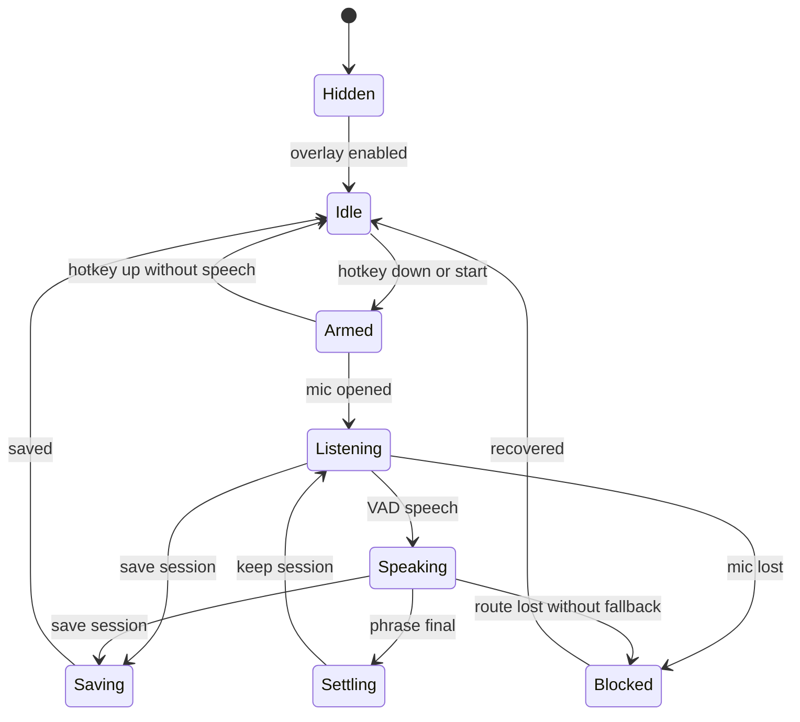

# Live Speaking Overlay And Controls

> **Historical record — current authority (2026-07-14):** This foundation
> design predates the converged island and safety amendments. Synthesized input
> is retired; current behavior uses native-confirmed bounded shortcut enrollment
> and clipboard-only delivery. Use
> [ADR 0013](../../adr/0013-global-hotkey-injection.md) and the
> [canonical live spec](../../specs/live-dictation-client-ux.md) as authority.

**Status:** Historical foundation design; baseline landed and native convergence remains
**Date:** 2026-07-05
**Scope:** Next PR for the live speaking UI/state/control foundation. This is the Phase 3/ADR 0013 bridge: build the always-available overlay, configurable hotkey, microphone setup, and typed live state contract before cross-app text injection. It does not implement the full audio thread, Scribe, save-session pipeline, or Phase 8 server streaming connector.
**Canonical specs:** [../../specs/live-dictation-client-ux.md](../../specs/live-dictation-client-ux.md), [../../specs/client-state-machine.md](../../specs/client-state-machine.md)

> **Current truth (2026-07-14):** Overlay, hotkeys, mic capture, local streaming, saved sessions, one visible-bounds island, native physical-chord enrollment, and Windows clipboard delivery subsequently landed. The original "next PR" exclusions below are historical.

## Problem

At the time of this design, the desktop app had a recordings home and playback review surface but did not yet have the live speaking control surface.

The product direction is:

- Live speaking is fast and snappy, with a compact Wispr Flow-style control tier.
- Capture is hotkey-gated or explicitly started. The app is not always listening.
- The overlay can stay visible at the top of the screen, but the "mic hot" state must be unmistakable.
- Team mode eventually routes live audio to `serverLive` when the GB-class server connector exists; this PR may model/display that future route, but must fall back or block until Phase 8 provides the connector.
- Cross-app delivery was intentionally later than this foundation slice; safe clipboard delivery has since landed on Windows, while synthesized input has been retired.

## Decision

Build a live-speaking overlay foundation in the existing Tauri app:

1. A separate `live-overlay` webview/window renders a compact top-positioned translucent control.
2. A live state contract drives overlay tiers, main-window settings, and future server/local live routes.
3. A user-configurable global hotkey starts/stops or push-to-talks live capture.
4. Mic device selection, default-device fallback, permission recovery, and preflight level checks are first-class settings.
5. OS text injection remains out of scope except for reserving future result states. No clipboard commands or copy fallback are implemented in this PR.

Do not bolt this onto the recordings queue as generic upload state. Live has its own session state, then optionally emits a saved recording job when the user saves the session.

## Product Surface

| Surface | Requirement |
|---------|-------------|
| Overlay placement | Top center of the active display with safe margins; avoid covering system title bars when possible. |
| Collapsed tier | Small translucent/dark dot or pill with status color/level, no text by default. |
| Expanded tier | Shows mic, route, short live partial, stop/save controls, and error recovery when needed. |
| Main window | Settings exposes hotkey, capture mode, input device, server route, and setup status. |
| Motion | Snappy 120-220 ms transform/opacity motion; GSAP only for transform-heavy overlay transitions. |
| Reduced motion | Replace pulses/waveforms with static level and instant state changes. |
| Privacy | Visible "mic hot" state whenever audio capture is active; no silent background capture. |

## Live Overlay States

| State | Trigger | Overlay behavior | Route label |
|-------|---------|------------------|-------------|
| `hidden` | User disables overlay | No window or hidden webview | none |
| `idle` | App ready, capture inactive | Small quiet dot/pill | none |
| `armed` | Hotkey held before speech or toggle armed | Dot brightens; no transcript text yet | Server or fallback |
| `listening` | Mic open, VAD sees silence | Subtle level meter | Server or fallback |
| `speaking` | VAD speech active | Live level/wave activity and partial text if expanded | Server or fallback |
| `settling` | Final token or phrase commit | Quick morph/crossfade into final text | Server or fallback |
| `blocked` | Mic/server/setup permission issue | Compact warning affordance; click opens settings | Required action |
| `saving` | User saves session | Small progress state | Save |



## State Contract

Add explicit live session state beside the existing recording-job projection:

```ts
export type LiveOverlayVisibility = "enabled" | "hidden";
export type LiveCaptureMode = "pushToTalk" | "toggle";
export type LiveSessionStatus =
  | "idle"
  | "armed"
  | "listening"
  | "speaking"
  | "settling"
  | "blocked"
  | "saving";
export type LiveRoute = "serverLive" | "localFallback" | "blocked" | "none";

export type LiveSessionView = {
  visibility: LiveOverlayVisibility;
  status: LiveSessionStatus;
  route: LiveRoute;
  captureMode: LiveCaptureMode;
  hotkey: string;
  inputDeviceId?: string;
  inputDeviceLabel?: string;
  level?: number;
  partialText?: string;
  finalText?: string;
  error?: string;
};
```

Rust owns the authoritative live lifecycle. React renders snapshots and sends user intents.

## Tauri And OS Hooks

| Capability | Candidate implementation | Notes |
|------------|--------------------------|-------|
| Overlay window | Tauri webview/window labeled `live-overlay` | `transparent`, undecorated, always-on-top, skip taskbar if supported, active-display positioning. |
| Global hotkey | `tauri-plugin-global-shortcut` | User-configurable chord, conflict detection, unregister/re-register on change. |
| Mic devices | `cpal` | Enumerate inputs, default device, selected device persistence, unplug fallback. |
| Resampling/VAD | Phase 3 audio thread | Keep callback real-time; VAD/dispatch outside audio callback. |
| Opus stream | Phase 3/8 connector | Required for server live; local fallback can use PCM until the connector lands. |
| Permissions | Platform-specific recovery | Mic denied opens instructions/settings; macOS may require Input Monitoring for global shortcuts; Accessibility is later for text injection. |

Frontend package changes should be minimal. Do not add `@gsap/react` unless a component needs React-specific GSAP lifecycle beyond the current dynamic import pattern.

## Route Policy

| Condition | Route | User-visible behavior |
|-----------|-------|-----------------------|
| Team server ready and Phase 8 connector present | `serverLive` | Overlay labels route as server; audio streams to org GB-class node. |
| Team server configured but connector absent | `blocked` or `localFallback` | Overlay labels the server route as unavailable; do not fake server streaming. |
| Server missing/offline and fallback ready | `localFallback` | Overlay labels fallback/degraded; local Nemotron INT8 handles English live/offline fallback. |
| No server and fallback missing/disabled | `blocked` | Overlay prompts setup; capture cannot start. |
| Server drops mid-session and fallback ready | `localFallback` | Continue degraded if possible; preserve visible route change. |

The overlay must not hide a route downgrade. If audio leaves the device for team mode in a later Phase 8 implementation, the route label must be inspectable in the expanded overlay and settings.

## Keybind Requirements

- Default to a conservative chord such as `Ctrl+Shift+Space` on Windows until user research chooses the final default.
- Settings supports "record shortcut" capture, clear, reset, and mode selection.
- Detect invalid chords and registration conflicts.
- Support push-to-talk first; toggle mode is allowed but must show persistent mic-hot state.
- Do not capture arbitrary keystrokes beyond shortcut registration. This is not a keylogger.
- The hotkey toggles live capture only; text injection remains disabled until the injection PR.
- Shortcut capture stores only the selected chord and mode. It must not persist arbitrary typed characters.

## Mic Requirements

- Enumerate input devices and persist selected device.
- Auto-select the system default when no user choice exists.
- If the selected device disappears, fall back to current default and show a compact notice.
- First live start requests mic permission and has a denied-state recovery path.
- Run a short level preflight before starting STT; show "No input detected" instead of silently recording silence.

## Acceptance Criteria

- [ ] A narrow desktop window can open settings and configure live controls.
- [ ] The overlay window can be shown/hidden independently of the main window.
- [ ] Overlay states render from a typed `LiveSessionView`.
- [ ] Hotkey settings persist and validate a user-selected chord.
- [ ] Mic device settings enumerate, persist, and recover from missing devices.
- [ ] Starting live clearly shows whether the route is modeled as `serverLive`, `localFallback`, `none`, or blocked; without the Phase 8 connector, `serverLive` must not claim active streaming.
- [ ] Reduced motion disables pulse/morph animations.
- [ ] No cross-app text injection is implemented in this PR.
- [ ] Idle or merely visible overlay does not open the microphone.
- [ ] Capture starts only after explicit start or hotkey intent.
- [ ] A visible mic-hot state is present whenever audio capture is active.
- [ ] Shortcut capture stores only the chosen chord and mode, not arbitrary keystrokes.
- [ ] A saved live session can later become a recording job without reusing upload-only types.

## Open Risks

| Risk | Mitigation |
|------|------------|
| Phase 3 vs ADR 0013 scope drift | Name this PR "overlay/hotkey foundation"; keep injection later. |
| Always-on overlay feels like always-listening | Separate visible overlay from mic-hot state; capture only via hotkey/start. |
| Tauri overlay focus quirks | Prototype window flags and click-through behavior on Windows first. |
| Hotkey conflicts | Registration failure must keep the old shortcut and show an inline error. |
| Server privacy ambiguity | Route label and settings must clearly distinguish server vs fallback. |
