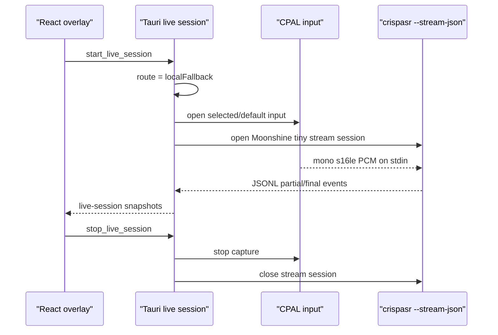

# Local Moonshine Live Transcription

**Status:** Draft
**Date:** 2026-07-05
**Scope:** Turn the existing live overlay/hotkey foundation into real local live transcription by streaming selected microphone audio to the pinned CrispASR Moonshine tiny fallback. This is a client-only **Phase 3a bridge**, not completion of the full Phase 3 audio spec. It does not implement the Phase 8 server WSS connector, Cohere batch upload, Scribe, diarization, or cross-app text injection. It must keep the live stream process warm across sessions and leave explicit seams for Rust Silero `vad_segments`, Opus upload, and saved live audio.
**Canonical specs:** [../../specs/phase-3-live-ux-audio.md](../../specs/phase-3-live-ux-audio.md), [../../specs/client-state-machine.md](../../specs/client-state-machine.md), [../../adr/0002-crispasr-unified-stt-runtime.md](../../adr/0002-crispasr-unified-stt-runtime.md), [../../adr/0014-server-tier-compute-topology.md](../../adr/0014-server-tier-compute-topology.md)

## Problem

The app can show the live overlay, register a hotkey, choose a mic, and model `localFallback`, but pressing live only arms the UI. It does not open a sustained capture stream, feed Moonshine, or render partial/final text.

We need the smallest real live path:

- Use local Moonshine tiny only for live/offline fallback.
- Keep large recordings blocked or queued for server Cohere.
- Preserve the server-first architecture by making this a swappable local transport, not a new product center.
- Keep punctuation enabled.
- Avoid adding the full Rust Silero/Opus/diarization stack before live text exists, while reserving the same audio-session owner those pieces will attach to.

## Decision

Build a local live session runtime in Tauri Rust:



Use the pinned `crispasr` binary and pinned artifacts already installed through the local fallback setup flow.

`ponytail:` CrispASR 0.6.12 exposes the live JSON stream over stdio, while the existing app sidecar uses HTTP server mode for file transcription. This branch uses one managed stdio child owned by `LiveRuntime`, started on first local live use and kept warm until idle timeout or app exit. Live sessions attach/detach microphone capture to that warm child. This is not per-utterance spawning.

```text
crispasr --stream --stream-json --backend moonshine-streaming -m <moonshine-tiny.gguf> -l en --punc-model <fireredpunc.gguf>
```

Add GPU flags the same way the existing sidecar does: `--gpu-backend auto` when GPU preference resolves to GPU, otherwise `-ng`.

The implementation plan must also add a small command builder and test for this stream command. Do not reuse the existing HTTP `CrispasrSidecar` launch code directly; it binds a server port and sets stdin/stdout to `null`.

## Ownership

| Concern | Owner now | Later owner |
|---------|-----------|-------------|
| Live overlay, hotkey, mic picker | Client | Client |
| Local Moonshine fallback stream | Client | Client degraded/offline fallback |
| Server live WSS | Not in this slice | `yap-server` + client connector |
| Opus upstream chunks | Not in this slice | Client connector |
| Rust Silero `vad_segments` | Seam only in this slice | Client audio path before diarization |
| Cohere batch recordings | Blocked/queued client state | `yap-server` batch pool |
| Diarization / speaker identity | Not in this slice | Server two-pass pipeline |

## Runtime Owner

Add one runtime owner beside `LiveSessionState`:

```text
LiveRuntime
  owns current session token
  owns optional CPAL stream
  owns optional warm CrispASR stream child
  owns cancellation flag
  owns writer/reader/level worker handles
  owns in-memory vad segment recorder seam
```

`LiveSessionState` stays the serializable view snapshot. It must not hold CPAL streams or child processes.

The start command must receive enough state to reject invalid work:

- `SttState` to block live while a file transcription is active.
- `RuntimeOrchestratorState` to mark `LiveActive`/return to ready state.
- `LiveRuntime` to avoid stale stop/start races.

Use a monotonically increasing session token. Background reader/writer threads must check the token before emitting snapshots so an old stream cannot update a new session.

## Client Behavior

| User action | Required behavior |
|-------------|-------------------|
| Start live while server ready and server connector implemented | Route `serverLive`; not implemented in this branch. |
| Start live while server unavailable and fallback ready | Start local Moonshine stream, set route `localFallback`, status `listening`. |
| Start live while server readiness is unknown and connector absent | Prefer `localFallback` if ready; otherwise block. Do not claim `serverLive`. |
| Start live while fallback missing/disabled | Set `blocked` with setup error; do not open mic. |
| Start live while file transcription is active | Set `blocked` or return busy; do not run dual STT. |
| Speak | Update `level`; stream JSON partial text into `partialText`; switch status to `speaking` when text or level indicates speech. |
| Phrase finalizes | Move text from `partialText` into accumulated `finalText`; briefly use `settling`, then return to `listening`. |
| Stop | Close mic stream, stop sending PCM, keep the warm CrispASR child alive, set status `idle`, keep `finalText` until a new session starts. |
| Stream crashes | Stop capture, set `blocked`, keep existing final text visible. |

## Audio Path

Use `cpal` for capture. The callback must not run model inference or do filesystem work.

Minimum viable path:

1. Re-resolve the selected input device at stream-open time, falling back to system default if the selected device vanished.
2. Convert input samples to mono `f32`.
3. Downsample or upsample to 16 kHz with a simple linear resampler.
4. Convert to little-endian signed 16-bit PCM.
5. Send PCM chunks over a standard channel to a writer thread.
6. Writer thread writes to CrispASR stdin.
7. Reader thread parses CrispASR stdout JSONL and emits live snapshots.
8. Stop detaches the mic stream and leaves the warm stream child alive until idle timeout/app exit.

`ponytail:` Linear resampling is enough for the fallback MVP. Replace it with a dedicated resampler only if measured accuracy/latency is bad on real mics.

This branch must also update the canonical Phase 3 docs to label this as **Phase 3a**. It does not satisfy the full Silero/chunker acceptance criteria until the Silero asset/runtime lands. The same `LiveRuntime` should later add Rust Silero ONNX and a chunk manifest writer:

```text
CPAL mono frames -> level + resample -> Moonshine stream now
                 -> Silero/chunk manifest later
                 -> Opus/server WSS later
```

## Stream Event Parsing

CrispASR stream JSON is treated as an integration boundary. Parse defensively:

- Accept `text` as the transcript text.
- Treat event/type/status values containing `final` as final text.
- Treat event/type/status values containing `partial` as partial text.
- If no event type exists, treat non-empty `text` as a partial.
- Ignore malformed lines instead of crashing the live session.

This keeps the client tolerant of minor upstream JSON shape changes while still pinning the binary version.

## Server Boundary

This slice must not add a fake server connector. When the server is ready, live should route to `serverLive` through a separate connector that streams Opus over WSS and receives partial/final tokens from the GB-class node.

Until then:

- Live uses local fallback when ready.
- Larger recordings remain blocked/queued when server batch is unavailable.
- No local Cohere path is reintroduced.

## Runtime State Mapping

| Runtime state | Live view status | Notes |
|---------------|------------------|-------|
| `Idle` | `idle` | No mic, no active stream. |
| `FallbackReady` | `armed` or `idle` | Local fallback artifacts are ready; mic is still closed until explicit start. |
| `LiveActive` | `listening` / `speaking` / `settling` | UI sub-state depends on level and stream events. |
| `FallbackRunning` | `listening` / `speaking` / `settling` | Acceptable until the orchestrator grows a dedicated local-live state. |
| server unavailable + fallback missing | `blocked` | No capture starts. |

## Acceptance Criteria

- [ ] `start_live_session` opens the selected/default mic and starts a local Moonshine streaming process when fallback is ready.
- [ ] `start_live_session` rejects file-transcription busy state and cannot run dual local STT work.
- [ ] A `LiveRuntime` or equivalent owner holds capture/process/thread handles; `LiveSessionState` remains a snapshot.
- [ ] The local Moonshine stream process is kept warm across stop/start sessions and is cleaned up only on idle timeout, crash, or app exit.
- [ ] Live overlay receives `listening`, `speaking`, `settling`, `blocked`, and `idle` snapshots from real runtime events.
- [ ] Partial and final text from CrispASR JSONL appear in `partialText` and `finalText`.
- [ ] Punctuation stays enabled through `--punc-model`; no `--no-punctuation` flag is used.
- [ ] Stop closes capture, stops sending PCM, and leaves the warm stream child alive until idle timeout, crash, or app exit.
- [ ] Stop does not erase `finalText`; a new session clears prior text.
- [ ] File/batch transcription remains server-only/blocked when server is unavailable.
- [ ] Tests cover command construction, JSONL event parsing, mono/resample conversion, and live state transitions.
- [ ] Manual smoke test records live speech on the development machine and reports whether CPU/GPU latency is acceptable.

## Out Of Scope

- Server WSS connector.
- Opus encoding.
- Rust Silero ONNX inference and emitted `vad_segments` manifests, except for the runtime seam and Phase 3a docs amendment described above.
- Save live session audio.
- Scribe polish.
- Diarization and speaker labels.
- Text injection into other apps.
