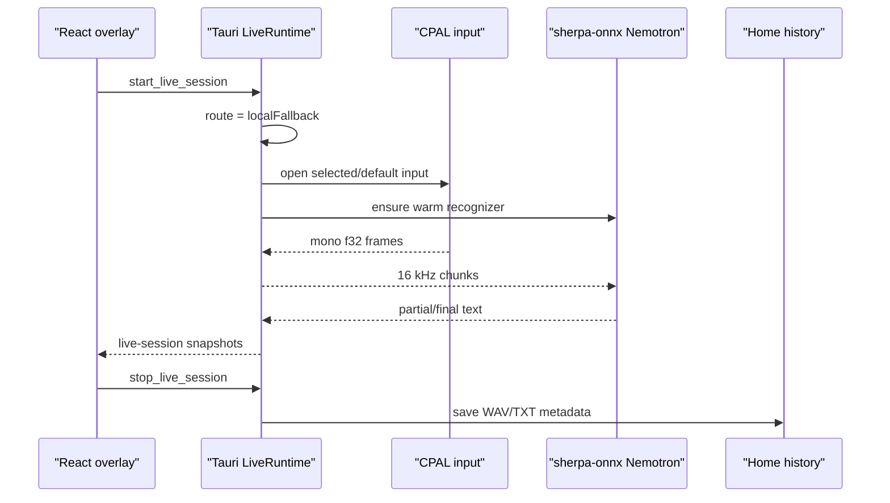

# Local Nemotron Live Transcription

**Status:** Current branch target
**Date:** 2026-07-05, amended 2026-07-08
**Scope:** Make live dictation real through one local fallback: Nemotron 3.5 ASR Streaming 0.6B INT8 via in-process `sherpa-onnx`. The client captures mic audio, streams it to the warm recognizer, saves live WAV/TXT output into Home history, and stays explicit that larger official recordings belong to the server path.
**Canonical specs:** [../../specs/live-dictation-client-ux.md](../../specs/live-dictation-client-ux.md), [../../specs/client-state-machine.md](../../specs/client-state-machine.md), [../../adr/0019-local-streaming-model-selection.md](../../adr/0019-local-streaming-model-selection.md), [../../adr/0014-server-tier-compute-topology.md](../../adr/0014-server-tier-compute-topology.md)

## Problem

The live overlay and hotkey are product-critical, but the client must not become a grab bag of model routers. The MVP needs one understandable local live/offline path that:

- Starts quickly enough for dictation.
- Runs under real time on CPU.
- Saves transcript and audio artifacts in the same history surface.
- Blocks or queues larger recordings when the server is unavailable.
- Leaves server WSS, Opus, Silero chunk manifests, Scribe, diarization, and text injection as separate phases.

## Decision

Use Nemotron INT8 through `sherpa-onnx` as an in-process Rust-owned runtime. Do not keep a local CrispASR child, Parakeet command builder, client-side GPU routing, or fusion router in the desktop client.



## Runtime Owner

`LiveRuntime` owns non-serializable work:

```text
LiveRuntime
  owns current session token
  owns optional CPAL stream
  owns warm Nemotron stream engine
  owns cancellation flag
  owns worker handles
  owns local artifact save
```

`LiveSessionState` remains the serializable view snapshot. It should not own CPAL streams, recognizers, files, or background handles.

## Client Behavior

| User action | Required behavior |
|-------------|-------------------|
| Start live while fallback ready | Open mic, route `localFallback`, stream to warm Nemotron, set `listening` / `speaking`. |
| Start live while fallback missing or disabled | Set `blocked` with setup action; do not open mic. |
| Start live while file/server work is active | Reject or queue; never run dual local STT work. |
| Speak | Update level and transcript snapshots without changing overlay layout size. |
| Stop | Stop capture, finalize local save, keep final text visible until the next session. |
| Server unavailable for larger recording | Queue/block; do not silently process official large recordings locally. |

## Acceptance Criteria

- [x] `start_live_session` opens the selected/default mic when fallback is ready.
- [x] Local live audio streams through one in-process Nemotron INT8 runtime.
- [x] Live state snapshots contain level, partial/final text, status, and route.
- [x] Local live sessions save audio and transcript metadata into Home history.
- [x] Model setup uses explicit install/remove/status controls.
- [x] Client code does not include active Parakeet, Moonshine, CrispASR child, or local GPU routing.
- [ ] Rust Silero ONNX, `vad_segments`, Opus/server WSS, Scribe, and diarization land in follow-on phases.
- [ ] CI parity has a committed/mock audio path for non-skipped runtime smoke coverage.

## Out Of Scope

- Server WSS connector.
- Opus upload chunks.
- Rust Silero ONNX inference and emitted `vad_segments` manifests.
- Scribe polish.
- Diarization and speaker labels.
- Cross-app text injection.
- Client-side model fusion or GPU model routing.
